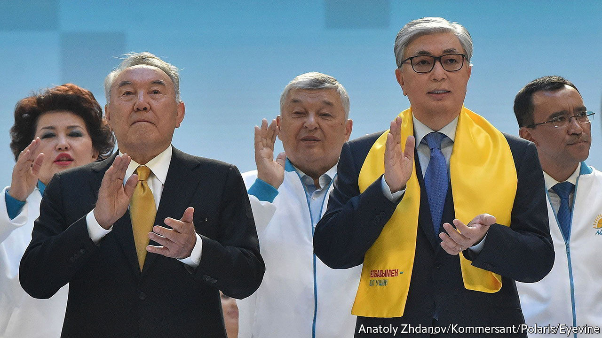

###### The rights of one man

# Kazakhstani voters may revoke their ex-president’s vast privileges 

##### But constitutional changes would still leave the current one with plenty of power 

 

> Jun 2nd 2022 

When kassym-zhomart tokayev became president of Kazakhstan in 2019, he promised his people a “listening state”. But even a deaf one would have heard the clamour in January, when  to register their displeasure at rising fuel prices. As the protests spread, the demand morphed into one for broad political change. Some 230 people were dead before order was restored to the streets. 

Five months down the line, Mr Tokayev (pictured, right) is keen to show that he has been listening. On June 5th Kazakhstanis will vote in a referendum on wide-ranging constitutional reforms that he hopes will reset relations between the state and its citizens. He promises to build a “new Kazakhstan”, which he bills as a “second republic”. It will replace the discredited one he inherited from Nursultan Nazarbayev (pictured, left), his strongman predecessor, who ruled for nearly three decades.

The referendum is a yes-or-no affair covering a package of 56 measures, some of which are so arcane that even the president’s allies admit that ordinary voters may not grasp them. One is to replace the constitutional council with a constitutional court; another is to turn the budget-control committee into an audit chamber. The reforms will almost certainly pass. The choice is between retaining a much-disliked status quo and choosing change, however limited.

Mr Tokayev wants to transform what he calls the “super-presidential” system established by Mr Nazarbayev into one with greater checks and balances. Central to this is the removal of all mention of Mr Nazarbayev from the constitution. He will lose , including immunity from prosecution and the right to rule in tandem with Mr Tokayev. Close presidential relatives will be banned from holding senior public positions. 

Yet the reforms do more to curb the power of the ex-president than of the presidency itself. Mr Tokayev will still appoint the prime minister, cabinet members, security chiefs and the heads of the central bank and constitutional court. It is true that he will lose the right to strike down statutes passed by local mayors and governors. But they are his appointees. 

Mr Tokayev says his new Kazakhstan will offer a more level political playing field. He is adamant he wants the next election—which is due in 2026 but may be called early—to deliver a more robust parliament under a reformed electoral system. The president and many other officials will be barred from joining political parties. He also promises to make it easier to form parties. The number of signatures needed to support an application will fall from 20,000 to 5,000. Yet a similar reduction two years ago made no difference. All new applications ahead of an election last year were rejected. Mr Tokayev has for years tried to play the reformer. What he does with his probable referendum victory will show how much he means it. ■

