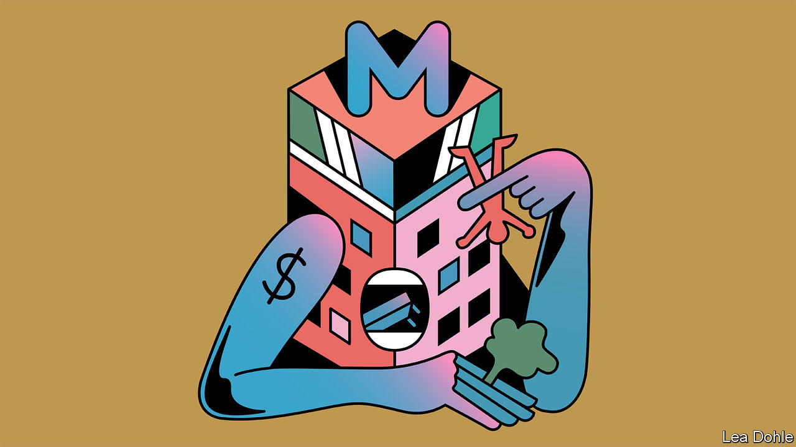

###### Banyan

# The luxury of Asia’s malls is no substitute for genuine public spaces 

##### The continent needs places where anyone can picnic, hang out or even protest 

 

> Jun 2nd 2022 

The shopping mall was invented, nearly 70 years ago, in America. It was then copied in Europe. Yet Asia has inarguably made the shopping mall its own. Eight of the world’s ten biggest malls are in the region; exclude China and five still remain, all in South-East Asia.

Asia’s glass-and-concrete malls sucking city dwellers indoors mark a huge architectural and cultural break. Until near the end of the 20th century, the region’s monumental architecture was dominated by imposing projections of imperial, communist or newly minted post-colonial state power: think of Beijing’s Forbidden City and Tiananmen Square, Lutyens-era New Delhi or Sukarno’s reshaping of Jakarta, with wide avenues and imposing government buildings. What will future archaeologists, then, make of the vast retail boxes jutting out of Asia’s urban sprawl?

They may divine Asian antecedents. In early 20th-century Japan, the development of railways made terminuses the natural place for multistorey emporiums that blended shopping with entertainment and even culture: exhibitions of exquisite kimonos, lacquerware, pottery or woodblock prints designed to appeal to a burgeoning middle class. Just as many of Tokyo’s posh department stores were built by railway companies, so today one of Hong Kong’s big mall developers is the public-transport operator. Passengers are whisked effortlessly from the platform to the mall above.

In the densest conurbations, the concept goes a step further. Various malls are connected by underground tunnels or, more dramatically, sky-bridges. Discouraged from ever touching the ground outside, you float for miles through elevated rivers of retail and entertainment bliss, sampling shops, eateries, cinemas, exhibitions, play areas, skating rinks and even parks. High-rise housing blocks also connect, allowing residents to descend to heaven. Here is a safe space for multi-generational families or friends to gather. Bangkok is one example of the trend. Singapore is an apotheosis of sorts, a republic of malls.

Yet Banyan is, by profession, a flâneur in Asia. And despite notable improvements in public transport, an invariable consequence of mall-building is to wrap developments in ever-widening networks of highways and approach roads. Heavily discriminated against is the pedestrian trying to cross the city at ground level.

Nor is the flâneur nourished once inside the pleasure domes. There sit the same store brands and the same eateries (though if you are lucky you may be able to sit “outside” under plastic palm trees). Artificial light replaces the natural kind, an intentional disruption to circadian rhythms to keep you trapped in mall-time. Less heaven than inescapable purgatory. In the malls along Singapore’s Orchard Road, getting out is a challenge. You pop your head above ground like a marmot, to find that you are in the wrong place. No choice but to return to the mall and wander about for another eternity.

To be fair, malls offer shelter from the heat and humidity: one Hong Kong colleague hates malls except from May to October, when the weather is at its most oppressive. But try napping on a bench, if you can find one. A security guard will soon be nudging you awake. All this points to a glaring, if little mentioned, feature of Asia’s malls. Though supposedly open to all, they are pseudo-public spaces at best. In India officious guards keep out anyone but the upper classes, unless they are employees or carrying someone’s bags. Everywhere behaviour is circumscribed by the (unpublished) by-laws of private developers. People in power surely approve of malls’ anaesthetising effect upon political expression. 

If true civic space and accountability existed in abundance outside the malls, it would not matter. But governments too often give politically well-connected developers cut-rate land, eating into scarce public space. In Manila the biggest malls sit in surreal, first-world developments that are a self-enclosed world away from nearby slums, poverty and violence. Manila’s elites, who live in these developments, are notoriously unconcerned with confronting the city’s huge challenges.

Does the pandemic mark peak mall? In many, footfall is returning only slowly. Shopping is moving fast online. In South-East Asia tax perks and easy money have encouraged a mall surfeit, with hulking carcasses now rotting across the cityscape. Future archaeologists will wonder why 21st-century urban planners thought shops needed so much space, and people so little.


