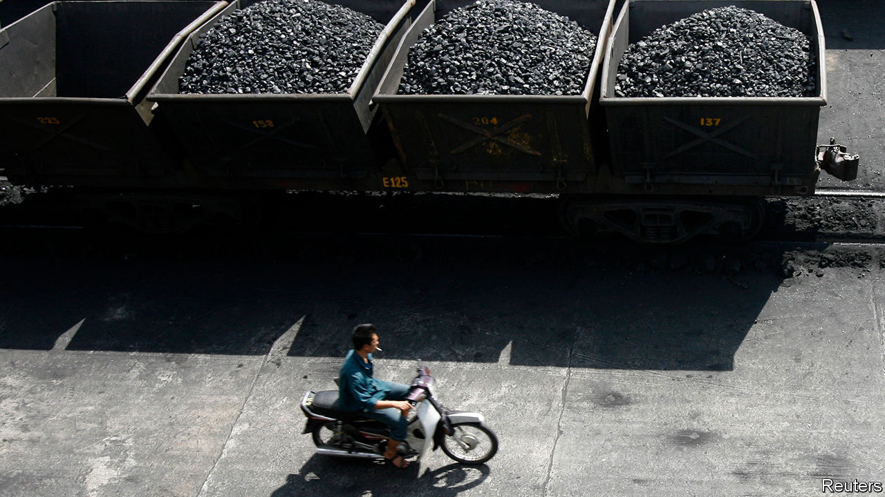
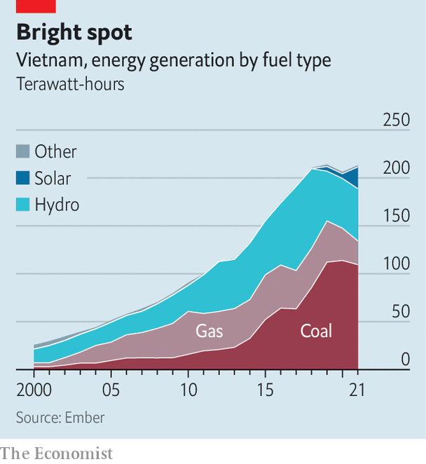

###### Steaming ahead

# Vietnam is leading the transition to clean energy in South-East Asia 

##### But it still needs to wean itself off coal 

 

> Jun 2nd 2022 

South-east asia is among the parts of the world . Yet this smoke-belching region seems uninterested in forsaking fossil fuels. Vietnam is a bright spot on an otherwise soot-black map. 

In the four years to 2021, the share of electricity generated by solar in Vietnam increased from practically nothing to nearly 11%. Not only was this a faster rate of increase than almost anywhere else in the world. It is a bigger share than larger economies such as France or Japan have managed. By last year, Vietnam had become the world’s tenth-biggest producer of solar power. Underscoring his country’s commitment to the energy transition, Pham Minh Chinh, Vietnam’s prime minister, vowed in November to stop building new coal-powered plants and to reduce his country’s emissions to net zero by 2050. 

Other South-East Asian countries hoping to up their game can learn a few lessons from Vietnam. It has quadrupled its wind and solar capacity since 2019. This “extraordinary achievement” is primarily the result of political will and market incentives, according to a study conducted by Paul Burke and Thang Do of the Australian National University, and others. In 2017 the government began paying solar-power suppliers a fixed-rate “feed-in tariff” of as much as 9.35 us cents for every kilowatt-hour they delivered to the grid, which was generous given that costs typically range between 5 and 7 cents per kilowatt-hour. The result is that  in 2019 and 2020, increasing the country’s solar capacity by a whopping 16 gigawatts. Other South-East Asian countries have tried feed-in tariffs, but they have been insufficiently enticing.

Reforms making it easier for foreign investors to do business in Vietnam have helped, too. So has ending the monopoly of Vietnam Electricity (evn), the state energy firm, on domestic generation. By contrast, foreign investors in other South-East Asian countries often find themselves draped in red tape, and must compete against domestic fossil-fuel firms, which enjoy chunky subsidies. 

 


But if Vietnam hopes to achieve net-zero emissions by 2050, it will have to work even harder. Demand for energy in the country has grown by about 10% a year over the past decade, according to Dezan Shira, a consulting firm. More and more of it is being met with coal. The share of electricity generated by the dirty stuff increased from 33% to 51% in the five years to 2021, says Ember, an energy think-tank in London (see chart). The government must also ensure that the economy continues to boom—before the pandemic it was growing by 5-7% per year—even as the country weans itself off coal. 

Government planners “need to ramp up wind and solar very quickly, year in, year out”, says Mr Burke. It is not yet clear how they will do this. The master plan outlining how the country will generate energy, published once a decade, is being revised, and may be out as early as this month. Most of the electricity derived from renewables currently comes from hydroelectric dams. 

Planners also need to consider the grid, which must be expanded and upgraded so that it covers the entire country and is able to cope with the intermittent nature of power supplied by renewables. It does not even have the ability to absorb all the renewable energy Vietnam is currently generating. “Improving the grid will be extremely expensive, almost certainly requiring the government to seek private investment,” says an analyst based in Hanoi. But some at evn, as well as policymakers worried about national security, are reluctant to cede big transmission assets to the private sector. “Mindsets at evn can shift,” says the analyst, “but it will happen slowly.” To reach its targets, Vietnam will need to hurry them along. ■


