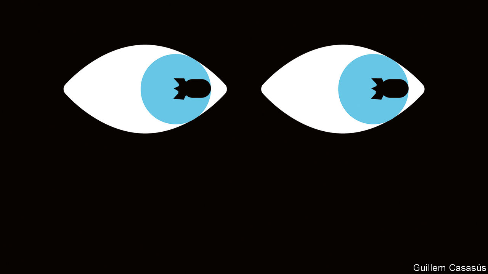
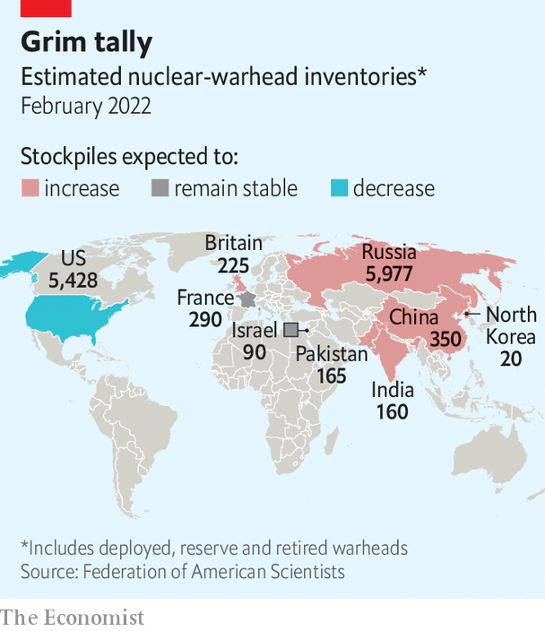
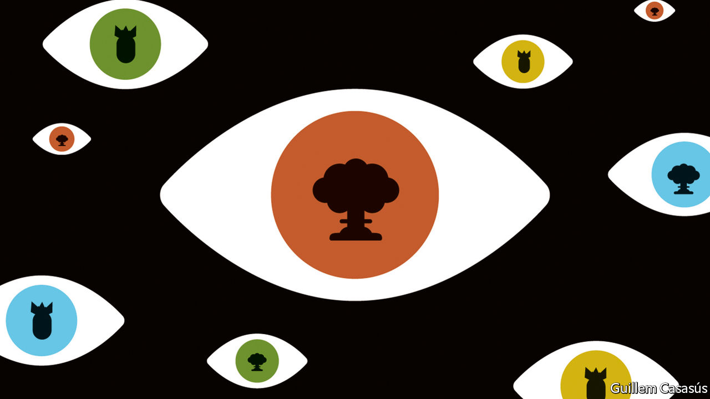

###### Armageddon used to this

# Russia’s invasion of Ukraine has eroded the nuclear taboo 

##### This war is unlikely to go nuclear. But it is increasing the risk that future conflicts will 

 

> Jun 2nd 2022 

In 1999 nina tannenwald, a political scientist at Brown University, wrote a paper analysing something she had observed among generals, politicians and strategists: the “”. This was not, she argued, simply a matter of general queasiness or personal moral qualms; it had important consequences. The lack of nuclear wars in the years since America’s destruction of Hiroshima and Nagasaki, she argued, was not simply a matter of deterrence. It had also relied on a growing sense of the innate wrongness of nuclear weapons putting their use beyond the pale. 

Threats of nuclear attack like those made in the 1940s and 1950s had become vanishingly rare. As the taboo had strengthened, seeking to acquire nuclear weapons had come to be seen as the mark of a barbarian. Avoiding any explicit mention of actually using the ones you already had was the mark of a gentleman. If there was a certain hypocrisy about all this—which there was—it was one that exemplified the French aphorist La Rochefoucauld’s definition of the term: the tribute that vice pays to virtue. 

To see such nicety stripped away, tune in to the state-owned television channel Russia-1. “Just one launch, Boris,” warned Dmitry Kiselev, the station’s main news presenter, on May 1st, “and England is gone.” In case this message proved too subtle for the British prime minister, or the audience at home, Mr Kiselev laid out the launch options he had in mind. One was a Sarmat intercontinental ballistic missile (icbm) shown streaking towards Britain. Another was a Poseidon thermonuclear torpedo, designed to whip up an isotope-laced tsunami. “Having passed over the British Isles, it will turn whatever might be left of them into a radioactive desert,” enthused Mr Kiselev, “unfit for anything for a long time.”

This was not a one-off. “The Russians are really brandishing this,” says Dr Tannenwald. “Every few days, some Russian official is making explicit nuclear threats.” And such thinking runs deeper than broadcast bombast. Boris Bondarev, a diplomat at Russia’s mission to the un in Geneva, resigned his post on May 23rd in disgust at his country’s invasion of Ukraine. He told the  that what had disturbed him most was the glib fashion in which his colleagues—arms-control specialists, no less—revelled in talk of nuclear war. “They think that if you hit some village in America with a nuclear strike, then the Americans will immediately get scared and run to beg for mercy on their knees,” said Mr Bondarev. “That’s how many of our people think, and I fear that this is the line that they are passing along to Moscow.”

The mixture of norms, treaties, mutual assurances, blandishments, suasion, technical mechanisms, fear and taboo which has kept the world from seeing nuclear weapons used against armies or cities since 1945 was looking pretty ragged even before Vladimir Putin, Russia’s president, warned on February 24th that third parties standing in Russia’s way risked “consequences…such as you have never seen in your entire history”. 

In terms of arms control, pacts between America and Russia had almost all lapsed; Russia was developing new weapons, such as Poseidon, not covered by the agreements that remain; China’s nuclear arsenal was expanding rapidly. As to stopping the weapons’ spread, decades of international pressure had failed to prevent North Korea first from acquiring nuclear weapons and then from increasing both their sophistication and the range of targets against which they could be used. 

The single non-proliferation agreement of note made in the past decade, the  in which Iran limited its nuclear programme in return for relief from sanctions, was hanging by a thread, with the Islamic republic closer to a bomb than ever. It is now closer still. And the lack of progress towards disarmament by America, Britain, China, France and Russia, the nuclear-armed states party to the Nuclear Non-Proliferation Treaty (npt), was continuing to erode the legitimacy of the regime that treaty established.

The  has torn further holes in this ragged fabric. With Russia waging a war of conquest and members of nato providing Ukraine with increasingly capable weapons with which to fight back there is a small but real risk that the two sides might stumble into a war which escalates beyond the nuclear threshold. There is also a separate fear that should things go very badly for Mr Putin (and a mortifying defeat is the preferred outcome for many countries in nato) he might use a nuclear weapon to shock Ukraine into standing down rather than see his armed forces annihilated, or Crimea lost. 

Some pretty strong personal feelings

The severity of these risks and how to handle them is fiercely debated. Emmanuel Macron, France’s president, has warned against the “humiliation” of Russia. Polish and other eastern European officials, along with British ones, argue that escalation risks have been over-egged by Germany, Italy and France. But the war’s impact on the nuclear order is not confined to the question of whether nuclear weapons will be used in the conflict itself. It is also about the effect their presence in it will have on the norms and incentives according to which other states make decisions in other places. How nuclear weapons are thought about and talked about is changing. What Russia is doing, says Dr Tannenwald, “is very damaging to the nuclear taboo”.

Again, the damage is being done to something already suffering neglect. After North Korea tested an icbm that could reach America in 2017 Donald Trump, a president with little time for taboos, threatened North Korea with “fire and fury like the world has never seen”. In 2018 Kim Jong Un, the Korean leader, warned that his nuclear button was “always on my table”—a comment that prompted Mr Trump to retort that his button was “much bigger”. At an election rally in 2019 Narendra Modi, India’s prime minister, addressed Pakistan’s reminders that it had nuclear weapons which would deter India with mockery. “What do we have then?” he asked, rhetorically. “Have we kept it for Diwali?” 

Such loose talk might have its origins in the political currents of the past decade, say Oliver Meier and Maren Vieluf of the University of Hamburg. They argue that nationalist-populist leaders, a category in which they include Messrs Putin, Trump and Modi, are more likely to speak irresponsibly about nuclear weapons. Machismo might be an issue, as might the sort of taste for shock and flirting with the unsayable seen in edgelords online. So might a general scorn for international opinion. It is often among policy elites that the nuclear taboo is treated most seriously. To a man like Mr Trump that makes it suspect in and of itself. 

“This kind of open discussion goes even further in reducing that taboo quality of nuclear weapons for many people,” says Scott Sagan, a political scientist at Stanford University. “You see open discussions about nuclear superiority and being able to win a nuclear war in the —stuff that I think is pretty wild. Once you start having people writing about that in major papers, it has an impact on public perceptions.” When ideas about winnable nuclear wars were raised by members of Ronald Reagan’s administration in the early 1980s there was widespread outrage. Today not so much. 

Part of the issue may simply be one of time and forgetting. Save for , there is no one anywhere near the corridors of power who remembers, as an adult, hearing the news from Hiroshima and Nagasaki. All but the most precocious of the children who picked up on their parents’ dread at the time of the Cuban missile crisis are in their late 60s. The cold-war shadows in which the nuclear taboo grew up, which only started to disperse after Reagan and Mikhail Gorbachev agreed that “a nuclear war cannot be won and must never be fought”, have been gone for 30 years. 

 


There is also the fact that breaking the taboo on the use of chemical weapons—a taboo which, unlike the nuclear one, is codified in international law—has turned out to have lower costs than might have been expected. Bashar al-Assad used them in the Syrian civil war but remains in power; poisoners working for Mr Putin and Mr Kim have used them, too. Their use when other options were possible hints that breaking the taboo is a signal all on its own.

It is also possible that the population at large was never as squeamish on the subject as their leaders. President George H.W. Bush privately ruled out any use of nuclear weapons in the first Gulf war, though he allowed some obfuscation on the subject in public statements. But 28% of the American public told pollsters they were fine with the use of tactical, or low-yield, nuclear weapons against Iraq. Among people told it might save the lives of American troops the number was 45%.

Not saying we won’t get our hair mussed

Similar feelings might well hold sway today. In 2017 Dr Sagan and Benjamin Valentino of Dartmouth College ran an experiment in which subjects were told that Iran had destroyed an American aircraft-carrier, that America had invaded Iran to overthrow its government in response, and that the invasion had stalled. Should America use nuclear weapons on the city of Mashhad to “shock” the government into surrendering? A clear majority said yes: killing up to 2m Iranian civilians was an acceptable price for avoiding 20,000 American deaths that would result from a continued invasion. It is worth noting that, , this is quite similar to the scenario in which Mr Putin uses a nuclear weapon to cow Ukraine if it achieves a decisive advantage.

A follow-up published this February by the original authors and Janina Dill of Oxford University showed that this grim calculus held beyond America. Majorities or near-majorities in Britain, France and Israel were supportive of using nuclear weapons in conflicts with non-nuclear nations if they were more effective than conventional ones. That is not a way people think about something which is truly taboo. “People do not dabble in cannibalism when they are a little hungry; rather they resist until they are on the verge of starvation,” Dr Sagan and Dr Valentino have written. “With nuclear weapons, however, the us public’s preference for nuclear options seems to grow steadily as a function of perceived utility.”

That utility is not really to do with how armies fight. For countries with first-rank conventional forces the need for nuclear weapons on the battlefield itself is quite limited. What nuclear weapons offer that is unique is the ability to put whole cities at risk and threaten populations in the tens or hundreds of millions. It is that which gives them their strategic value. 

Yet interest in tactical nuclear weapons has revived in recent years. Russia is thought to have as many as 2,000 of them. The air-dropped bombs which make up the small nuclear arsenal America keeps in Europe can have their yields reduced to very low levels. In 2020 America deployed the W76-2, a low-yield weapon fitted to submarine-launched ballistic missiles. 

America’s justification for this was that it provided a capability to respond “in kind” if Russia used a tactical weapon. This suggests that there are cases where, for messaging purposes, nuclear weapons might have to be used simply because they are nuclear—perhaps because the public would expect a nuclear response to a nuclear attack and find anything less unforgivable. That is the opposite of a taboo. 

They’re getting ready to clobber us

It is not just because of their presence that the war is changing people’s thinking about nuclear weapons. Their absence matters too. When the Soviet Union came apart in 1991 a third of its strategic nuclear arsenal and much of its nuclear industrial complex sat on Ukrainian territory. Ukraine’s politicians did not control the command systems with which to use those weapons. Their country could not have maintained a viable arsenal without considerable investment, says Mariana Budjeryn of Harvard, whose book on the subject, “Inheriting the Bomb”, is forthcoming. With no enemies halfway around the world to threaten with icbms, Ukraine gave up the arsenal, receiving in return assurances from America, Britain and Russia that it would be safe within its borders.

The war has brought with it a lot of coffee-shop counterfactuals about how things might have gone if Ukraine had made a different choice. It would not have been easy. Ukraine’s economy in the 1990s was in poor shape, says Dr Budjeryn, and it needed help from the International Monetary Fund and the World Bank—help which might not have been forthcoming if the country had decided to invest heavily in producing weapons-grade nuclear material for a sovereign nuclear arsenal. Russia and, in all likelihood, nato would have been angered.

What is more, nuclear weapons do not make your territory invulnerable. Egypt and Syria attacked Israel in 1973, Argentina seized the Falkland islands in 1982, Pakistan mounted an incursion into the Kargil region of Indian-held Kashmir in 1999. A developing nuclear capability might not have deterred Russia from some sort of action—indeed it might have seen armed conflict come about earlier. 

But nuclear states are widely assumed immune to attacks aimed at all-out conquest or regime change, rather than peripheral deserts, islands or mountains. That is because one of their defining qualities, as Hermann Bondi, a long-ago chief scientific adviser at Britain’s Ministry of Defence, once observed, is that no one can afford to make them desperate. 

 


Some countries afraid of their neighbours will doubtless take note—as they will have taken note of the deaths of Saddam Hussein and Muammar Qaddafi, both of whom abandoned nuclear-weapons programmes, and the comparative impunity enjoyed by Mr Kim. Those in South Korea or Japan who want their country to host or build nuclear weapons will be emboldened. It was not by chance that Abe Shinzo, Japan’s former prime minister, encouraged his compatriots to consider emulating the scheme by which European allies host American nuclear weapons just days after Russia’s invasion in February.

Meanwhile countries with nuclear weapons are getting a lesson in the room for manoeuvre their possessions allow. What is distinctive about this war is not that the aggressor has nuclear arms, or that their use has been threatened. It is the explicit way in which those threats are being used to keep third parties out. Seeing that approach work might encourage China to apply the same thinking with respect to Taiwan. The extent to which nuclear haves—and possibly almost-haves, like Iran—are emboldened in this way could well further increase incentives for proliferation among the have-nots. 

Turn the music down, just a little

The hope that arms control might help in some way seems forlorn. In principle, delivering some of the disarmament promised under the npt could reinforce the non-proliferation norm. But that will not happen. America is unwilling to limit future missile defences, which Russia and China would like it to do. There are no established verification regimes for new weapons such as hypersonic gliders and undersea drones. China seems intent on narrowing the warhead gap with America. And Russia is more committed to nuclear weapons than ever. The damage the war has done to the material state and reputation of Russia’s armed forces “takes us back to the late 1990s,” says Kristin Ven Bruusgaard of the University of Oslo. Then “Russian conventional forces were in a particularly dire state and Russian strategists were deliberating that Russia would potentially need to resort to nuclear weapons at a very early stage in a conflict with nato.” 

The question of who wins in Ukraine thus has a world-changing side-wager running on it. “The value of nuclear weapons as a tool of statecraft hinges on the outcome of this war,” argues Dr Budjeryn. If Ukraine prevails with Western weaponry and recovers the territory it has lost since February 24th, “perhaps the conclusion will be that these weapons are only good for terrible dictators who are inflicting pain—but in the end they’re useless.” That would be a harder case to make if Ukraine is defeated and dismembered. “The world will emerge from this with some deep questions and very painful understandings about the role nuclear weapons play in human affairs.” ■


