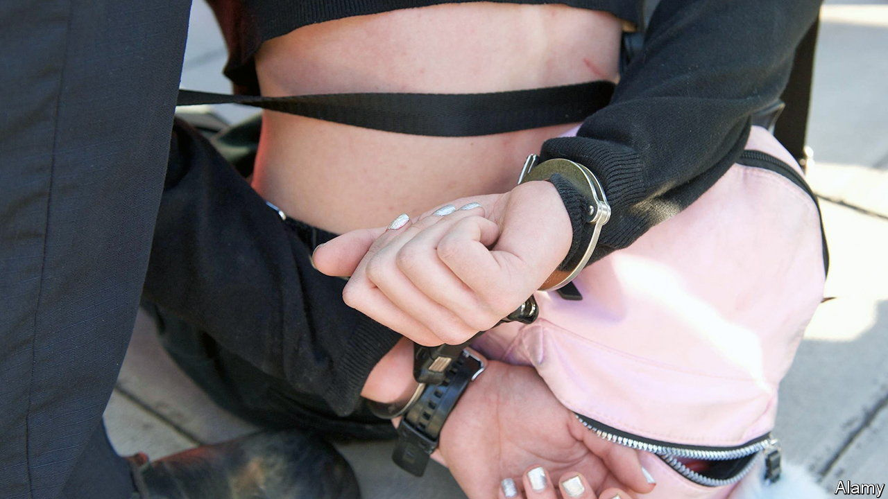
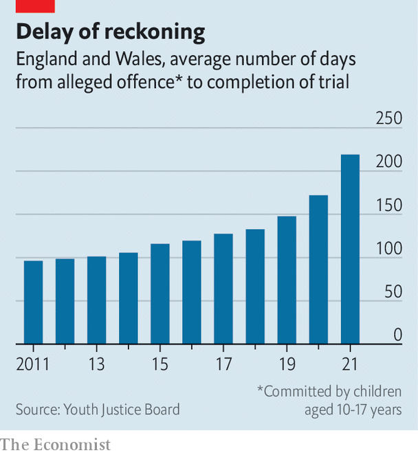

###### A criminal form of justice

# An 18th birthday is bad news for children awaiting trial 

##### Youth offender, adult criminal 

 

> Jun 2nd 2022 

When Rob Moussalli, a criminal-defence solicitor at Burton Copeland, a law firm in Manchester, started representing a 15-year-old arrested in connection with a violent crime in December 2019, he expected the case to make its way to court quickly. Instead the police investigation dragged on for months, then years. His client turned 16, then 17. Mr Moussalli calls the delays “ridiculous”. For others in the same boat, they can be life-altering. 

Children who are accused of committing an offence and who turn 18 before getting their day in court must be tried and sentenced in the adult criminal-justice system. The likelihood of that happening has gone up. In the year ending March 2021 there were 50,000-odd arrests of children. It took an average of 219 days from the time of a suspected offence until the end of a trial, if one occurred (see chart). That is six weeks more than one year earlier, and four months more than a decade earlier. 

 


The delays stem from longer investigations, cuts to court budgets and pandemic-related backlogs. A report by Just for Kids, a charity, cited estimates from the Youth Justice Board, a public body, that 2-3% of proven offences committed by children in 2018 were by someone who turned 18 prior to his or her conviction. The pandemic is likely to have inflated that proportion.

Just under two-fifths of children arrested in recent years have wound up in court; of these, two-thirds received sentences. Those who turn 18 before their first hearing lose out in multiple ways. During the trial itself, for example, these young adults lose the anonymity afforded to nearly all children, which can make it more difficult for them to enrol in university or rent a flat. If they are found guilty, they are denied access to specific types of youth sentences like referral orders, a non-custodial sentence for first-time offenders. 

Even when adult sentences are the same length as youth sentences, they have a more enduring afterlife. The period of time a crime would turn up on a basic background check for an adult after a custodial sentence of more than six months is about double that for a child. 

The youth criminal-justice system is different for a reason: many children who commit crimes are less likely to do so once their brains mature and their judgment improves. So keeping people accused of childhood crimes from entering the adult system is right. The Police, Crime, Sentencing and Courts Act, which was passed in April, includes a provision that encourages police to release suspects on bail before charging them. There are time limits on how long someone can be released on bail, so this could speed investigations up.

But more could be done. Lawmakers could assign the types of court and sentence based on the age at which a defendant is accused of committing a crime rather than their current age. Advocates tried unsuccessfully to include this in the new act. Courts could also fast-track the cases of children who are nearing 18. During the pandemic a working group was created to ensure courts gave priority to youth cases but its members are now meeting less frequently.

As for Mr Moussalli’s client, he has not yet turned 18 but one of his co-defendants, who was 16 at the time of the alleged offence, recently did. Because children who are charged alongside adults must have their cases heard in adult courts, Mr Moussalli’s client is also heading to Crown Court. He will still be eligible for a youth sentence, but his co-defendant will not. ■

