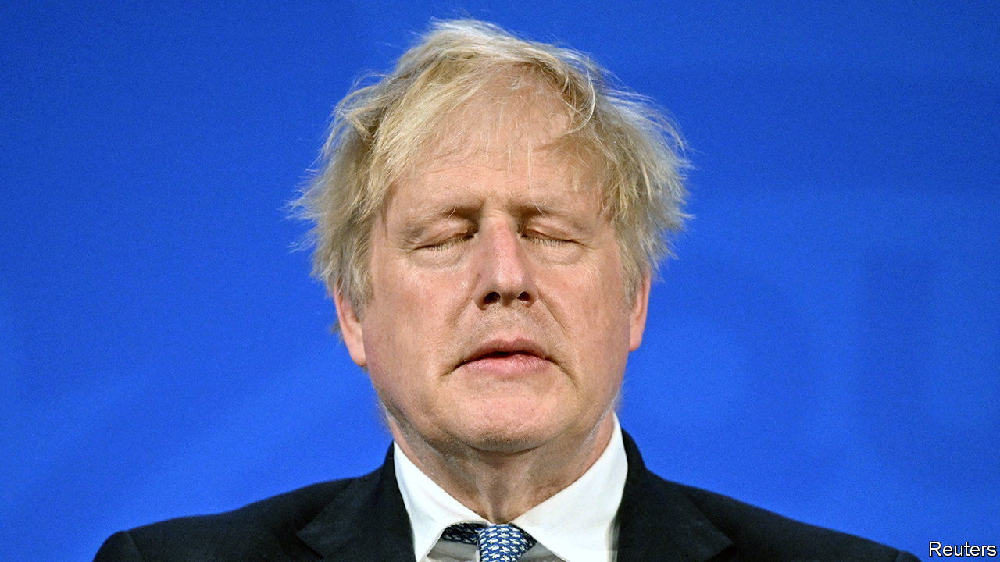

###### What changed?

# Boris Johnson’s position is looking precarious 

##### Poor polls and Partygate are prodding more Tory MPs to move against him 

 

> Jun 1st 2022 

Something is shifting in Westminster. In January, when the scandal over parties held in Downing Street during covid-19 lockdowns flared, some  talked of ousting Boris Johnson. A vote of confidence in Mr Johnson’s leadership would be triggered if 54 Tory mps send letters demanding one to a party grandee. That threshold was not met; the moment passed. 

Such a contest now looks rather more likely, even if Mr Johnson would still have a good shot at winning the ballot that would follow. Around 30 mps have publicly called for him to quit; more have expressed unease about his leadership. Dissenters seem to be evenly spread: from northern and southern seats, newbies and greybeards, from the right-wing and moderate flanks of the party. More mps are planning to test the mood of their constituents over this  holiday weekend; depending on what they hear on doorsteps and at fetes, they may add to the no-confidence letters. 

What has changed?  into the Partygate affair, which was published on May 25th, was lurid enough in its descriptions of Downing Street drinking to anger the public, yet too patchy to provide the catharsis that mps hoped for. Details continue to trickle out about a gathering said to have been organised by the prime minister’s wife, which Ms Gray chose not to investigate. His independent ethics adviser has reportedly been mulling resignation. 

At the same time growing numbers of mps think that the party cannot win the next election under Mr Johnson. The Tories’ polling has hovered in the mid-to-low 30s since January; a poll number in the 20s would be widely interpreted as irreparably bad. A £15bn ($19bn)  to protect families against inflation that was announced by the government on May 26th has made little political difference. For fiscal disciplinarians on the Tory benches, that’s a lot of buck for no bang. 

Many mps had used the war in Ukraine as a pretext for not moving against Mr Johnson. But the war exerts a weaker grip on their attention now. The critical moment may come on June 24th, the day after two by-elections in England that the Tories are widely expected to lose. It may come sooner. It may not come at all.

That the process is so opaque is a result of changes in 1998 to the rules for Tory leadership contests. Previously, rebels would simply organise a direct leadership challenge, as Michael Heseltine did against Margaret Thatcher. Democratising the system has produced a lottery: since only one person knows how many letters have been sent, no one else can be sure if or when the contest will begin. If it does, there is no consensus over who should replace Mr Johnson. The uncertainty is thrilling Westminster and paralysing the government.

