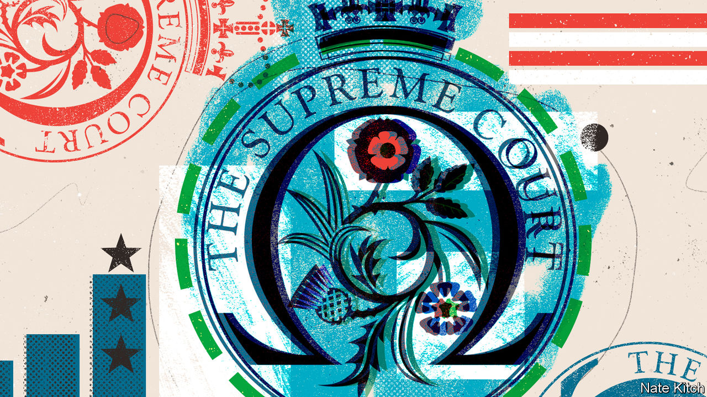
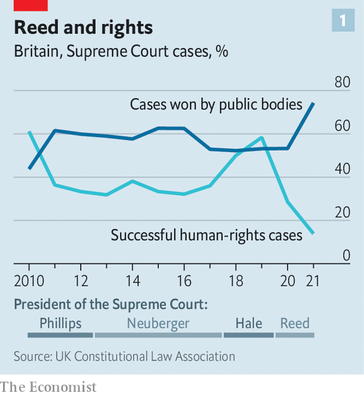
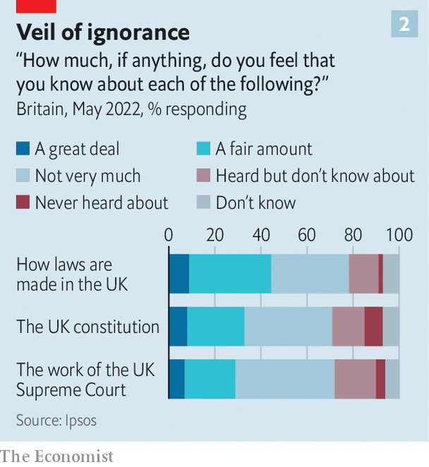

###### Separation anxiety

# Britain’s Supreme Court takes a conservative turn 

##### It rejects more human-rights claims and sides with public bodies more often 

 

> Jun 2nd 2022 

In 2015 the Conservative government announced that it would restrict child-benefit payments to two children per family in order to trim budgets. That was challenged by two mothers, who argued it breached their legal rights to privacy and a family life. When the case reached the Supreme Court in July 2021, it was dismissed by Robert Reed, the president, and six of his colleagues with a striking brusqueness. 

The case was part of a trend of lobbyists turning to the courts after failing to get their way through politics, he remarked in his judgment, which found that the generosity of welfare systems is a question for lawmakers alone. “There is no basis, consistent with the separation of powers under our constitution, on which the courts could properly overturn Parliament’s judgment that the measure was an appropriate means of achieving its aims,” he wrote.

 


That judgment met with warm approval from the British government, which declared it a welcome part of “the ebb and flow of case law, between more and less activist approaches”. In truth, the tide has been going in one direction for a while. An analysis of data by Lewis Graham of the University of Oxford suggests a trend towards a more “executive-minded” Supreme Court. In the first two years of Lord Reed’s presidency, the court has rejected more human-rights claims and sided with public bodies more frequently (see chart 1).

 


Polling conducted for  by Ipsos suggests that Britons are in a state of happy ignorance about the Supreme Court: just 29% say they are familiar with its work (see chart 2). Unlike America’s Supreme Court, it cannot strike down primary legislation but only ministerial decisions, so it has a limited role in deciding questions such as abortion or free speech. But its short history shows how much it matters. 

The Supreme Court was opened in 2009 by the Labour government. It took on the job of Britain’s highest appeal court, previously performed by judges sitting in the House of Lords. A new constitutional landscape—which included devolution in Scotland, Northern Ireland and Wales, and the introduction of a human-rights law—demanded a high-profile body to oversee it. 

That has made Britain’s most senior judges bolder and more independent-minded, argues Charles Falconer, a former justice secretary who designed the overhaul. “In the old days you would see the Law Lords hanging around the chamber, and eating in the Lords’ dining room, and they’d be picking up currents which they’d reflect quite frequently in the way they dealt with public law.”

Others were less convinced. Many Conservatives thought the reforms vandalism. Their sense that something was amiss was reinforced in September 2019 when the judges, among them Lord Reed, ruled unanimously that Boris Johnson’s suspension (or “prorogation”) of Parliament during the Brexit saga had been unlawful. The then president, Brenda Hale, became a folk-hero to Remainers. Cabinet ministers called the decision a constitutional coup.

In the election campaign that soon followed, the Tories promised a constitutional review to prevent the courts from being “abused to conduct politics by another means” and to “restore trust in our institutions”. Ministers mused about changing the court’s name. Dominic Raab, the justice secretary, has since proposed new reforms to the human-rights act. He intends to halt the “incremental expansion of a rights culture without proper democratic oversight”. This is a restorationist agenda, seeking to revive an older constitutional orthodoxy which stresses the supremacy of Parliament and the ability of ministers to exercise discretion without a judge looking over their shoulder. 

Talk of reviews and name changes has subsided at the same time as the court has taken a more restrained approach. “The idea that we have gone soft on the government or we are reluctant to find against the government is completely without foundation,” remarked Lord Reed recently. But he added: “What has been perhaps more evident in our judgments is greater respect for the separation of powers.” 

Take the case of Shamima Begum, a Briton stripped of her citizenship after travelling to join Islamic State in Syria. In February 2021 the Supreme Court upheld this decision, reasoning that the government’s view that Ms Begum was a security risk demanded respect from the courts because the home secretary was accountable to Parliament. Or that of Margaret McQuillan, the sister of a Northern Irish woman shot in 1972; British troops were suspected to have been involved. In December 2021 the court asserted a firm cut-off date for investigating historic human-rights abuses. 

The Supreme Court has also taken a distinctly limited view of the powers of devolved parliaments, emphasising the tight constraints imposed by Parliament in Westminster. That makes any legal bid by the Scottish government to force an independence referendum in 2023 look much less likely to succeed. 

Views differ on what is happening. Conor Gearty, an academic and human-rights barrister, points to a change in leadership. On this view, judges such as Lady Hale took a more flexible and imaginative approach, taking into account the life experiences of litigants and the good of society. Mr Gearty sees the court under Lord Reed as taking a more old-fashioned, “formalistic” approach, focused on narrow legal questions.

Jonathan Sumption, who served on the court from 2012 to 2018, thinks the new orthodoxy predates Lord Reed’s term, and is shared by a generation of talented judges. The prorogation decision under Lady Hale wasn’t a case of extreme judicial activism at all, he says. Sometimes defending the will of Parliament means standing up to overweening governments. At other times it means pushing back at campaigners seeking to change government policy.

Others see a court shielding itself from a harsh political climate. Lord Reed and Lord Burnett, the head of the judiciary in England and Wales, seem to think it is “constitutionally unwise for there to be a sense of conflict between the judges and the executive,” says one senior lawyer. Lord Reed has sought to mend bridges with mps, patiently reassuring them in meetings that he understands the court’s role. In a speech on May 30th Lord Burnett said: “Judges should be allergic to politics.” 

Politics has a habit of seeking judges out, however. One idea in the Tory ether is to give Mr Raab more discretion over picking judges (at the moment he approves or rejects a single candidate picked by an independent panel). Growing attention is paid to the decisions of individual judges, and attempts are made to categorise them as activists or conservatives. That worries liberals, who fear the independence of the judiciary is under threat, but it is also an inevitable product of the court’s importance. With status comes scrutiny. ■


