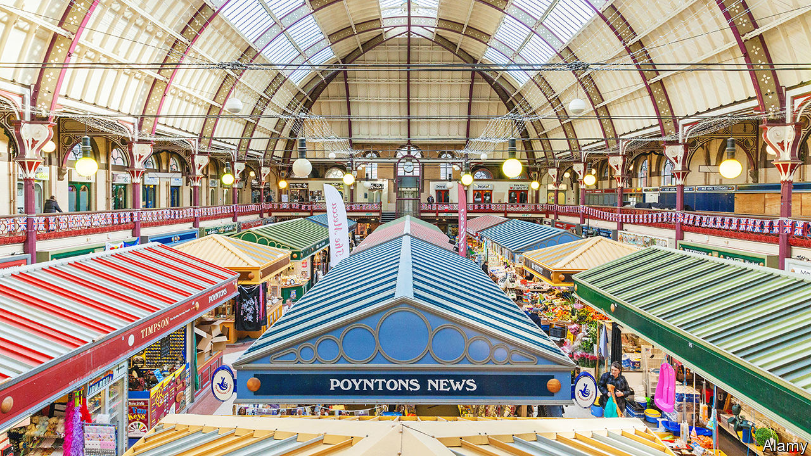

###### Architecture and commerce

# The fall and rise of the British market hall 

##### In many places, levelling up has been a boon for one sort of building 

 

> Jun 2nd 2022 

Derby put on an impressive show at the opening of its market hall in 1866. Visitors to the city, some of whom arrived on special trains, heard a performance of Handel’s Messiah and “a powerful and effective organ”. Today the hall echoes with the shouts of scaffolders. The rows of market stalls on the ground floor are lifeless, the traders having moved elsewhere. The building will not reopen until 2024. 

Even in its half-repaired state, Derby Market Hall is spectacular. It has a vast roof of glass and wood, with iron supports. It looks a little like St Pancras Station in London, which is not a surprise—the engineer Rowland Mason Ordish worked on both. Derby Council proudly expresses the comparison the other way around. St Pancras, it says, “has a comparable splendour to the roof of Derby Market Hall”. 

The Midlands and north of England are studded with Victorian market halls, which are frequently among the grandest buildings in their towns. Many are now being spruced up. Work is under way, or expected to begin soon, on market buildings in Brighouse, Bury, Carlisle, Derby, Doncaster, Goole, Lincoln, Newcastle and Southport. Newport market in Wales reopened in March. In many places, the single most tangible consequence of the government’s “levelling up” programme to reduce regional inequality is that something is being done to the indoor market. 

Market halls were one weapon in the 19th-century campaign against street traders. People who hawked food from carts and baskets were accused of obstructing traffic, cheating shoppers and creating noise and disorder. They were a “crying evil”, as the burghers of Bolton put it. The traders were swept from the streets and into covered halls, where intense competition would in theory keep prices low. Few halls were built in London or south-east England. London was by the 19th century far too large for centralised retail markets to fulfil people’s needs.

Because every town wanted a more spectacular market hall than its neighbours, they became enormous and ornate. They were orderly, at least in theory. Drunk customers were barred. Wolverhampton hired a market policeman to crack down on loitering boys; a hall in Newton Abbot even had a jail cell. In Leeds fruit-sellers were reprimanded for their “habit of making a great noise and wearing an objectionable costume in front of their shops, causing annoyance to the other tenants, and unduly attracting customers”.

By the early 20th century attracting customers, unduly or otherwise, was becoming harder. Indoor markets faced stiff competition from department stores, then from supermarkets. Slum-clearance projects denuded city centres of inhabitants. Derby’s planners decided that what the place really needed was an inner ring road that severed the city centre (and the market hall) from residential districts. According to “The British Market Hall”, a book by James Schmiechen and Kenneth Carls, more than 650 public-market buildings have been constructed in Britain since 1750. Only 24 were built after 1910. 

Some market halls were pulled down after the second world war; Bolton’s was turned into a shopping centre. The others carried on trading, often not terribly successfully. In Doncaster, where the markets occupy several linked buildings, the council estimated in 2019 that they were losing £600,000 ($750,000) a year. The grandest building is the Corn Exchange—originally a wholesale market where grain was sold by sample but now occupied by retail traders. It is suffering from water damage, its plasterwork crumbling away. 

Sarah Wilson, who manages the Gentleman Fishmonger stall in Doncaster, remembers the market being packed with shoppers in the 1970s. Now many of the traders are ageing, along with their customers. Few show much interest in social media, in home delivery or in long hours: “Go to the butchers at two o’clock and all the shutters are down,” she says. The market seems stuck in time, selling old-fashioned foods such as pork pies, Scotch eggs and tripe. (None of this is true of Ms Wilson, an impressive entrepreneur who has set up a restaurant counter and sells sushi.) 

Boris Johnson’s government is now riding to the rescue. It has invited local authorities that want to spruce things up to bid for pots of money, dubbed the Future High Streets Fund, the Levelling Up Fund and the Towns Fund. The cash can be used for many things but it should be spent by 2024, when the next general election is likely to happen. Much of the money is going outside London and the south-east. 

Local authorities have jumped at this as a chance to repair their indoor markets. They often own the halls and lease the stalls, so it is in their interest to make them more alluring. The buildings are generally protected by law, but not nearly as stringently as, say, cathedrals, so they can be altered fairly quickly. Besides, “It’s sexier than redoing the bus station,” says Emma Forbes of Market Asset Management, a property developer which runs the Doncaster market, among others. 

Many of the market halls will not be restored to their old state. In Derby the large fixed stalls are going, to be replaced by small booths that can be moved aside to stage events. There will be lots of seating, more toilets and a bar on the mezzanine level. The aim is to create a place where people want to linger. “You can’t just have people coming in for ten minutes,” says Simon Riley of the city council. One model is Doncaster’s Wool Market, which was renovated in 2019. It now has fewer stalls, several excellent takeaways and crowds of punters in the evenings. The Victorians would be appalled.■

