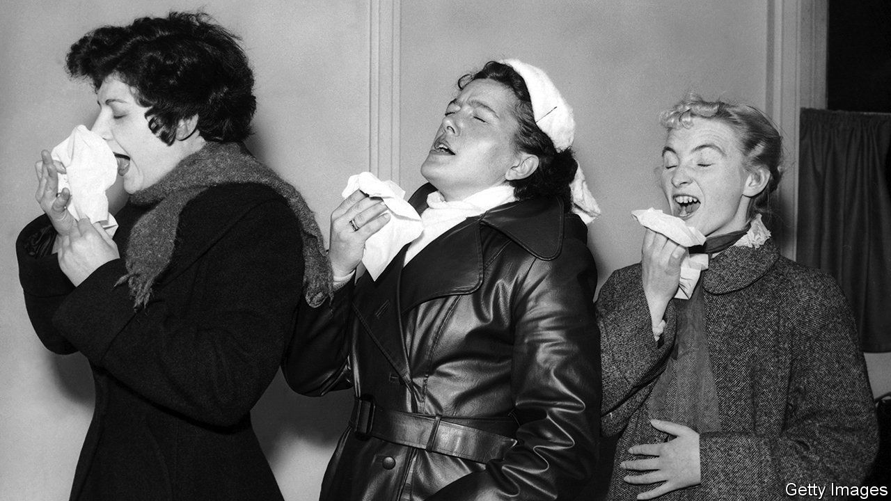
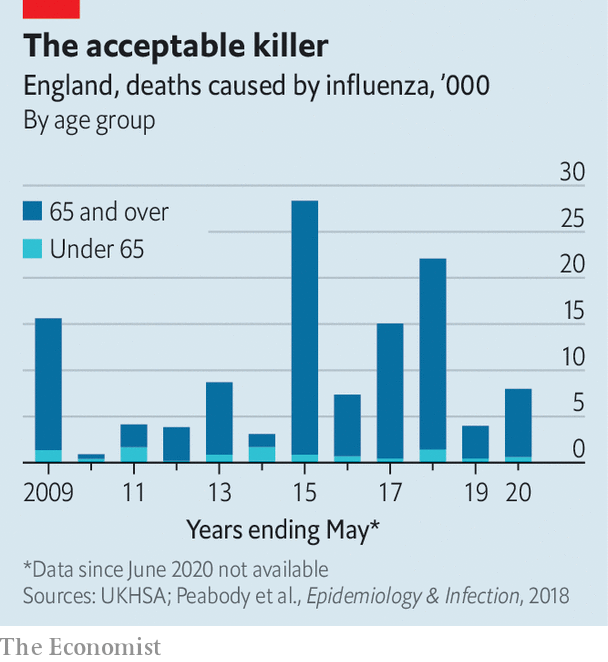

###### Business as flusual

# What if the flu were treated more like covid, not the other way round? 

##### A post-pandemic thought experiment 

 

> May 30th 2022 

The covid-19 pandemic rumbles on. In the week ending May 21st, one in 60 adults in Britain were estimated to be infected; 16,504 people have died with the virus since February 23rd, which was when England’s . But only a new, more harmful variant would prompt a return to the rules of the past. 

The government’s plan is to deal with the disease in a “similar way to other existing respiratory illnesses” such as the flu. In practice, that means less surveillance, fewer vaccinations and a greater willingness to accept infections and deaths. This trade-off seems reasonable to many (though less so to clinically vulnerable people). But dialling down the response to be more like the approach to  is not the only option. Another would be to treat flu more like covid. “There is a fatalism about flu,” says Professor Ajit Lalvani of Imperial College London. “Every year the winter flu season overwhelms the nhs. Applying the lessons learnt through covid could help.” 

If ever there was a time to think differently about the disease, this is it. Epidemiologists worry that two years of low exposure to flu may have caused immunity to wane to low levels. That may result in an extraordinary number of cases this winter, at a point when huge waiting-lists will still clog up the National Health Service (nhs). 

Before asking how things might be done differently, start with how things usually are. Pre-covid estimates based on serological surveys suggest that as many as one in five Britons contract the flu each year. The vast majority of people get a relatively mild illness but for some a trip to the doctor will be needed. A study in 2007 estimated that flu results in some 800,000 visits to family doctors each year. Unlike covid, it particularly affects the very young as well as the elderly: children under 14 accounted for two-thirds of visits. 

If a respiratory infection worsens sufficiently, treatment at hospital is needed. As many as 40,000 people are hospitalised each year with breathing difficulties caused by the flu; the average total in-patient cost is £7,500 ($9,360). Because respiratory infections are slow to shift, patients stay for 11 days on average. Occupancy of the nhs’s 100,000 hospital beds rises from about 88% to over 95% during the winter; flu plays a big part in that. 

 


Official data suggest that, on average, around 500 people died from flu each year in the decade to 2020. But since flu infections are not systematically diagnosed, that number is a massive undercount. To estimate the true number of deaths from influenza, epidemiologists model excess winter mortality, disaggregating flu infections from cold snaps that also lead to death. On this basis an average of 10,000 died each year from flu in the ten years to 2020; in the winter of 2014-15 as many as 29,000 died (see chart). That is fewer than from covid, which is projected to cause 60,000 deaths this year, but hardly trivial. 

Covid shows how the fight against flu could be joined more vigorously. The first line of defence against any virus is a vaccine. As everyone got used to  during the pandemic, the proportion of over-65s who got vaccinated against flu rose to 80% in 2021, meeting the who’s target of at least 75% for the first time. Some protections are now being withdrawn. Adults aged between 50 and 64, and children aged between 11 and 15, were offered a free vaccine during the 2021-22 flu season, but will not be for the coming winter; Britain’s Joint Committee on Vaccination and Immunisation had wanted the programme for schoolchildren to be extended.

The next line of defence is surveillance, to monitor infection rates and emerging strains, and to do a better job of allocating resources. Flu surveillance in Britain, estimated to cost around £1m a year, mostly consists of gathering influenza-like illness data from a sample of gp surgeries and online search trends. According to Professor John Edmunds of the London School of Hygiene and Tropical Medicine: “Flu surveillance is like a net with massive holes in it: nothing gets caught.” 

For covid, in contrast, the Office for National Statistics (ons) takes 75,000 swabs each week to get a representative rate of infection across the whole population, and runs a statistical analysis to model infection rates for different groups of people. The survey costs about £390m a year to administer and may soon be scaled back. But even a pared-back version could test for other respiratory viruses at little extra cost. 

The pandemic also inured people to home-testing. Lateral-flow tests (lfts) exist for influenza, as well as for covid and other diseases, and are sometimes used by hospitals. Making flu and covid lfts available for home use at market costs could reduce transmission, particularly among those visiting high-risk people. Perhaps one-quarter of flu deaths typically occur among care-home residents. 

Finally, the pandemic showed how rapid testing of promising treatments can yield striking results. Large-scale covid trials co-ordinated by academics at the University of Oxford found, for example, that a low-cost steroid, Dexamethasone, reduced deaths by one-third among ventilated patients. Professor Sir Peter Horby, who led the covid trials, says that extending these trials to evaluate treatments for severe flu is a “no-brainer” but he has so far not received funding to do so. 

There is one big way in which the pandemic has made transmission of flu less likely in the future. Among people who have the option to work remotely, 70% told the ons in May that they were more likely, compared with pre-pandemic times, to stay home if they have a cold in the future. Those who do still struggle in are more likely to wear masks than they were. But in other ways, the approach to flu does not seem likely to change markedly. There may be good reasons for this choice but come the winter, it may have consequences. ■

