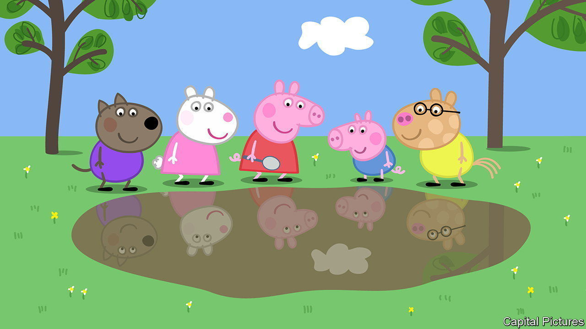

###### Patent aggression

# Has Russia legalised intellectual-property theft? 

##### A new law seems to strip away the IP rights of Western firms 

 

> Jun 2nd 2022 

As its economy was being bombarded with Western sanctions in early March, Russia decided to amend a section of its civil code. The world took little notice of decree number 299, which authorised the use of patented inventions, including in medicine and digital technology, from “unfriendly countries” without asking the owner for permission or paying any compensation. Unsurprisingly, Ukraine, which Russia invaded, is deemed “unfriendly”. So are America and the eu, which are not at war with Russia but are pounding its economy and arming the Ukrainians. 

Russia’s move is not illegal under international law. Countries are allowed to make exemptions to patent rules in a national emergency. Cumbersome paperwork and tedious price negotiations can cause delays. But some compensation, no matter how paltry, is expected. Under Russia’s new law, though, patent holders could get nothing.

Although the law applies only to patents, which protect inventions, it indirectly gives a free pass for other kinds of intellectual-property (ip) infringement. This is because the courts will offer little protection against opportunists, says Maria Ostroshenko, an ip lawyer at alrud, a Moscow law firm. She notes that some Russian judges are now asking why the ip of international companies, including trademarks and copyright, deserve protection. This has never before been in question. 

Western firms are already feeling the shift. In early March Entertainment One uk, the British arm of a Canadian company, lost its case against a Russian rival using a fake Peppa Pig, one of its trademarked cartoon characters. The case was dismissed, says Vladimir Biriulin from Gorodissky and Partners, Russia’s biggest ip firm, because Britain falls into the “unfriendly” camp. When Entertainment One asked for compensation, an arbitration court in Russia ruled that granting such a demand was “an abuse of right” in light of British sanctions. In May a higher court rejected the firm’s appeal.

Facing isolation from the West and friendly courts at home, Russians are feeling emboldened to grab foreign ip. More than 50 applications to register Western brands such as Coca-Cola and Christian Dior were made in the last two weeks of March alone. Patented software and devices whose foreign producers have stopped selling in Russia are likely to be next. On May 6th Russia published a 25-page list of goods that could be imported without permission from the owner. It includes Apple phones, Nintendo game consoles and parts for Tesla cars, as well as weapons and ammunition.

William Miles of Briffa, an ip-law firm in London, reports that all this means his clients have “zero interest” in introducing new trademarks or inventions in Russia. This will chill innovation, predicts Koen Berden of the European Federation of Pharmaceutical Industries and Associations, whose members include Johnson &amp; Johnson, Novartis and Pfizer. The new law is already hurting pharmaceutical research and development, which was starting to recover from years of underfunding and neglect. Most foreign drugmakers are refusing to launch new trials in Russia as long as the war rages on, making it hard for new medicines to get approved. That is unwelcome news for a country that imports nearly 70% of its drugs. ■


