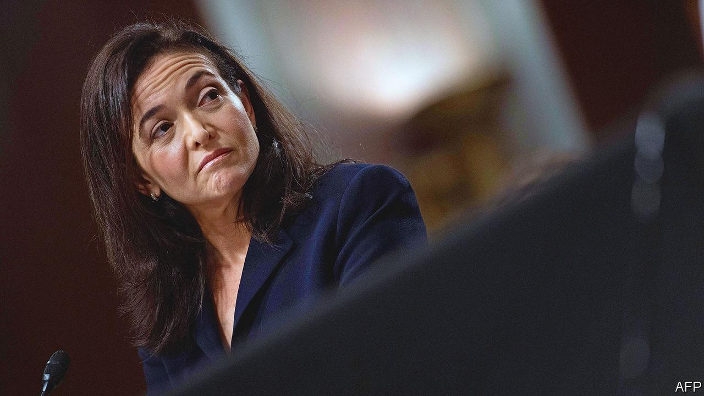

###### Leaning out

# Sheryl Sandberg, Meta’s second-in-command, leaves the embattled firm 

##### Could the move foreshadow an even greater shift towards virtual reality? 

 

> Jun 2nd 2022 

“When i took this job in 2008, I hoped I would be in this role for five years,” wrote Sheryl Sandberg on her Facebook page on June 1st. With that the chief operating officer of Meta, the social network’s parent company, announced her resignation. The year she joined Facebook made $272m in revenue. Last year turnover reached $118bn. Aside from Mark Zuckerberg, Meta’s boss, no one has done more to build the tech behemoth, which boasts more than 2bn users around the world. 

In 2008 Facebook was in its infancy. Mr Zuckerberg, then 23 years-old, had no concrete plans to make it a viable business. Ms Sandberg had been running Google’s advertising operation, after stints at McKinsey, a consultancy, and America’s Treasury. A compulsive organiser, she was brought on to provide adult supervision. She “handles things I don’t want to”, Mr Zuckerberg once said. That included commercial strategy and staffing, as well as politics.

Ms Sandberg flourished in the role. She masterminded the firm’s growth as an ad platform. By 2010 Facebook was profitable. Last year only Alphabet, Google’s parent, earned more advertising revenue. One of her books, “Lean In”, became synonymous with female empowerment in the boardroom. All this helped cement her place as Mr Zuckerberg’s second-in-command.

But over the past few years speculation grew that the relationship was fraying. Mr Zuckerberg apparently blamed Ms Sandberg for a scandal which involved the sharing of Facebook users’ private data with third parties by Cambridge Analytica, a political consultancy. Other reports suggest that the Trump years added extra strain. As a vocal Democrat she became less effective at advocating for the firm in Trumpian Washington. Meta denies there is a problem. Ms Sandberg says she is leaving to pursue her philanthropic work.

The departure comes at a tumultuous time for Meta. Fewer teenagers are signing up to Facebook. Even Instagram, Meta’s youth-friendly platform, is losing out to TikTok, a hipper rival. New privacy rules introduced by Apple allow users to opt out of ad-tracking. That makes Facebook less valuable to advertisers. Meanwhile lawmakers are increasingly concerned about misinformation on social media.

Mr Zuckerberg wants the firm to go all-in on the “metaverse”. Over the past year, the firm has bulked up its virtual-reality teams, ploughing $10bn into the effort. It plans to release four new headsets by 2024. As a digital-ads guru, Ms Sandberg may have found herself adrift at a firm veering towards hardware.

The exit of Mr Zuckerberg’s adult supervisor seems to alarm investors; Meta’s share price dipped by 3% on the news. And it leaves his firm looking like a one-man show. He is the only founder still calling the shots at one of America’s tech giants. Reports were already swirling that his management style had become more iron-fisted, taking big decisions with less counsel. Without his long-term partner, he may start to cut an even more solitary figure. ■


