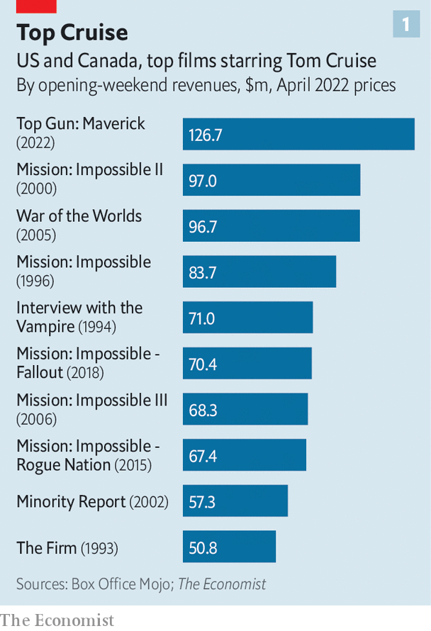
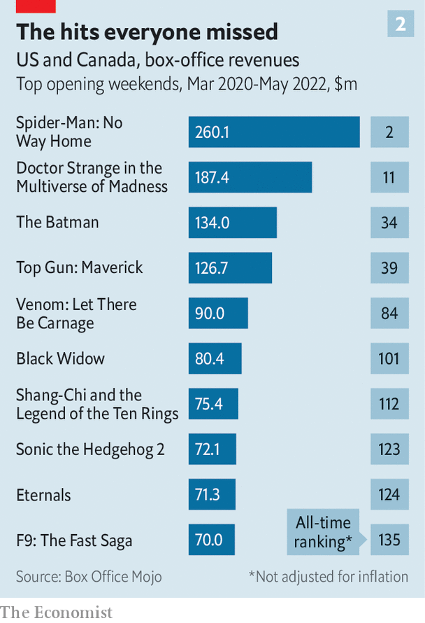
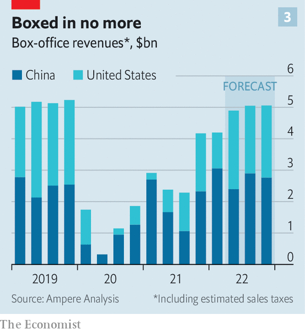

###### The movies

# “Top Gun” flies high, sparking hopes of a theatrical recovery 

##### Will a summer of blockbusters prise consumers off the sofa? 

 

> Jun 2nd 2022 

“Your kind is headed for extinction!” barks a senior officer to Tom Cruise’s hero in “Top Gun: Maverick”, a supersonic action flick released by Paramount last week. “Maybe so, sir,” replies Maverick. “But not today.”

Cinema owners are feeling similarly defiant. Worldwide box-office receipts fell by 72% in 2020, when the pandemic forced film buffs to say goodbye to the silver screen and hello to their sofa. After ticket sales recovered only partially in 2021, many predicted curtains for theatres. Yet “Top Gun”, a sequel to a classic of the genre from 1986, raked in $248m on its opening weekend, the biggest-ever debut for a film starring Mr Cruise. Its domestic haul of $156m over the long weekend broke the Memorial Day record set by one of Disney’s “Pirates of the Caribbean” films in 2007.

 


Theatre owners hope that “Top Gun” heralds the beginning of a broader recovery. It is only the fourth-biggest opener of the pandemic era (see chart 2). However, the other big hits—Sony’s “Spider-Man: No Way Home” last December, Marvel’s “Dr Strange in the Multiverse of Madness” in May, and Warner Bros’ “The Batman” in March—have all been superhero flicks, with young fans. “Top Gun”, by contrast, sold 55% of tickets to over-35s. This suggests that viewers old enough to harbour fond memories of Mr Cruise’s original turn as Maverick 36 years ago are now ready to come back to the movies, too.

 


The recovery is far from complete. This year’s worldwide box office will be only about three-quarters of 2019’s, forecasts Gower Street Analytics, a research firm. China, which these days rivals America as the biggest cinema market, is still locked down and in any case increasingly hostile to Hollywood (“Top Gun” has no Chinese release date). Russia is also off-limits since its invasion of Ukraine. Above all, studios are focusing attention and resources on their streaming platforms, releasing fewer films in cinemas, for shorter runs.

 


The summer release slate is promising: June will see “Jurassic World: Dominion” from Universal and “Lightyear”, the latest in Disney’s “Toy Story” series. “Thor: Love and Thunder”, the next Marvel movie, is out in July. Yet there will be strong reasons to stay at home, too. On the day that “Top Gun” was released, Netflix unveiled its latest season of “Stranger Things” and Disney+ launched a “Star Wars” spin-off, “Obi-Wan Kenobi”. In August Warner Bros Discovery will start a new “Game of Thrones” saga, before Amazon releases a “Lord of the Rings” series in September. This latest adaptation of J.R.R. Tolkien’s fantasy epic is the most expensive piece of television ever made, with a budget around three times that of “Top Gun”. ■


