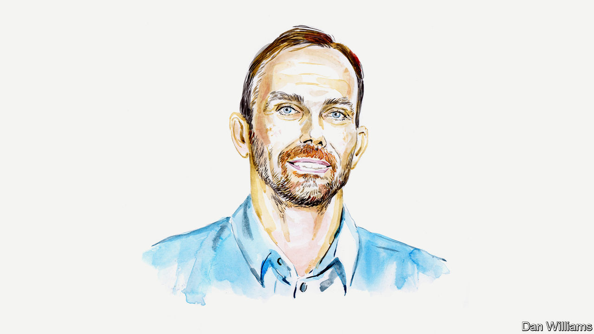

###### Germany and Ukraine

# The German chancellor may be turning a corner, says Thorsten Benner 

##### The analyst says Olaf Scholz has got the big calls right, but has not communicated his policies well 

 

> Jun 1st 2022 

FOR THOSE who have accused the German chancellor, Olaf Scholz, of , or worse, over the war in Ukraine, his speech to the German Bundestag on June 1st was a revelation. Announcing the delivery of fresh arms to Ukraine, Mr Scholz was passionate and combative, rebutting criticism from the opposition in unscripted, lively language. He promised modern air-defence and radar systems to Ukraine, as well as support for America’s efforts to provide rocket launchers.

Mr Scholz would never present it as such, but the speech represented a big pushback at critics of Germany who have been out in force in recent weeks. “Can anyone please share the full text of the Putin-Scholz Pact?”, tweeted Anton Shekhovtsov, a well-known Ukrainian researcher based in Vienna. Gustav Gressel, a researcher with the European Council on Foreign Relations think-tank in Berlin, called Mr Scholz an “enabler of Russian aggression”. President Volodymyr Zelensky himself has hinted at his frustration with German inaction.

Germany certainly deserves its share of criticism. In particular, Mr Scholz has been too cautious about delivering weapons to Ukraine at precisely the moment when they may come in most useful, with Russian troops bedding down in the Donbas region.

Yet some of the attacks have been too harsh. The very fact that Germany is sending heavy weapons to Ukraine marks a major break from its post-war tendency to pacifism. Indeed, that break was explicitly acknowledged in Mr Scholz’s famous “” (“turning-point”) speech on February 27th, also delivered to the Bundestag. In that address, made three days after Russia’s invasion began, the chancellor announced an extra budget of €100bn ($107bn) for the German armed forces, a commitment to meet NATO’s defence-spending target of 2% of GDP, and the construction of two liquified natural gas terminals to help wean the country off supplies of Russia piped gas.

Mr Scholz has skilfully held his three-party “traffic-light” coalition together, and built a close relationship with America’s president, Joe Biden. Despite the charges of critics, the two governments broadly share a common approach to the war. And although Mr Scholz has long shared the miscalculations of Germany’s elite about the country’s crippling long-term dependence on Russian energy supplies, unlike other members of his Social Democratic Party (SPD) he has never had personal ties to Vladimir Putin or sympathy for his political positions. While former politicians such as Gerhard Schröder, the last SPD chancellor, reinvented themselves as Kremlin lobbyists, Mr Scholz, as mayor of Hamburg, delivered a speech in St Petersburg in 2016 criticising Mr Putin’s authoritarian crackdown. He makes an unconvincing pro-Kremlin poster boy.

Those seeking an explanation for the vitriol faced by the chancellor would do better to turn to his dismal communication failures. Passive and undemonstrative, traits typical of his home city of Hamburg, Mr Scholz once dismissed charges that he is too dull to lead by saying he was not seeking to become a “circus ringmaster”. Earlier in his career he  “Scholzomat” for his robotic delivery. A streak of self-confidence that can border on arrogance only infuriates his critics further. His passion is for the daily business of governing, much of it behind the scenes. He communicates results only once they have been secured, which is why, after the  speech, he simply went to work and said little of value in public for weeks.

That was a big mistake. The German public, shell-shocked by the brutality of Mr Putin’s war, was left floundering in its search for guidance. Displays of empathy and political symbolism would have gone a long way under these circumstances. But the chancellor dislikes both. With Ukrainians streaming into Germany he visited a makeshift refugee reception centre in Berlin, but did not want any media with him. Mr Scholz’s stubborn decision not to visit Kyiv, after a diplomatic fallout with the Ukrainian leadership, was a typical misfire: a refusal to bow to public pressure took precedence over the demonstration of a simple but effective sign of solidarity with a country under attack. Nor has the witless performance of the chancellor’s social-media team helped in the face of relentless pressure from Ukrainian officials, including the outspoken ambassador to Germany, and their supporters.

Mr Scholz is unlikely to be able to bring about a turning-point for Germany’s image in central and eastern Europe any time soon. Too much damage has been done over the years on matters such as Nord Stream 2, a gas pipeline connecting Russia and Germany (after much dithering, Mr Scholz scuppered it days before his  speech). Moreover, many foreign observers will see value in keeping up the moral pressure on Germany, as it often seems to deliver results. At home, if war fatigue among citizens starts to bite, the chancellor’s detached style could prove to be an asset. But meanwhile he will find that being a more empathetic listener and a better communicator will start to deliver political dividends. Abroad, he might learn the value of high-profile gestures. A visit to see Mr Zelensky in Kyiv, ideally with the French president, Emmanuel Macron, would be a start. Damage has been done, but it will not be impossible to repair.■

_______________


Thorsten Benner is the director of the Global Public Policy Institute in Berlin.


