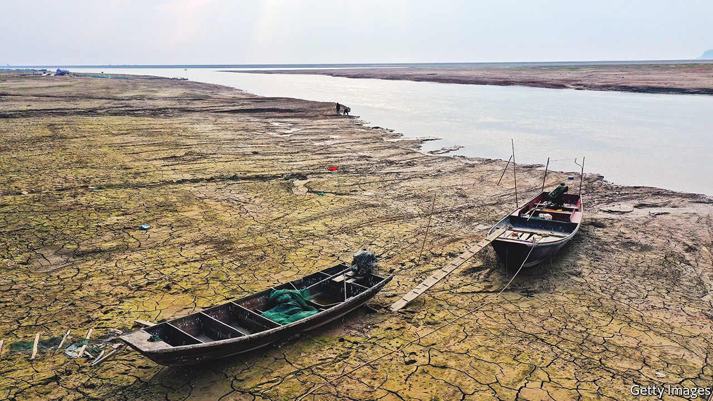

###### Down with the tyrants

# China’s war over sand 

##### The dark side of China’s property boom 

 

> Jun 2nd 2022 

Environmentalists have long fretted about soaring global demand for sand. It is used to make the concrete that is being poured into the world’s expanding cities, often at the expense of vital ecosystems such as rivers and lakes from which the material is extracted. No country is hungrier for it than China, where the damage caused by rampant illegal mining has been enormous. In March the Communist Party’s mouthpiece, the , called it “irreparable”.

The central authorities are trying to impose better order. Since 2000 they have declared various curbs on sand-dredging in the Yangzi river, where extensive mining has threatened embankments used to prevent potentially catastrophic floods. But restrictions have driven diggers elsewhere: many to the country’s largest freshwater lake, Poyang (pictured). This expanse of water changes in size seasonally to a maximum of about 4,500 sq km, roughly three times the area of Greater London. The fluctuations help to regulate the Yangzi’s flow, but sand-mining is hindering this function. In May officials released an environmental study on a proposed remedy: a 3km dam. It did not impress China’s small band of green activists. They fear the structure could make matters even worse for Poyang’s beleaguered wildlife, including rare cranes and porpoises. 

Last year the central government launched new campaigns against unauthorised mining, beginning in March with a crackdown along the Yangzi. This included seizing and scrapping hundreds of dredging boats and sand barges that had been operating illegally on the river. In July they declared a year-long nationwide war on , or “sand tyrants”, and , or “mine tyrants”, who extract other minerals. The names refer to the mafia-like control they exert over mining in their areas. Thousands of suspects have been arrested so far. Last year more than 1,200 officials were prosecuted for being the “protective umbrellas” of such criminals. In August the authorities began another year-long operation aimed at illegal dredging, this time covering all rivers in China. 

In April the un’s environmental agency, unep, warned of a looming “sand crisis”. It said ill-regulated extraction in many countries was fuelling violence, making coastlines more vulnerable to rising sea levels, and exacerbating floods. But to Chinese city-dwellers—the main beneficiaries of the country’s sand-fuelled building frenzy of recent decades—these concerns may seem remote. To some of them, at least, it is not the mining of sand but getting their hands on it that makes them anxious. 

Officials also use the term  to describe a kind of criminal who can make life hell for the buyer of an urban flat. These are often sold as empty shells: walls need plastering, flooring must be laid. Much sand and cement is needed. In collusion with the property-management firms that look after apartment blocks, a  gang will demand that such materials are bought only from them. They are usually low-quality and overpriced. Anyone who tries to get them from another source will be beaten up. 

China’s property market has been hammered by pandemic-related lockdowns and state efforts to rein in developers’ debt. But the  can wait.

