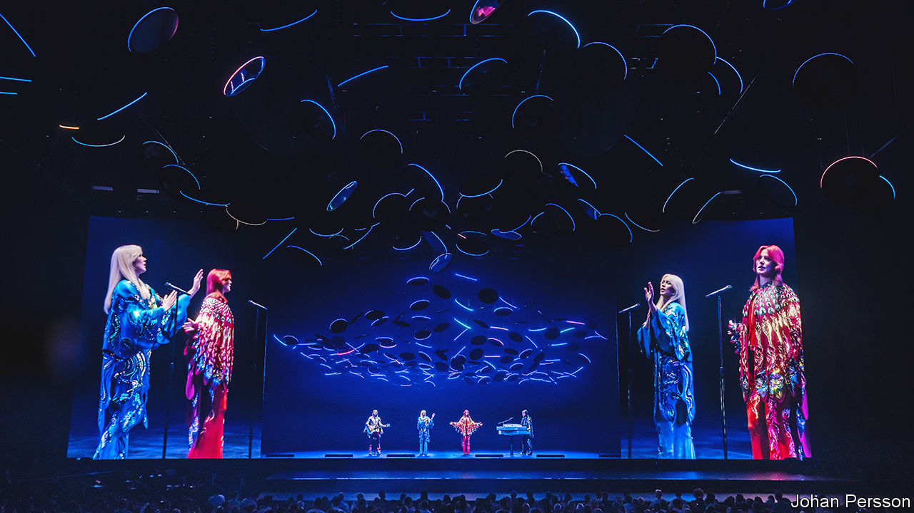

###### The new ventriloquists

# ABBA and the rise of the work-from-home rock star 

##### Musicians are finding profitable ways to perform remotely to their fans 

 

> May 27th 2022 

Thursday night and the lights are low, as the four members of abba, one of the most successful musical acts in history, take to the stage for the first time in nearly 40 years. Or do they? To the crowd at a purpose-built arena in east London, abba’s quartet—Agnetha, Björn, Benny and Anni-Frid—look authentic, their sequinned dresses and feathered mullets swaying to the beat provided by a live band. Yet the singers are computer-generated illusions, captured as they looked in 1979, and their voices a blend of recordings from nearly half a century ago. The virtual “Abbatars”, who played their first concert on May 26th, will perform seven shows a week while the human band members stay at home and collect the royalties.

Concertgoers got used to digital performances during the lockdowns of 2020-21, when in-person gigs were not possible. Since the relaxation of covid rules, people have returned to shows in person. But even as live music roars back, some digital innovations are here to stay. Selling tickets to online video-streams of live gigs has become standard. Online gaming platforms are experimenting with hybrid music-gaming experiences. Musicians are realising that, pandemic or not, there is money to be made in performing gigs without being physically in front of the audience.

abba’s extraordinary new show, “Voyage”, goes even further. It demonstrates the potential for a new category of event that is at once in-person and virtual. abba’s reanimation took six years and cost £140m ($175m), a third of which went on the high-tech London stadium. The band members spent five weeks performing on a stage in Stockholm, in front of 160 cameras operated by Industrial Light and Magic, a visual-effects company that has previously brought to life Jedi knights and Avengers.

Their rejuvenated virtual selves are eerily real: dancing, jiving and, between songs, joshing with the crowd (virtual Benny insisting that he is the real thing: “I just look very good for my age”). On the opening night the audience, which included the king and queen of Sweden, suspended their disbelief, unselfconsciously cheering and applauding what was, strictly speaking, an empty stage.

Most high-tech concerts are nothing like as sophisticated as the abba show. But basic digital services are changing the economics of even ordinary gigs. In the early days of lockdown, singers live-streamed impromptu concerts from their bedrooms on online video platforms such as Twitch. They soon realised that, when competing for screen time with the likes of Netflix, “you need it to look as cinematic and as spectacular as the latest blockbuster,” says Ric Salmon of Driift, one of several firms that sprang up in 2020 to help musicians stream professional-looking gigs. As shows got slicker they charged more: whereas in April 2020 only about 1% of live-streamed concerts were ticketed, 18 months later nearly half were, at an average price of $16, says Tatiana Cirisano of midia Research, a firm of analysts.

The number of live streams fell by about half last year, as life got back to normal. But acts have continued to make money from online gigs—and they expect to make more. In March bts, a Korean pop sensation, streamed a concert for 2.4m paying viewers online and in cinemas. By 2028, according to midia, live-streamed concerts will generate $4bn-5bn a year, more than at the height of the pandemic. Last year Live Nation, the biggest live-entertainment company, acquired Veeps, a live-streaming startup. Spotify and Deezer, subscription music services, have both done deals with Driift. 

The name of the game

A recent tour by Little Mix, a British pop group, gives an idea of the new normal. The trio played 24 dates in April and May, in arenas packed with giddy teenagers. They commissioned Driift to live-stream the final show, which sold nearly 60,000 tickets at £13 to fans in 143 countries. Another 29,000 paid to watch the feed in cinemas, suggesting total streaming ticket sales of a little over £1.1m. Producing the live video cost about £250,000. “There’s nothing like being in the room,” says Steve Homer, the chief executive of aeg Presents, a live-events giant which promoted Little Mix’s in-person gigs. But streaming has become “a good bolt-on”.

Some artists see it as more than that. As social media have squeezed musicians into ever shorter formats, an hour-long video-concert is “an opportunity to create beautiful long-form content”, says Mr Salmon. Digital gigs also provide artists with more data about their fans.

Meanwhile, a new breed of online gaming experience is allowing some artists to transcend the constraints of real-life shows. In concerts held on Fortnite, an online video game, Travis Scott has mutated into a giant and Ariana Grande has sprouted wings and let her fans ride flying unicorns. Roblox, another gaming platform, hosted a Wild West-themed concert in which Lil Nas X appeared as a colossal cowboy. Minecraft, a world-building online game, has held music festivals. No one thinks such shows are substitutes for in-person performances, but they seem to be outliving the pandemic as an evolving entertainment category in their own right.

These varied formats and technologies hold out the tantalising prospect for fans—and concert promoters—of more opportunities to see artists perform. Life on the road is draining, especially for ageing stars or those with children. abba’s virtual show is in some ways an extension of its early adoption of the music video in the 1970s, which helped the band become world-famous despite doing only a handful of international tours. “Voyage” can play to hundreds of thousands of fans a year for as long as the band members—or perhaps, one day, their estates—choose.

In theory there is no limit to who could take advantage of this technology. Already Whitney Houston, who died in 2012, performs six nights a week in a Las Vegas hotel, in what the show’s organisers describe as “holographic” form. Buddy Holly, Roy Orbison, Maria Callas and Tupac Shakur have been brought back for similar posthumous concerts. 

The abba concert shows how to optimise the effect. The proof of the show’s persuasiveness came at the end of the premiere when, after a closing rendition of “The Winner Takes It All”, the Abbatars departed and the real abba members came on stage to take a bow. It was the final trick played on the audience: the “real” band members turned out to be another illusion. They vanished and the -real abba came on stage, to a wild ovation.

“Voyage” had sold more than 300,000 tickets before its opening night; the 3,000-capacity London arena is almost fully booked for summer. A quarter of the tickets have been bought by fans overseas. If the Abbatars are a hit they may perform simultaneously in other cities: the advantage of virtual talent is that “you can just copy-paste them”, says Svana Gisla, a producer of “Voyage”. (What’s more, she adds, “they don’t take days off and they don’t get covid.”) Entertainment companies have sent scouts to the show. It may give other ageing rock stars something to ponder.

Ludvig Andersson, Benny’s son and a producer of the show, is also trying to wrap his mind around the experience of working alongside a recreation of his 33-year-old father. Digitally capturing the band members reminded him of the “19th-century idea of a camera sucking out your soul…That’s exactly what we did.” He has come to think of the Abbatars as individuals in their own right: a “combination of them being abba and them being themselves…A ghost in the machine.” Whoever or whatever they are, the troupers, immortalised in 120 terabytes, are destined to go on entertaining new audiences, frozen for ever in 1979. ■

