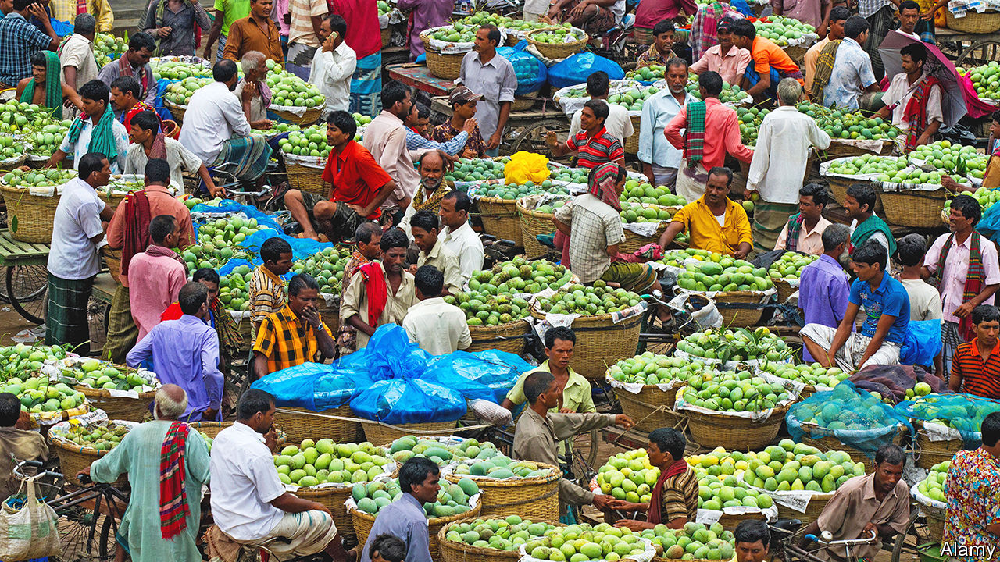

###### Stuck in the middle with you

# The problems with complex supply chains 

##### In a new book Kathryn Judge lays out her criticisms of the “middleman economy” 

 

> Jun 2nd 2022 

By Kathryn Judge. 

In 2011 there was an outbreak of in Germany. Thousands of people fell ill. The authorities suspected that salad ingredients were to blame, but did not know which ones were contaminated with the bacteria. Their initial guess was Spanish cucumbers—and so European consumers avoided that country’s fresh produce. Only later did the authorities find that salad sprouts grown in Germany were to blame. 

The reason for the confusion, argues Kathryn Judge, a professor at Columbia Law School, was the complex supply chains that have developed in the global economy. It is not easy for regulators, let alone consumers, to know where goods come from. She draws a parallel with the subprime-mortgage crisis of 2007: loans had been repackaged so many times that investors were far from sure which financial products, and which banks, were safe. So they avoided them all, thereby exacerbating the panic.

These supply chains have evolved in the name of economic efficiency. But Ms Judge suggests they are inherently fragile and that their opacity can mask the costs paid by consumers—and the profits made by intermediaries—as well as the environmental damage they cause. In addition, what she calls the “middleman economy” has led to the emergence of powerful intermediaries such as Amazon or Walmart. These companies may offer low prices to consumers, but their relentless focus on costs may have adverse social effects in the form of low wages or poor working conditions at their suppliers. 

Ms Judge urges readers to buy directly from suppliers when they can, noting that only 15% of the money consumers spend on food goes to the farmer who grew it. One initiative the author recommends is “community supported agriculture”. At one such site, Genesis Farm in New Jersey, more than 300 families come each week to pick up a basket of vegetables. They have no choice over which items they get: that depends on the weather, the season and the farmer’s planting decisions. In return, however, consumers get fresh produce and the prospect of a healthier diet.

All this may be very commendable, but the scale of such projects is inevitably limited. It would hardly be practical, let alone environmentally sound, for everyone who lives in Manhattan to trek out to New Jersey to buy their produce every week. When you contemplate all the items in a typical supermarket trolley, it is clear that most consumers will simply not have the time or the resources to buy more than a handful of items directly from the suppliers. 

And while complex supply chains have their drawbacks, relying on a single supplier can be problematic, too—as European countries dependent on Russian gas know only too well. More consumers bought their food directly from local suppliers in the late 19th century, but that was an era marked by adulterated products and outbreaks of food poisoning. 

As a concept, the “middleman economy” is a little imprecise. There have been middlemen around since ancient times in the form of merchants. Retailers are middlemen, as are banks. But Ms Judge is right to point out that intermediaries have acquired a lot of power in the modern economy. She offers guidance for policymakers, including making sure “existing antitrust laws are applied with rigour”. Consumers, too, should be made more aware of the role intermediaries play, the associated fees and the working conditions at the original suppliers of the goods they buy. ■

