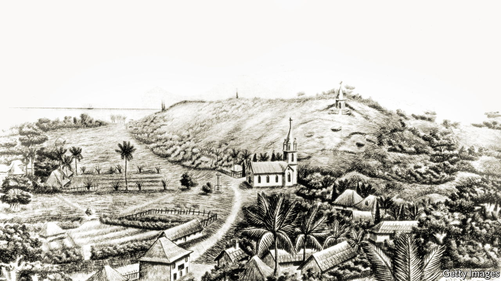

###### Banishment

# The story of three 19th-century dissidents sent into exile 

##### William Atkins brings together the tales of Dinuzulu kaCetshwayo, Louise Michel and Lev Shternberg with reflections on belonging 

 

> Jun 2nd 2022 

By William Atkins. 

Ovid was banished to the outer reaches of the Roman Empire in 8ad for what he called —a poem and a mistake. The exact nature of his transgression is disputed, but the suffering he endured hundreds of miles from Rome is not: on the shores of the Black Sea, he spent his final years writing about the pain of being separated from his beloved city. 

As the ancient world’s best-known deportee, Ovid is often invoked by those who write about displacement. They look at his outpouring of nostalgia—in its original meaning of homesickness—and his descriptions of sadness. He wrote in one letter, for example, about feeling dismembered by exile, seeing himself as a metaphorical Mettus. (The character in Virgil’s “Aeneid” was torn apart by chariots after betraying Rome.) “A part of me”, he wrote, “seemed wrenched from my body.”

Given Ovid’s status as a famous exile, it is unsurprising that William Atkins’s new book about the subject makes good use of him. In “Exiles: Three Island Journeys”, the author takes the Roman poet as his “guiding spirit”. But while his literary forebear will be known to many readers, the same cannot be said for the three people whose footsteps he decides to retrace. 

The trio were all sent to remote islands in the late 19th century by different imperial powers. Louise Michel was exiled to New Caledonia in the Pacific for her role in the short-lived Paris Commune, an insurrection brutally quashed in 1871. Dinuzulu kaCetshwayo, a young Zulu king deemed a threat to British colonial interests, was dispatched almost two decades later to St Helena, the South Atlantic outpost where Napoleon Bonaparte had been held. And Lev Shternberg, a Ukrainian-born anti-tsarist who had previously languished in jail in Odessa, was shipped to Sakhalin, an island off the east coast of Siberia. 

Although life in these far-flung places was supposed to cure them of their perceived troublesomeness, it actually did little to dampen their resolve. On her return to France, Michel resumed campaigning and writing and was detained again for her commitment to revolutionary ideals. Dinuzulu, back near his ancestral homeland, reinvigorated his people’s desire to oppose colonialism. As a result, he was sent into exile once more, dying in 1913 at a farm in the Transvaal, a province of South Africa. 

Mr Atkins visits New Caledonia, St Helena and Sakhalin on his travels, weaving together a layered portrait of the exiles’ personalities, back stories and interests. He shows that, like Ovid, they contended with sorrow and heartache. But they also found new hobbies to pass the time: Michel became an enthusiastic botanist, Dinuzulu learned the piano and Shternberg began to study indigenous cultures.

With a discerning eye, the author gives sharp—and gracefully written—observations about his own experiences, including asides on dreary Sakhalin villages and disillusioned British expats on St Helena. As his trip to New Caledonia coincides with an independence referendum, he also provides a gripping account of the antagonism between the indigenous Kanaks and French settlers, tensions that would have been recognisable to Michel, an ally of the locals, roughly 150 years earlier. 

Unlike her two fellow 19th-century deportees, Michel grew fond of her surroundings in exile. She looked back warmly on her life in New Caledonia, once referring to the Pacific island in her correspondence as “home”. It is this word that Mr Atkins’s brilliant travelogue deftly explores, teasing out the nuances of what he describes as “the conflict between leaving and staying that seems to animate the world”. In his reflections on belonging, the author himself feels the tension between remaining and going because his father’s illness worsens during his travels. Such grief adds to the emotional depth of his study into dislocation and loss. “One reason stories of exile move us”, he suggests, “is that they seem to acknowledge the unhealable ruptures in our own lives.” ■

