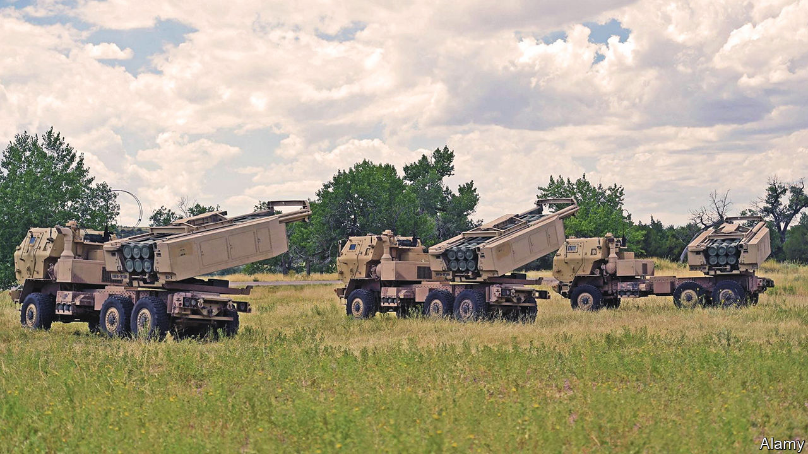

###### Weapons upgrade

# America sends advanced missiles to help Ukraine fend off Russia 

##### They have been a long time coming 

 

> Jun 1st 2022 

Ukraine’s defence ministry recently released unusual aerial footage of the war in Donbas. It did not show Ukraine’s successes against Russia, but rather its vulnerabilities: pockmarked fields being blasted by salvos of incoming Russian rockets. “This is what the largest and most horrific war of the 21st century looks like,” said the tweet on May 26th. “Ukraine is ready to strike back. To do this, we need nato-style mlrs. Immediately.”

Belatedly, Western allies are responding. President Joe Biden announced on May 31st that he would send “more advanced rocket systems and munitions that will enable them to more precisely strike key targets on the battlefield in Ukraine.” The Pentagon said it would send a first consignment of four m142 High Mobility Artillery Rocket Systems (himars), currently pre-positioned in Europe. Each carries a pod of six gps-guided missiles, accurate over distances as far as 70-84km—about three times the range of the howitzers that America has supplied thus far. Reports say Germany and Britain are likely to provide himars’s older cousin, the m270 Multiple Launch Rocket System (mlrs), which fires the same family of missiles.

Given that Ukrainian troops will require three weeks of training, the weapons may arrive too late to save the city of . And himars comes with conditions. America will not provide the bigger Army Tactical Missile System (atacms), which has a range of about 300km. And Ukraine has had to promise not to fire the weapons at Russian territory.

As the war has shifted from close-in battles around Kyiv and Kharkiv to artillery duels in the open terrain of Donbas, the Russians have made use of their overwhelming firepower, including rocket artillery such as the Uragan and the Smerch, which are less accurate and slower to move than himars. Ukraine has some of these too, but struggles to get new supplies.

Why the delay in providing the more effective Western systems? American officials say they had to wait for the money—supplemental funding of $40bn in humanitarian and military aid for Ukraine was only signed into law on May 21st—and were giving priority to weapons that Ukraine could use quickly. But America is also worried about escalation with Russia.

Writing in the , Mr Biden was at pains to reassure the Kremlin. America sought neither war with Russia, nor to unseat President Vladimir Putin. Unless nato were attacked, it would not be directly involved in the conflict. “We do not want to prolong the war just to inflict pain on Russia,” Mr Biden wrote. He also warned of “severe consequences” if Russia used any kind of nuclear weapon.

Built on the chassis of a Bradley tracked armoured vehicle, mlrs carries two pods, with a total of 12 missiles. Early versions fired “dumb” rockets that scattered bomblets over wide areas. Later munitions, called gmlrs, were guided by satellite; cluster warheads were superseded by tungsten balls (akin to a shotgun) or single warheads (aka “the 70km sniper rifle”). himars packs less punch, having just one pod, but is wheeled rather than tracked, and is faster. It can thus “shoot and scoot” more nimbly to avoid counter-battery fire. 

Jeff Edmonds of the Centre for Naval Analyses, an American think-tank, argues that gmlrs will be of most use against command-and-control centres and other “high-value targets”. To be most effective, they will need to be combined with drones and other means of target-spotting. Despite talk of himars being a “game-changer”, Colin Kahl, the Pentagon’s under-secretary for policy, is cautious about its impact. “No system is going to turn the war. This is a battle of national will,” he says. “It is a grinding, hard conflict…it will stretch on for a long time.” ■


