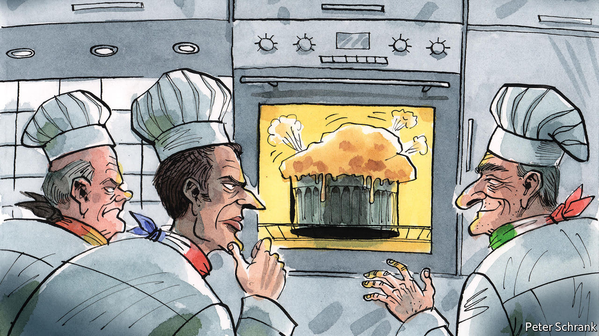

###### Charlemagne

# Europe is squabbling—but remains united where it really matters 

##### A new sanctions package belies complaints of internal rifts 

 

> Jun 2nd 2022 

Unity among the nations of Europe is like a French First comes the impressive puff, then, inexorably, a graceless sagging as the dish is tested by time and cutlery. Both the diplomat and the diner are then left wondering whether the whole thing was worth whipping up in the first place. Russia’s invasion of Ukraine on February 24th jolted Europe into unity. Acting as one made the eu into something akin to a geopolitical power, albeit precariously. As expected, 100 days later that unity looks somewhat punctured. Intra-European squabbling has resumed, and is now quite loud. But what sounds like serious discord must be interpreted by European standards. In the ways that matter, continental unity is holding up rather well.

Europe has more potential rift lines than national dishes. To oversimplify, in past crises the division has often been between flinty northerners who resent being made to pay for ever more costly European schemes—bail-outs, stimulus packages and so on—and spendthrift southerners. Over Ukraine, by contrast, the main fissure has been between east and west. Eastern hawks, notably in Poland and the Baltics, fear that anything other than an unambiguous defeat of the Russian invasion will encourage Vladimir Putin to attack them next. In their eyes the traditional powers that dominate the eu are showing insufficient steel in their support of a neighbour under attack. France, Germany and Italy, they mutter, are complacent about the threat Europe faces, and would rather chit-chat with Mr Putin than stand up to him.

Some of the criticism aimed at the “old Europe” trio, to revive a phrase, is warranted. Olaf Scholz, Germany’s chancellor, sometimes declares that Mr Putin must not win and at other times sounds like an otherworldly peacenik. “Can violence be fought with violence?” he recently mused. Promises of German arms deliveries to Ukraine have not always been followed up with actual deliveries. France has sent advanced kit into battle, but President Emmanuel Macron has also warned that Russia should not be humiliated. Mr Macron is using the war to promote his idea of “strategic autonomy” (ie, a Europe that depends less on America). Mario Draghi, the Italian prime minister, has pleaded with Europeans to crank up the pressure on Russia rather than chill with the air conditioning afforded by cheap energy—while Russian crude exports to Italy have in fact increased, and some Italian firms have bowed to the Kremlin’s demand for payment in roubles. 

All three leaders sporadically call for a ceasefire. The hawks object that this would mean accepting Mr Putin’s theft of Ukrainian territory, and giving his forces a chance to dig in, regroup and attack again. Worse, Messrs Scholz, Macron and Draghi regularly speak to Mr Putin, which the hawks deride as pointless, counterproductive or bordering on treasonous. None has yet been to Kyiv, a city that eastern European leaders (and Britain’s Boris Johnson) visited while rockets still rained on it. Of the big western European powers, only Italy is overtly pushing for Ukraine to become a candidate for eu membership, something easterners fervently desire. 

These rifts are not imagined—even if some of the charges against the old guard are. Reports that Italy had sought a sanctions carve-out for its luxury-goods exports to Russia turned out to be bunk (and Mr Draghi used his central banker’s wonkishness to devise painful sanctions on Russian foreign currency reserves). Charges that Mr Macron tried to nudge Ukraine into giving up territory for peace look similarly flimsy; he has made clear time and again he is speaking to Mr Putin at the behest of Ukraine. Germany has been least successful in dodging criticism. But kinder analysts point out that the overhaul of its foreign and defence policy, known as and including a €100bn ($107bn) boost to its armed forces, was never likely to achieve overnight results.

More importantly, the spiky intra-eu rhetoric is not blocking co-operation. Where it matters, Europe has shown unity. On May 30th, in their fourth meeting since the invasion, European leaders agreed upon stiffer sanctions against Russia. Their sixth such package included an embargo on most imports of Russian crude oil. That the deal took several weeks to come good was not because France or Italy demurred, but because the Putin-friendly regime in Hungary played hardball, threatening to veto the whole thing. Hungary depends on Russian oil delivered via a pipeline, which is now much cheaper than other sources. It won an exemption from sanctions for piped crude. As with any eu policy, oil sanctions would not have been seriously considered, let alone passed, without the encouragement of the biggest countries. Nor would €9bn in financial aid to Ukraine have been mobilised without the consent of the three biggest contributors to the club’s budget.

A lot of hot air

Europe has a propensity to look more fractious than it is. Democracy is always noisy; a union of 27 democracies even more so. Leaders who snipe at each other on the European stage are often playing to a domestic audience, while forgetting that their neighbours also have domestic politics. Every time Mr Draghi publicly favours delivering weapons to Ukraine, say, he is taking a political risk: the Northern League and Five Star Movement, the two biggest parties backing his fragile coalition, are vocally against it. In eastern Europe, where the public eagerly reach into their pockets when asked to donate money to buy weapons to pummel Russians, leaders lose no votes by sounding hawkish.

How long will unity last? An obvious next step would be for the eu to slap sanctions on Russian gas, which the Kremlin would struggle to reroute to other clients, but which European customers (not least German ones) would also struggle to replace. The possibility seems distant at the moment—but then again, so did an oil embargo a few weeks back. As the struggle continues to stop Russia from biting chunks out of its neighbours, European unity will be further tested. But so far, it seems to be holding. ■


