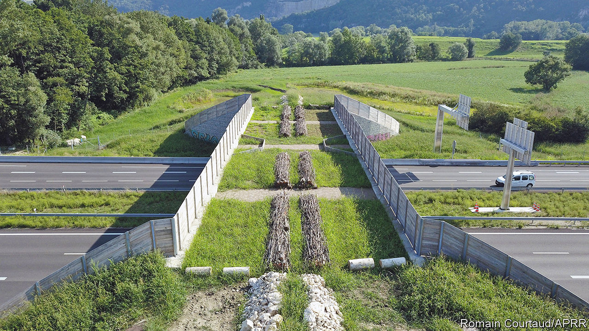

###### For hedgehogs, not road hogs

# France is building overpasses to reduce roadkill 

##### It has a long history of eco-bridges 

 

> Jun 2nd 2022 

Motorists heading from Paris to the Mediterranean on the  this summer may be surprised by the proliferation of bridge-building over France’s main north-south artery. The intended beneficiaries are more unexpected still: hedgehogs, badgers, wild boar, weasels, deer and other furry, spiky or slimy things. Between 2021 and 2023, 19 new , or wildlife bridges, will be built over the a6 and other motorways operated by aprr, a private firm, at a total cost of over €80m ($86m). This will bring its network of green bridges in France to 119. 

Designed to reduce roadkill and help animals roam more freely, wildlife bridges have become popular from Canada to Australia. In France they have a long history. aprr built its first, near Fontainebleau, in 1960. Early versions were rudimentary. Today’s models, such as the one under construction to connect forests near Chagny, in Burgundy, are deluxe: 25 metres wide, complete with a pond for frogs and other amphibians, opaque wooden-fenced sides to shield the passing critters from the glare of headlights, and carefully laid piles of rocks and branches and landscaped vegetation. Pedestrians are banned.

Every year an estimated 29m mammals are killed on roads in Europe. It is hard to say how many are saved by . A study for Vinci, another French motorway operator, found that between 2011 and 2015 each of its green bridges was used each year on average by 1,086 red deer, 150 wild boar, 104 roe deer, 48 foxes, eight badgers, four weasels, one hedgehog and one wolf. Smaller mammals and reptiles preferred underpasses: on average 189 badgers (as well as 37 weasels, 37 genets and five fire salamanders, among others) crossed via each of its motorway tunnels.

Private motorway operators are making these hefty investments in order to green their reputations and keep their state-awarded operating concessions. Governments too have been building eco-bridges. Sweden is putting up “renoducts” to help migrating reindeer. Germany has built more than 80 wildlife crossings, which have helped to protect the grey wolf. Green campaigners approve, but add that fewer cars on the roads would be better still.

