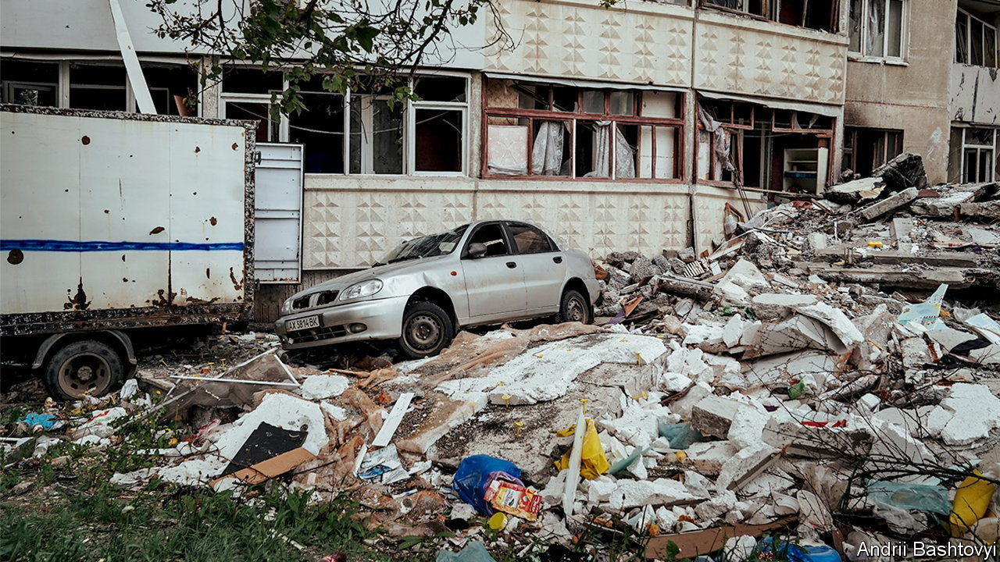

###### Tragedy on Shakespeare Street

# How war has changed Ukraine’s second city 

##### In Kharkiv, Vladimir Putin has “liberated” thousands from their lives and homes 

 

> Jun 2nd 2022 

Quick thinking saved Yulia Rebenko from probable death. She ran from her kitchen to the bathroom as soon as she heard the first thuds. By the time the  reached her flat on Shakespeare Street on the afternoon of May 26th, slicing through the chestnut trees to land outside her window, Ms Rebenko was two walls away from the impact. She walked away with minor cuts. At least nine others ended up in the morgue. 

Ukraine’s second city, a proud, gutsy, working-class centre, faces a most uncertain future. Because it is only 40km from Russia, few thought Kharkiv stood any chance of withstanding an invasion. In the event, enemy armour was inside the sprawling city boundaries within the first three days. But a combination of spirited resistance and a reluctance by Moscow to commit the kind of forces needed to encircle the city meant Kharkiv somehow survived. In mid-May Ukraine counter-attacked and retook several villages to the north and north-east. Many people began to hope normal life was possible; some even began to return home. The reality has proven more sobering. The northern parts of the city remain within range of Russia’s long-range artillery, as the Shakespeare Street attack demonstrated. The Russians are digging in, reinforcing their positions in a way that will make pushing them back again very difficult.

Governor Oleh Synyehubov says the battle for Kharkiv does not look as though it will end soon. “We understand it isn’t a one-month story, and we will need to live within this new reality,” he says. He has been without an office since a Russian cruise missile took out his headquarters in March. Just over half of Kharkiv’s 1.5m people have left. Everyone who remains is vulnerable to Russian jets, rockets and, in places, artillery; he wants them to stay at home unless they have an urgent need to be on the streets. Some appear to be heeding his advice. But others defiantly ignore it. The Ditch, a cocktail bar 2km from Shakespeare Street, continued with its plans to re-open after three months despite the renewed missile strikes. “Artillery doesn’t faze us any more,” said Daria Taran, barman and co-owner. “We know a missile might have our name on it. But that’s fate.”


Over at the city’s gigantic Barabashova market, once the beating heart of Kharkiv trade but now mostly reduced to scorched rubble, a couple of shopkeepers are daring to set up again. Iryna Petrovna has returned to sell flasks and metal pans. Her inventory is Chinese, and with Ukraine’s ports under Russian blockade, she knows she is unlikely to get new stocks. “We’re scared as hell, but what else can we do? We need to work.” 

The market lies at one end of the sprawling Saltivka district—a tough, Soviet-built prefab jungle that owing to its position in the north of Kharkiv has borne the brunt of Russian violence. It used to be called the Moscow district, but like many other Russian-themed names, that has changed. In safer parts of the city, people are returning, but here the traffic is one-way. Residents are returning to pick up whatever possessions they can before scarpering: paintings, televisions, fridges, air-conditioning units, toilet fittings. Alla Yaroslavtseva, 57, emerges from the charred ruins of 80 Natalii Uzhvii Street clutching a handful of memories. She doubts that she will ever return. She worked all her life to buy her flat outright in the hope that she could pass it on to her children, she says. “Now I have to start again because the fucking Russian World decided to come and liberate me. From what? From my apartment? From my home?” ■


