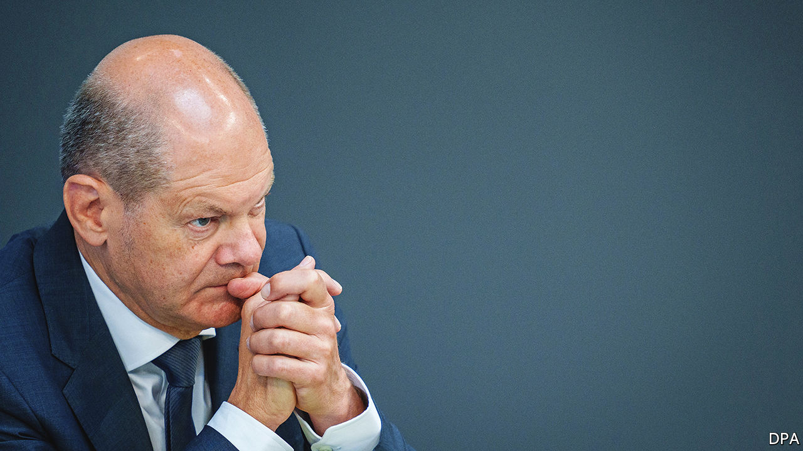

###### Germany and Ukraine

# Olaf Scholz’s dithering is damaging Germany’s international image 

##### Especially in eastern Europe 

 

> May 31st 2022 

“The war raises many questions. Can violence be fought with violence? Can [true] peace only be established if force is not employed?” This pronouncement by  raised a fair few eyebrows when tweeted, in a cryptic translation from the original German, by Germany’s delegation to nato. The delegation failed to explain that the chancellor had been speaking at a convention of German Catholics. It was a gathering of pacifists (who, as it happened, spent most of their powwow discussing whether Jesus was transgender). So perhaps Mr Scholz was questioning pacifism, rather than endorsing it? It was just one of countless examples of the German leader’s inept communication over the war in Ukraine.

Germany is getting criticism from many sides for its apparent reluctance to  with , which is tarnishing its reputation within the eu and nato. “Germany ‘breaks its promise’ to give Kyiv more heavy weapons,” declared a recent headline in the. “There is a clear absence of political will within the German government to deliver heavy weapons to Ukraine,” lamented Andrij Melnyk, Ukraine’s ambassador to Germany, to , an online newspaper. 

In fact, even in proportion to its mighty economic size, Germany is more or less in line with the average member of the eu in providing hardware and funding for military equipment, though admittedly much of it has still to arrive in Ukraine. But despite this, Mr Scholz keeps being singled out for a lack of leadership and courage because he has two big problems, according to Wolfgang Ischinger, a former chairman of the Munich Security Conference. One is the poor communication. The other is that many members of Mr Scholz’s Social Democratic Party (spd) do not support the huge rearmament that is central to the new foreign and security policy he outlined in what has been dubbed his  (“historic turning point”) speech, made three days after Russia’s invasion began on February 24th. As a result, his party is slowing down the implementation of the new policies. It is perhaps for fear of alienating its members even further that Mr Scholz has been so reluctant to say clearly that Germany is now supplying light and heavy weapons to Ukraine because it wants Ukraine to win the war.

In a big debate in the Bundestag on June 1st the chancellor recited a long list of the weapons that Germany has already sent to Ukraine. It includes some 2,500 anti-aircraft missiles, such as Stingers, thousands of anti-tank weapons (many of which, however, turned out not to work), over 15m rounds of ammunition, 54 m113 light armoured vehicles (with Denmark), machineguns, a field hospital, lorry-loads of explosives, communications equipment, anti-drone guns, , medical equipment, tents and fuel. He also confirmed that the German government has now promised to supply Ukraine with the iris-t slm medium-range surface-to-air defence system, one of the most modern of its type available, and one that is capable of protecting a city as large as Kyiv. Germany is also supplying 30 Gepard anti-aircraft tanks, plus ammunition for them, though these will only arrive in Ukraine in July. And it is providing seven self-propelled state-of-the-art howitzers (the Panzerhaubitze 2000). Ukrainians are currently being trained to use them.

Germany is also helping central European countries to provide Soviet-built equipment to Ukraine by replacing what they send with newer and better Western kit. (The advantage of this is that Ukrainian soldiers are already familiar with Soviet-built tanks.) The Czech Republic will provide 20 t-72 tanks to Ukraine and Germany will give the Czechs 14 Leopard 2 tanks and an armoured earthmover to help fill the gap. Germany is doing something similar with the Greeks. Yet it is not backfilling enough, says Andrzej Duda, the Polish president. Mr Duda has accused the German government of not honouring a promise to make up for the 200-plus Soviet-made tanks it has sent to Ukraine with modern German ones. Steffen Hebestreit, a spokesman for the German government, denies this. He said he was “flabbergasted” by the accusation as Germany had never made such a promise.

All this causes problems. “For 70 years Germany was educated to be a pacifist country,” says Alexander Graf Lambsdorff, a leading politician of the pro-market Free Democratic Party (fdp). This means that Germany’s armed forces are small and woefully ill-equipped, and also that many of the country’s leading politicians are steeped in that pacifist culture. Rolf Mützenich, the leader of the Social Democrats’ parliamentary group in the Bundestag, the lower house of parliament, fought for disarmament for two decades. He wrote his doctorate on nuclear-weapon-free zones. By his own admission it “gnaws” at him to have to vote for his country’s rearmament. Late on May 29th German political leaders, some with gritted teeth, finally approved the central piece of Mr Scholz’s new security policy, a supplementary €100bn ($107bn) defence fund. It is likely to be approved by parliament by the end of this week.

Despite all this, damage has been done, in particular in central and eastern Europe where many observers are furious. “The impression here is that we can rely only on Britain, America and our own region,” says Radek Sikorski, a former Polish foreign minister and a current mep. They helped Ukraine early, even before the war started, whereas in his view Germany has done too little too late. Poland is doing more for Ukraine than most, if not all, eu countries. Yet, given its history and pacifist political culture, Germany is helping Ukraine militarily more than many expected. If only it were better at saying so, and moving rather more quickly. ■


