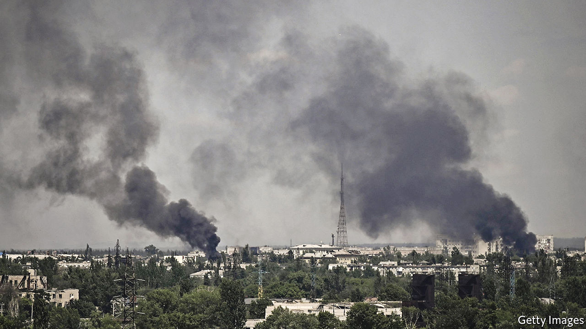
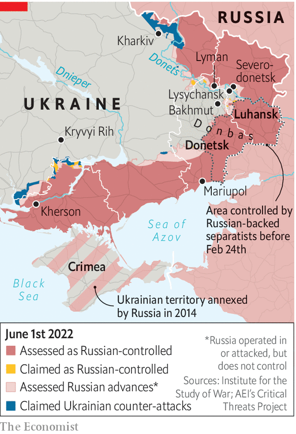

###### Fighting in Donbas

# Russia threatens to capture Severodonetsk 

##### The threat of encirclement looms for Ukrainian troops 

 

> May 31st 2022 

Several things told Arif Bahirov that it was time to leave Severodonetsk: the bodies on the streets, left because it was not safe to remove them; the fires that were no longer being extinguished; the missile that landed in the apartment downstairs. On May 21st the media manager dusted off his mountain bike and checked the tyres. He grabbed a few treasured possessions, as well as water and the most calorific food he could find, and threw them into a rucksack. Then he started pedalling towards Bakhmut, 70km away. 

The artillery-pockmarked road along which Mr Bahirov cycled is now a central focus of Russia's attempt to regain the initiative in . As the bigger of the two supply roads linking Severodonetsk, a town that sits at the easternmost point of a salient that juts into Russian-held territory, this route largely determines whether Russia can encircle a Ukrainian defence force estimated at 10,000 troops. The invaders have pounded the road with everything they have; and they now have at least part of it in easy firing range. Mr Bahirov didn't know any of this when he set off. He had been without news, an internet connection or electricity for weeks. So he survived by wartime intuition: jumping into the nearest ditch whenever he heard artillery or fighter jets, and hoping for the best. 

The endgame for Severodonetsk seems to be under way. Excited Russian tv correspondents at the scene are already claiming a complete victory. That is an exaggeration at this point, but their troops have a solid foothold in most of the town, with fierce battles now taking place in the westernmost streets. Local sources suggest that Ukraine has already begun to pull back from positions around Severodonetsk ahead of a broader retreat. 

 


Speaking on May 30th Serhiy Haidai, the governor of Luhansk, the province in which Severodonetsk lies, said it was only a matter of a few days before a retreat to Lysychansk might be necessary. The twin town lies across the Donets river and offers the additional advantage of being on a hill, though the threat of encirclement remains. Mr Haidai, who grew up in Severodonetsk, said it was a personal tragedy to see his hometown in flames. Nearly 65% of the town’s housing is now damaged beyond repair, he said. But he was proud to have helped evacuate all but 15,000 of the town’s pre-war population of 120,000: “I’ve done what I set out to do.” 

Russia has committed a substantial proportion of its battle-worn forces to the operations to take Severodonetsk and Lyman, a transport hub and possible bridgehead for crossing the Donets river farther north. These modest battlefield targets are a remarkable step down from the Kremlin’s initial ambition of taking over the entire country, and they also fall some way short of the more recently stated objective of taking the whole , which includes neighbouring Donetsk province. But the advance is real and bloody. According to President Volodymyr Zelensky, Ukrainian losses are running at 60-100 soldiers daily, with a further 500 injured.

Oleksiy Arestovych, a presidential adviser, says his country’s artillery units had been particularly affected in the barrage. “We simply haven’t had the systems or munitions to answer fire,” he says. A mismatch in firepower also seems to have let Russia reverse at least some of Ukraine’s recent counteroffensives farther north near the city of Kharkiv. A forward spotter in a Ukrainian reconnaissance team there says that marines from the Russian Baltic Fleet and other elite units are now reinforcing their defensive positions with concrete. “They are in for the long haul and won’t be easy to move,” he said. 

But this second phase of war has not been cheap for Russia. On May 30th British defence intelligence reported “devastating losses” among Russia's mid- and junior-ranking officers, who had been pushed forward by senior officers desperate for good news to report up the chain of command. “Our soldiers tell me they don't understand what is happening,” says Mr Haidai; “Twenty men go on the offensive; we shoot, they fall. Ten of them get up; we shoot, and they fall. And then [they] send in another 20 men.” Mykhailo Samus, a military analyst based in Kyiv, says that the intense fighting in Donbas will eventually favour Ukraine. Military science suggests losses will fall disproportionally on the advancing side, he notes. “Add in foliage, woodlands, water and defensive constructions built over eight years of war, and you understand every metre Russia moves forward comes at a massive loss to its men and equipment.”

There are no reliable numbers on the level of Russian losses in Donbas, but telephone intercepts released by Ukraine this week also purport to show one Russian unit on the edge of mutiny. In one expletive-laden exchange with a friend, a young soldier is heard to say that just 215 men remain from a unit that once numbered 600. “Our brigade can't take shit because there's nothing of it left. We have one full-time gun commander, two artillery pieces left from 12, and only three of 12 vehicles actually move.” 

Ukraine, meanwhile, is taking advantage of Russia's focus on Donbas to launch counter-attacks in Kherson province, in the south of the country and adjacent to Crimea. Its units are advancing with some success in two directions towards the villages of Snihurivka and Davydiv Brid. Its aim appears to be not to push Russian forces out of the region, but to deter them from attacking farther north towards the mining city of Kryviyi Rih, the hometown of Mr Zelensky. Mr Arestovych said that Western heavy-artillery systems had joined that battle just in time. “We had nothing to shoot for a week, but then suddenly we were able to hit the Russians hard, precisely, and they weren't happy.”

After some debate, America now seems set to deliver more-powerful rocket systems that would allow  and break up its supply lines. The new weaponry is unlikely to arrive soon enough to stop Severodonetsk from falling. But it could be used to stop the Russian advance, and even, in time, to offer Ukraine an opportunity to retake the town and others like it in the east and the south. Mr Bahirov certainly hasn't given up hope of returning. “I left the bike in storage in Bakhmut. It's going to be my big performance, my victory lap—riding back to Severodonetsk the very way I left.” ■


