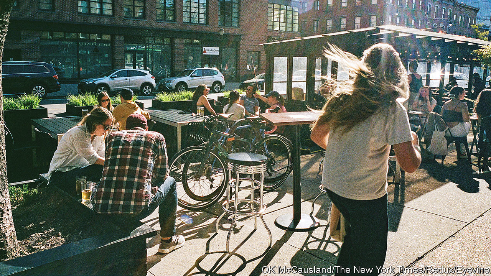
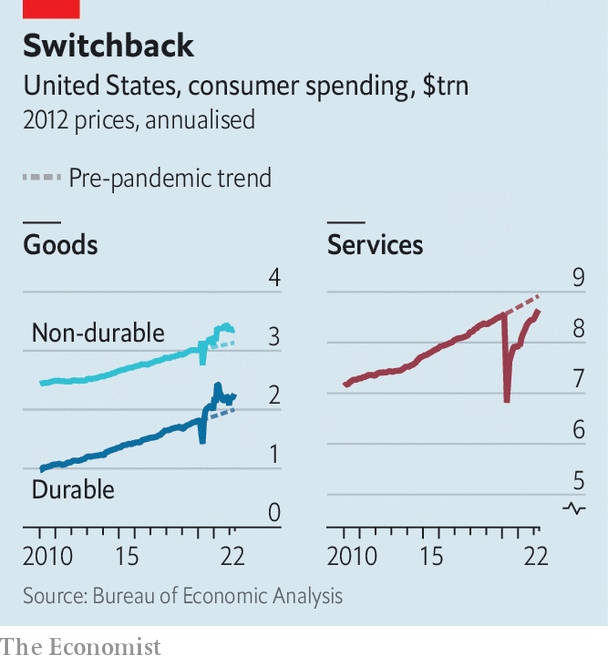

###### Balance of payments

# The changing American consumer 

##### Could a shift from goods to services ease inflation? 

 

> May 29th 2022 

Asked recently about Amazon’s sprawling , Brian Olsavsky, the firm’s finance chief, did not mince words. “We have too much space right now.” As consumer demand surged during the pandemic, the online retailer doubled its capacity from 193m square feet (18m square metres) at the end of 2019 to 387m square feet two years later. Today it has a glut, which the company says is costing it tens of millions of dollars a day. 

Retailers are bracing themselves for a  as . But Amazon’s troubles reflect another crucial development for the global economy: a shift in spending from goods back to services, reversing a pandemic-era trend. This switch should ease pressure on global supply chains and lower inflation. But it has been slow and uneven. 

Confined to their homes during the worst of the pandemic, consumers in the rich world splurged on appliances, cars and furniture. The binge was most notable in America, where it was fuelled by three rounds of “stimmy” cheques. People bought substitutes for the services they could no longer enjoy—an exercise bike, say, to make up for closed gyms. Perhaps as a result of having a little extra cash, they also treated themselves to things like watches and luxury products. A year into the pandemic, the composition of consumer spending had changed dramatically. By spring 2021, goods accounted for 42% of household spending in America, up from 36% before the pandemic; services accounted for 58%, down from 64%, a drop worth more than $900bn per year. 

 


Several other Western countries experienced a similar rise in goods consumption, though few witnessed a bigger boost than America. Daan Struyven and Dan Milo of Goldman Sachs, a bank, compare the evolution of goods spending in real terms across 23 oecd countries. America outperformed all but two. The latest data from the oecd suggest that the Nordic countries also splurged. On average, though, they spent about 5% more on goods in 2021 than pre-pandemic trends would have suggested, compared with 10% in America. 

The spending spree, where it occurred, helped lift economies out of recession. But it also contributed to an inflation headache. A deluge of new orders overwhelmed global supply chains, which were already strained by pandemic-related disruptions, leading to clogged ports and shipping delays. With demand outstripping supply, goods prices rose. America’s Bureau of Labour Statistics reckons that goods prices boosted consumer-price inflation by 4.9 percentage points in the year to April 2022, having reduced it by 0.1 points in the 12 months before the pandemic. 

Now spending is starting to shift in the other direction. Data published on May 27th showed that spending on goods fell in the year to April, and is now 9% above its pre-pandemic trend, down from a high of 16% last year. Spending on services is up by 7% in the same period, and is just 3% below pre-pandemic trends. But some services have been quicker to recover than others. Messrs Struyven and Milo of Goldman Sachs note that while “fun” spending categories with pent-up demand such as food services, air travel and hotels have rebounded over the past year, others have lagged behind. Services that cater to white-collar professionals have been slow to recover. Spending on public transport is about 24% below where it would have been without the pandemic; laundry and dry-cleaning revenues, meanwhile, are 20% below trend. 

Even some essential services have been slow to recover. Spending on doctors’ and dentists’ services is about 15% below trend; child care is down by 22%. Appetite for many non-essential goods, by contrast, shows little sign of abating. Spending on jewellery and recreational vehicles is 53% and 43% above trend, respectively. Spending on pets is up by 23%.

One question is whether the composition of consumer spending will return to pre-pandemic norms. The hope is that this eases bottlenecks and helps bring down inflation. Yet several uncertainties lie ahead. The process looks likely to be slow. If recent trends in America continue, goods and services spending will not return to pre-pandemic levels until perhaps the third quarter of next year. And some habits could stick: the rise of remote working, say, may have permanently changed the consumption mix, keeping the relative demand for goods higher than it was before the pandemic. 

Hovering over all this is a potentially souring economic backdrop, as people become gloomier about their finances. Consumers, especially those in America, powered an extraordinary goods boom over the past couple of years. What they do next is much less certain. ■


