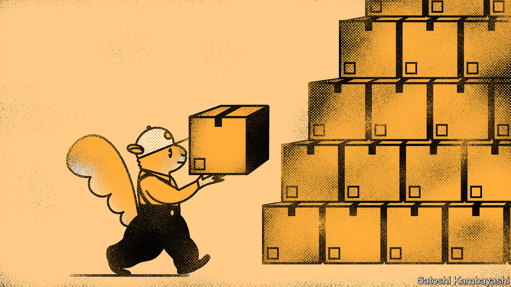

###### Buttonwood

# The return of the inventory cycle 

##### Why companies have become more prone to over-ordering stock 

 

> Jun 2nd 2022 

Remember the Great Moderation? This refers to the period before the global financial crisis of 2007-09 during which there was a marked fall in the volatility of gdp growth in rich countries. Explanations for it ranged from wiser monetary policy (yes, really) to globalisation. In fact, much of it was down to something more mundane: smaller inventories. One authoritative study found that more than half the improvement in the stability of rich-world growth was explained by diminished inventory cycles.

The classic stockbuilding cycle, in which inventory changes add to the momentum of gdp on the way up (through over-ordering) and on the way down (through stock clearances), is showing signs of a revival. Some big American retailers, notably Walmart, have reported large increases in stocks. In part this is the result of errors in forecasting demand. But it also reflects an increase in the desired level of inventories. As just-in-time production gives way to just-in-case stockpiling, the scope for greater volatility in gdp, and in corporate earnings, is increasing.

To understand why inventories are rising again, it helps first to understand why they fell. Improvements in computing mean that firms have more detailed and timelier information about demand from consumers. Such changes made large precautionary stockholdings redundant. A related factor is carrying cost. Interest rates were high in the 1980s, when businesses first began to favour leaner inventories. And a dollar in stock is a dollar that cannot be used profitably elsewhere. Accompanying this was the widespread adoption of just-in-time manufacturing, with its emphasis on flexible supply.

For the leanest companies, inventory consists of whatever FedEx or ups is carrying for them. Or it did until recently. The tech-and-trade wars between America and China challenged assumptions about the security of supply. The pandemic (and now the war in Ukraine) upset them completely. The pattern of demand suddenly shifted as locked-down consumers could not spend on dining out or live entertainment; instead they spent more on goods that could be ordered online and delivered to their door. Meanwhile shortages of workers and of key inputs, notably semiconductors, meant that some orders could not be fulfilled. Businesses lost sales for want of inventory. Logistical snafus became a board-level discussion.

The result, inevitably, has been an overcorrection. Having lagged behind spending, inventories got ahead of it. The share prices of Walmart and Target fell sharply in mid-May when the two retailers revealed they had been left with large stocks of unsold goods, after misjudging the strength of demand. Even the mighty Amazon has been blindsided, as the e-commerce share of retail sales, which exploded in the pandemic, has fallen back towards its pre-covid trend. 

The cyclical effects of all this will have to be reckoned with. Some retailers may be holding the wrong stock for the time of year. They will either have to store it, mark down prices to clear it quickly, or move it on to discount retailers that specialise in selling out-of-season stock. Inflation will be lower than it would otherwise have been. Some companies that have over-ordered will cut back on purchases to allow stock levels to adjust to the trend in spending. Albert Edwards of Société Générale, a French bank, reckons that the pain will be felt more in China, as “demand for Chinese imports gets hit hard just when the Chinese authorities are struggling to revive their moribund economy”.

Yet there is something more profound at play. Just-in-time production assumes a largely frictionless world—of open borders, predictable demand and low transport costs. This can no longer be relied upon. Inventory is a form of insurance against unexpected delays. And though insurance is costly, company bosses seem willing to pay for more of it. The trade-off between efficiency and self-insurance, between just-in-time and just-in-case, has shifted markedly towards the latter. And larger inventories imply greater scope for inventory cycles in the future.

There is a paradox here. The more companies seek to self-insure by holding more stocks, the more volatile gdp (and thus corporate earnings) is likely to become over time. American retailing might thus be offering a preview of a particular future—of jumpier revenues and more frequent profit warnings. The Great Moderation is going into reverse. 


