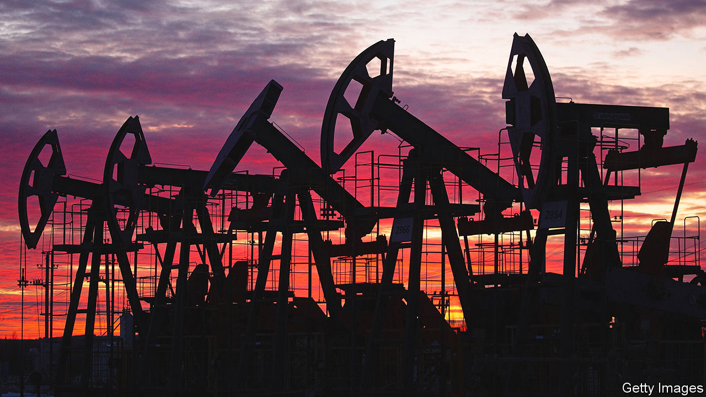

###### Crude calculations

# Why the oil price is spiking again 

##### A tightening EU embargo of Russian oil is just one explanation 

 

> May 31st 2022 

In the 1970s Arab states used the “oil weapon” of embargoes to punish Western governments for supporting Israel. On May 30th the heads of the 27 eu member governments agreed to turn the weapon on themselves, as part of a fresh round of sanctions against Russia following its . As well as cutting off Sberbank, Russia’s largest bank, from the swift cross-border payment system, the package will also ban purchases of Russian crude oil and refined products, such as diesel, by the end of the year. There would, the eu said, be a “temporary” exemption for oil delivered through pipelines. The price of a barrel of Brent crude leapt above $120 on the news, its highest level since March.

In principle, the decision is highly significant. As well as demonstrating unity, and the bloc’s willingness to bear economic pain to punish Russia, it cuts one of the few remaining trade ties with the Kremlin. It also imperils one of Russia’s most lucrative sources of . The eu is Russia’s biggest market for crude, buying about half the country’s oil exports. 

There are reasons, however, to be sceptical that the move will deprive the Kremlin of much foreign currency. For a start, the ban applies only to , transported via tankers. That is the price of unity: excluding oil delivered by pipelines was necessary to find a compromise with Hungary, which is both more sympathetic to Russia than most eu countries and critically dependent on the Soviet-era Druzhba pipeline (a name meaning “friendship” in Russian). Hungary imports about 65% of its crude from Russia.

Seaborne oil makes up a similar share of Europe’s imports from Russia. But the ban is likely to have a limited impact on the oil market. Many tankers are already subject to “self-sanctioning” in parts of the West. Dockworkers have refused to unload ships carrying Russian cargoes and oil majors have been worried about the hit to their reputations from accepting shipments. Western financiers are stepping back from writing insurance contracts. Insurers based in Russia’s allies could partly replace them, but have shallower pockets. 

A big question is whether Russian seaborne crude, once placed under sanctions, will go unsold. So far  have risen even as the country has come under sanctions. According to analysts at JPMorgan Chase, a bank, much of the increase has gone to India, which has not issued sanctions of its own. 

Another question is whether Europe does eventually ban piped Russian oil, which is harder to redirect to other countries. Poland and Germany have said they will cease importing via the Druzhba pipeline. Yet it is hard to imagine Hungary’s dropping its opposition to a wider ban. Viktor Orban, the country’s populist prime minister, has demonstrated his willingness to block eu decisions before. Thanks to a hefty discount on Russian crude—the Urals benchmark is trading significantly below Brent—mol, a Hungarian oil group, reports “skyrocketing” margins.

Partial though the embargo may be, such is the tightness of the oil market that prices still surged. Demand for fuel is strong as the pandemic subsides and consumers start , and as governments try to shield voters from the impact of higher energy costs. China’s easing of  in recent days has also added to the thirst for oil. The prices of industrial metals, including iron ore and copper, have rallied, too. 

Meanwhile, the Organisation of the Petroleum Exporting Countries (opec) and its allies, which include Russia, have shown little sign of increasing production just yet. The group was due to meet on June 2nd, as we went to press, and was not expected to depart from its plan to gradually increase supply to levels seen before the pandemic (although prices dipped on reports that it was mulling a plan to exclude Russia from its production targets, allowing Saudi Arabia and others to pump more to make up for any lost output). 

Tight supply and robust demand together translate into higher prices for consumers at the pump. To make matters worse, a shortage of refinery capacity in America has raised prices for petrol and diesel even further than the cost of crude. The surging dollar adds to costs for Europe and emerging markets, notes Francisco Blanch of Bank of America. None of this is welcome news in an . According to figures published on May 31st inflation in the euro area rose to 8.1% in the year to May, higher than economists had expected.

The Arab embargoes of the 1970s caused short-term pain for the West, but also spurred a drive for fuel efficiency that ultimately reduced its reliance on oil. European governments today may find themselves hoping that the short-term pain for consumers similarly gives way to the long-term gain of . ■


