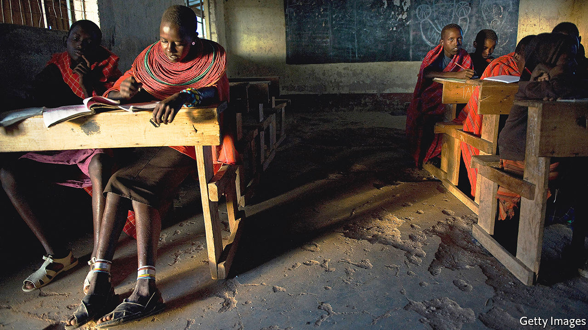
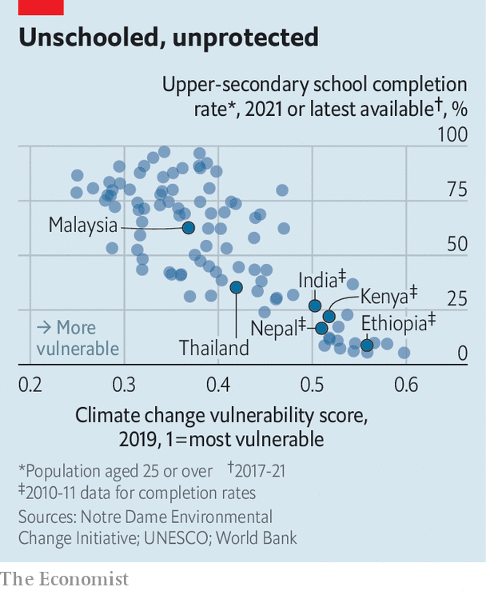
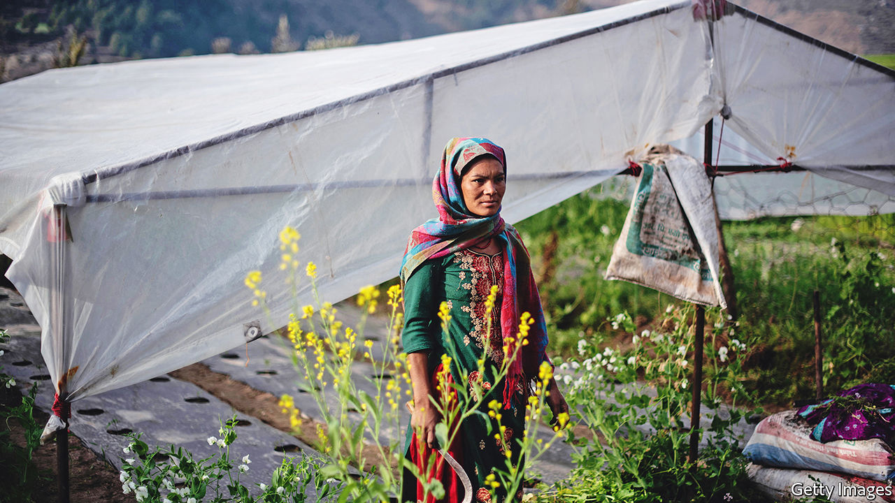
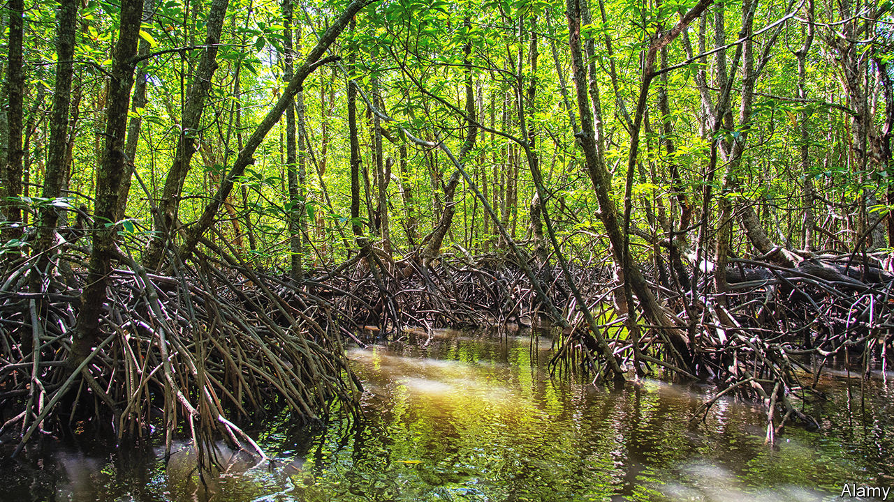

###### Survival of the bookish

# Climate change is harder on less educated people 

##### And covid learning loss has made them even more vulnerable 

 

> Jun 1st 2022 

When shadrack lolokuru was “nine or ten”, his relatives put him into a bucket and lowered him into a well. From the murky bottom, he filled the bucket and passed it back up so the family’s cows could drink. No one thought this odd. Among his people, the Samburu of northern Kenya, “a five-year-old is regarded as old enough” to help look after cows, he says; herding them, guarding them and making sure the precious beasts have enough grass and water.

Mr Lolokuru is now in his 50s and still owns cows with his two brothers. Water is even scarcer than when he was a boy, partly thanks to . The Horn of Africa faces its worst drought in four decades this year, says the World Food Programme. For the Lolokuru family, harsh weather is becoming the norm—and they disagree over how to adapt. 

Mr Lolokuru and his younger brother Robert are educated; both work as accountants in Nairobi, the capital. Their older brother Lkitotian, who tends the herd back in their home village, has never been to school. The bookish and unbookish brothers see the world very differently. 

Shadrack Lolokuru reads the news and understands that this year’s parched conditions are not a one-off. The weather is likely to be permanently hotter, and with more extremes. So he favours selling half of their herd. That way, they will have enough water to keep the remainder healthy. If they don’t, the whole herd could die. “Our cows [sometimes] become too weak to walk to where the water is. They drop dead on the way.” 

Uncowed

But Lkitotian does not want to sell. He has a “cultural attachment” to a bigger herd, explains Shadrack. “The more cows you have, the higher your social standing; the harder-working and more responsible people think you are,” he says. “The fewer cows you have, the less of a man you are.” Lkitotian, like many of his neighbours, also struggles to understand climate change. “They don’t get it. They don’t believe the weather is changing. They believe it will go back to how it has always been for generations,” laments Shadrack.

Gradually, Shadrack is persuading his brother to sell some cows. The herd has been trimmed from 140 head to 100 in recent years. Lkitotian is unhappy about this, but he trusts and respects his younger brothers. Intra-family negotiations are fraught. Shadrack says he has “to tread carefully”. But he can see what will happen if he does not win the argument. Several families in his home village have lost all their cows; some show up on his doorstep in Nairobi and ask for help finding jobs as security guards. 

The importance of education in  is underappreciated. Its role in mitigating global warming—better-educated folk have fewer children and invent more green technology, but also tend to emit more—is for another article. This one looks at how a bit of learning can help people adapt, and how its absence leaves them vulnerable.

Whether Earth warms a little or a lot, people will have to change how they live and work. A study by Erich Striessnig, Wolfgang Lutz and Anthony Patt of the International Institute for Applied Systems Analysis in Laxenburg, Austria, suggests ways education can make this easier. Better-educated folk have more access to information, such as early warnings for storms or droughts. Education “enhances cognitive skills and the willingness to change risky behaviour while at the same time extending the personal planning horizon”. It leads to better health, so people are physically able to adapt, and to higher incomes, which always come in handy. 

The authors compare two scenarios for sub-Saharan Africa: one in which 30% of young women had completed secondary school by 2050, and one in which 70% had. They estimate that in the second case the death toll from floods, droughts, wildfires, extreme temperatures and other extreme weather between 2040 and 2050 would be 60% lower. 

It seems that education itself makes the difference, and not simply the wealth that often accompanies it. A study by Raya Muttarak of the University of Bologna and Anna Dimitrova of the Wittgenstein Centre in Vienna looks at the relationship between floods and childhood stunting in India. In places where monsoon rains were one standard deviation above average (a proxy for flooding), infants were 20% likelier to be severely stunted, presumably because floods destroy crops and spread disease, for example by flushing sewage into sources of drinking water. 

Since stunting affects brains, too, these infants will surely do worse in school. But if the mother was educated, the researchers found, her child was much less likely to be stunted. Indeed, children born in poor households but to educated mothers faced roughly the same risk of stunting due to floods as children born in wealthy households but to uneducated mothers. 

There are several likely reasons for this. Mothers with more schooling typically understand more about nutrition. They are more scrupulous about hygiene, and more inclined to seek conventional (as opposed to mostly useless traditional) medicine. Because they are better at acquiring new information, they are better at assessing unfamiliar risks and respond in a more informed way to sudden changes.

Ms Dimitrova found similar results when looking at which households coped best with drought in Ethiopia. The mother’s education was the key to preventing stunting. Professor Muttarak also found that in a coastal area of Thailand, a 1% increase in the number of women with secondary education in a village raised by 11% the odds of any household in that village being prepared for a disaster such as a tsunami. Such women were better at abstract thinking: they could imagine an event they had never observed, devise an escape plan and share it with their friends. 

In Nepal, when Samir K.C. of the Asian Demographic Research Institute looked at deaths from floods and landslides, he found that education was a far better predictor of survival, both for families and their livestock, than wealth (using whether families lived in a house with a permanent structure as a proxy for wealth).

 


Unfortunately, the parts of the world most imperilled by climate change, such as Africa and South Asia, often have woeful schools (see chart). And covid-19 has made matters worse, by closing classrooms for 1.6bn children globally. Before the pandemic, 53% of ten-year-olds in low- and middle-income countries could not read a simple text. That figure may have risen to 70%, estimates the World Bank.

Another brick in the sea wall

That would be an emergency under any circumstances; global warming makes it more so. “Formal schooling equips people with the capacity to adapt to climate change. That’s one reason why it’s so important for states to help children make up for all the learning they have lost during the pandemic,” says Professor Muttarak. 

 


Professor Lutz argues that given the unpredictability of climate change, a lot of money destined to be spent on grand engineering projects to protect against its effects will be wasted. By contrast, improving education in poor countries, especially education of girls, will make societies more resilient under almost any scenario. It may therefore be a more efficient use of some of the money splurged on sea walls and dams, he argues.

The very poor tend to be very conservative. Often, they stick doggedly to the farming methods that fed their forefathers. Such risk aversion is rational. Trying something new can be fatal if you have no savings or safety-net. An accountant who retrains as a lawyer may find her new job dull; a subsistence farmer who tries a new planting technique that fails may starve. 

Education, however, gives people the confidence to break free of traditions, the curiosity to seek out new information and the cognitive skills to process and act on it. 

Consider the Mulwa family of Kitui county in eastern Kenya. Isaiah and his adult son Philip grow maize on neighbouring plots. Isaiah’s crop is barely knee-high; Philip’s towers over the tallest visitor’s head. Isaiah, who received only rudimentary schooling, expects just half his usual harvest this year because the rains are so bad. “There is nothing we can do,” he says, “We just wait for the next rain. And pray to God that it will be better.” 

Philip, who is better educated, is less fatalistic. He has dug a retention ditch to conserve water. He and his wife buy fertiliser and drought-resistant seeds, rather than simply taking seeds from the previous year’s crop. They test the ph of the soil, and add lime if it is too acidic. They plant their seeds earlier than their neighbours do, so they catch the first rain. They have adopted all these techniques in the past 10-15 years, partly in response to climate change. The new ways work well, as Philip’s burgeoning crop demonstrates. He offered to teach them to his father, but “he’s not interested” and uses none of them.

In this, Isaiah is not unusual. Few of the villagers understand what is happening to the weather. “I don’t know,” say several.

It is a sentence heard in unschooled households throughout the developing world, as people who fear any change try to grasp the gigantic one that has been thrust on them. Some 6,000km away from Kenya, on the plains of Nepal, found similar bafflement.

At first glance the small town of Basantpur resembles the kind of bucolic idyll depicted in many Bollywood movies. Goats, chickens and ducks scoot about outside squat brick houses. Cattle shelter from the sun in open sheds. Miles of rice paddy stretch into the distance. 

 


Yet wrenching disruption is afoot. Crop yields have fallen by half in the past five or six years, estimates Harikala Kaphle, a 78-year-old (she thinks) who toils with her son and daughter-in-law on a third of a hectare. The rains are less predictable than they were. She does not know why, or what to do about it. She has consulted no experts, sought no advice, received no training. A few times she built embankments but they got washed away. “What can I do? The rain is too heavy. Sometimes it even tries to take down my house,” she says. 

It is hard for her to know where to start. She has had no education, and cannot read or write. Her son and daughter-in-law had a couple of years of primary school, but they too started farming as children. “If I had studied until 5th grade, I could have done a lot [more],” she says. 

One of her neighbours, Ashok Kumar Lamichhane, takes a different approach. His farm is smaller, only a fifth of a hectare. But he grows higher-value cash crops, such as bell peppers, cucumbers and chillies, and sells them for a healthy profit. 

Rising temperatures and more erratic weather have brought a multitude of problems, from floods and landslides to invasive weeds and dengue-spreading mosquitoes. Mr Lamichhane is not helpless, however. The son of farmers, he was educated up to the tenth grade; he devours instructional YouTube videos from India, Nepal and the West on how to farm better, how to stop landslides and so on. 

“It is not exactly the same, so I cannot exactly copy the methods,” he says. “But I can adapt them to my conditions.” When landslides were washing away his embankments, he learnt a new method involving the use of shrubs and branches to build more robust ones, for example. As water sources dry up—another problem—he has employed drip irrigation. Mr Lamichhane now wants to diversify into growing mushrooms commercially. “It would have cost 300,000-400,000 Nepali rupees [$2,500-$3,200] to do training in India,” he says. “But I learnt it on my own online.” He has done at least 100 courses of agricultural training, he says proudly.

The most basic educational achievement—literacy—can make the difference in helping people adapt to climate change by creating the foundation to learn new skills. Consider the work of the Penang Inshore Fishermen Welfare Association (pifwa), on Malaysia’s west coast. It started as an organisation to keep foreign trawlers from poaching local fish. But it soon diversified into planting mangrove trees and teaching local people how to do so, too. 

Environmentalists love mangroves. They are the only trees that thrive in salt water, and their tangled roots create an effective sink for trapping carbon dioxide. Fishermen like them because all kinds of fish breed in mangrove swamps. 

pifwa has helped plant 400,000 mangrove saplings—a huge boon at a time when builders have been devastating mangroves in Malaysia and elsewhere. This has largely been paid for not by the organisation itself, but by other local groups it has taught and worked with.

Mangroves of academe

At the end of a dirt track that winds through criss-crossing waterways is pifwa’s education centre, a low-slung blue building. Inside is a classroom with posters of birds, fish and the threats to them. A vocabulary list shows how to spell “logging”, “deforestation” and “timber”. For 25 years the group has been preaching the benefits of mangroves in schools and factories, to local politicians and especially to local women, who “have been really effective at talking to their husbands”, says Ilias Shafie, the president of pifwa. 

At first it was hard, but the tsunami of 2004 woke people up to the necessity of having mangrove forests to protect the coastline. Also, in recent decades education has improved enormously. As recently as 1980, only a fifth of Malaysian adults had completed lower secondary school. Now more than three-quarters have. In other words, the vast majority of adults of working-age are literate. And that makes it “much easier” to teach them about conservation and persuade them to take it seriously, says Mr Shafie. Now there are plenty of mangroves in the area, filling local fishermen’s nets and protecting coastal villages from storms and floods.

Education can create virtuous circles; ignorance, vicious ones. For example, parents in Shadrack’s home village in northern Kenya pay school fees for their children by selling milk. Less-educated parents are more likely to see their cows die of thirst, leaving them no way to pay the fees. Many pull their children out of school. Some do so pre-emptively, to avoid selling their last cow. This sets up the next generation for failure. By contrast, better-educated farmers tend to put their children’s education above almost anything else. 

A story from eastern Kenya is even more striking. In Makueni county, a rocky hill rises above two villages. In recent years, there has never been enough rain. But when it comes it comes in unpredictable deluges, sweeping away topsoil, digging ravines and then vanishing towards the sea. The local government built a simple concrete barrier on the hill to catch these deluges and pipe them to the villages below, which were desperately short of water.

In one village, Masue, the villagers welcomed this innovation. Suddenly their school had tap water. This was a double blessing. Not only could villagers get clean water simply by queuing for it. But also the girls, who used to walk miles to fetch water most days, could go to school instead, and bring water home with them. Enrolment doubled. The next generation in Mafue will be better educated than their elders.

By contrast, the village on the other side of the hill, Kasuvi, was less keen. Many people there believed an old myth that if you tamper with a natural source of water, it will dry up for ever. They were so alarmed by the new plastic pipe on their side of the hill that they smashed it with pangas, recounts Douglas Mutua, a local head teacher. Many of the people in that village are “illiterate”, he sighs, and such people “find it hard to change their ideas”. ■


