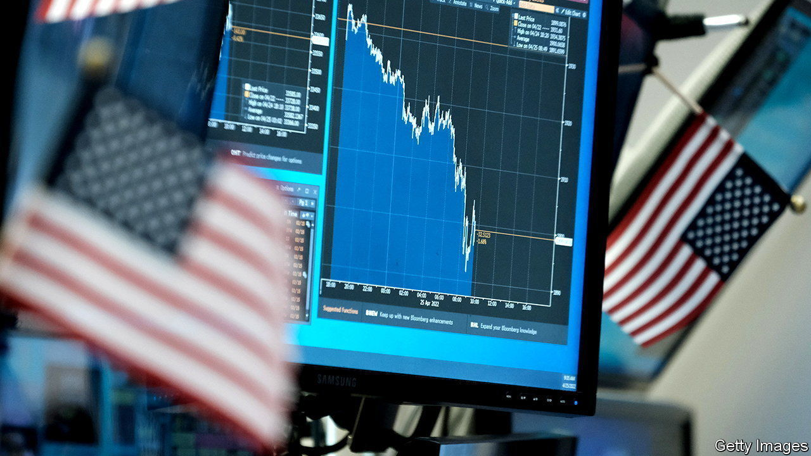
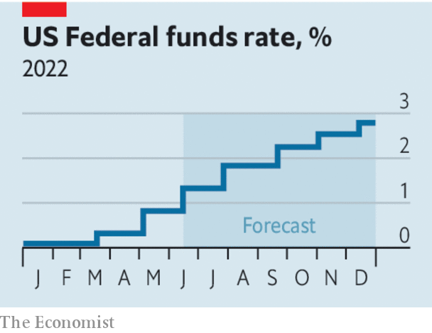

###### The coming downturn

# A recession in America by 2024 looks likely 

##### It should be mild—but fear its consequences 

 

> Jun 2nd 2022 

Not long ago recessions seemed to strike America roughly once a decade. But only two years after the first lockdowns, the  at a sickening speed and another one already seems to be on its way. If you are like most people, your memory of downturns will be dominated by the past two—the financial heart attack in 2007-09 and the pandemic-induced collapse in 2020. Both were severe and highly unusual. By their standards, America’s next recession will almost certainly be milder and more pedestrian. But because the world economy, asset markets and America’s politics are all fragile, it may yet have nasty and unpredictable consequences.

There is no escaping the squeeze ahead for America’s economy.  are eating into people’s spending. In April consumer prices were 8.3% higher than a year earlier. Even excluding food and energy prices, annual inflation is 6.2%.  could flare up for as long as  and China sticks to its zero-covid policy. The American , with nearly two job openings for every unemployed worker in March, the most since 1950, when data were first collected. A measure of wage growth by Goldman Sachs is at an all-time high of nearly 5.5%—a rate companies cannot bear unless they continue to raise prices fast.

The Fed is promising to pour water on the fire. Investors expect it to have raised  by more than 2.5 percentage points by the end of 2022. The central bank is crossing its fingers, saying that it can hit its 2% inflation target without causing a downturn. But history suggests that by acting to tame inflation it will cause the economy to shrink. Since 1955, rates have risen as fast as they will this year during seven economic cycles. In six of them recession followed within a year and a half. The exception was in the mid-1990s, when inflation was low and the labour market was more balanced. On June 1st Jamie Dimon, the boss of JPMorgan Chase, America’s largest bank, warned of an approaching economic “hurricane”.

 


In fact, although a  is likely, it should be a relatively shallow one. In the crisis of 2007-09 the financial system froze and in 2020 activity in entire sectors ground to a halt. Both downturns saw the sharpest initial drops in gdp since the second world war. This time will surely be different. In some ways America is resilient. Consumers are still flush with cash from the pandemic stimulus and companies have been enjoying bumper profits. The  is slowing as rates rise but, in contrast to the late 2000s, it is not about to bring down the country’s banks, which are strong. And at least the Fed does not face the predicament it did in the 1980s. Back then, inflation had been above 5% for six and a half years and it had to raise rates to nearly 20%, causing unemployment of almost 11%. Today inflation has been above target for a little more than a year. It should be easier to purge. 

The trouble is that even a mild American recession would expose glaring fragilities. One is the commodity-price crisis in much of the world, the result of Russia’s invasion of Ukraine. Countries from the Middle East to Asia are facing severe food shortages and soaring fuel bills. The euro zone is dealing with an especially sharp energy shock as it weans itself off Russian oil and gas. Around the world, household incomes are collapsing in real terms. 

An American recession would land another blow on vulnerable parts of the global economy by curbing demand for their exports. Tighter monetary policy at the Fed and the resulting strength of the dollar would also compound what has already been the biggest sell off in emerging-market bonds since 1994. The imf says that about 60% of poor countries are suffering debt distress, or are at high risk of it.

Another weakness lies closer to home, on Wall Street. So far in 2022 the American stockmarket has fallen by 15%—comparable to the decline during the mild recession that started in 1991. The sell-off has been orderly and America’s banks are stuffed with capital. But after over a decade of cheap money, no one can be sure how stratospheric asset prices will be affected by the combination of higher interest rates and a Fed-induced recession. Stocks are pricey relative to long-run profits. 

A system of market-based lending has sprung up since 2007-09 that has yet to be severely tested. It includes investment funds that act like banks, vast derivatives clearing-houses and high-speed bond traders. If something goes wrong, the Fed will find it hard to bail out Wall Street yet again, because it will at the same time be forcing Main Street to cope with higher rates and job losses.

A final fragility is America’s . A recession would probably strike by the end of 2024, colliding with campaigning for the presidential election. If the economy is shrinking, the race for the White House in 2024 is likely to be even more toxic than expected. 

Politics could distort the government’s response to a recession. The Fed may be dragged into a venomous political battle. After receiving handouts amounting to 26% of gdp in the pandemic, voters and firms may expect the state to protect them from hardship this time, too. Yet the Republicans, who will probably control Congress after mid-term elections in November, would be most unlikely to spend money to see off a downturn if that also risked saving President Joe Biden. 

From the roaring to the raging 2020s

If America’s economy does shrink in the next year or two, it could even alter the country’s long-term direction. The best response to a downturn during which inflation remained high would be pro-growth reforms, such as lower tariffs and more competition. Instead, recession may fuel populism and protectionism and even return Donald Trump to the presidency. Three of the past four recessions coincided with presidential elections or shortly preceded them. Each time the party controlling the White House lost power. 

Measured by the technocratic yardstick of lost gdp, the next recession could be mild. But not when judged by its impact on the emerging world, asset markets and American politics. Do not underestimate the perils that lie ahead. ■


