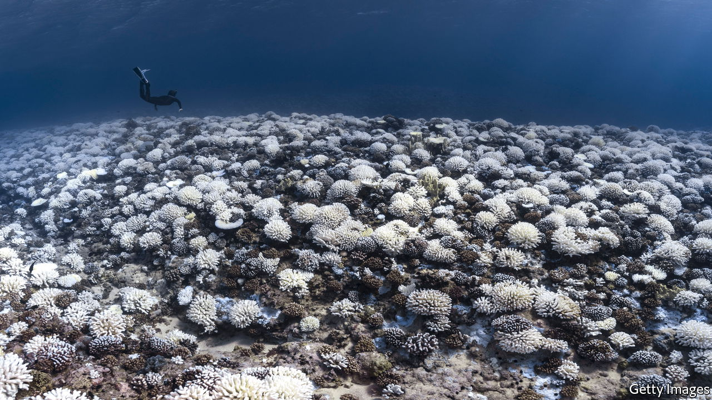

###### Coral reefs

# Those in peril in the sea 

##### A mix of natural resilience and human ingenuity can save endangered ecosystems 

 

> Jun 2nd 2022 

Human beings have been altering habitats—sometimes deliberately and sometimes accidentally—at least since the end of the last Ice Age. Now, though, that change is happening on a grand scale. The plough and the chainsaw bear much of the blame, but  is a growing factor, too. Fortunately, the human ingenuity that is destroying nature can also be brought to bear on trying to save it. 

Some interventions to save ecosystems are mind-boggling long-shots. Consider a scheme to reintroduce, by  Asian elephants, something resembling a mammoth to Siberia. Their feeding habits could restore the grassland habitat that was around before mammoths were exterminated, increasing the sunlight reflected into space and helping keep carbon compounds trapped in the soil. But other projects have a bigger chance of making an impact quickly. As we report, one example involves .

These are the rainforests of the ocean. They exist on vast scales: half a trillion corals line the Pacific from Indonesia to French Polynesia, roughly the same as the number of trees that fill the Amazon. They are equally important havens of biodiversity. Rainforests cover 18% of the land’s surface and offer a home to more than half its vertebrate species. Reefs occupy 0.1% of the oceans and host a quarter of marine species.

And corals are useful to people, too. Without the protection which reefs afford from crashing waves, low-lying islands such as the Maldives would have flooded long ago, and a billion people would lose food or income. One team of economists has estimated that coral’s global ecosystem services are worth up to $10trn a year. Reefs are, however, under threat from rising sea temperatures. Heat causes the algae with which corals are symbiotic, and on which they depend for food and colour, to generate toxins that lead to those algae’s expulsion. This is known as “bleaching”, and can cause a coral’s death. 

As temperatures continue to rise, research groups around the world are coming up with plans of action. Their ideas include identifying naturally heat-resistant corals and moving them around the world; crossbreeding such corals to create strains that are yet-more heat-resistant; employing genetic editing to add heat resistance artificially; transplanting heat-resistant versions of the symbiotic algae; and even tinkering with the corals’ “microbiomes”—the bacteria and other micro-organisms with which they co-exist—to see if that will help.

The assisted evolution of corals does not meet with universal enthusiasm. Without  and decline in local, coral-killing pollution, even resistant corals will not survive the century. Sceptics doubt humanity will get its act together in time to make much difference. Few of these techniques are ready for deployment in the wild. Some, such as gene editing, are so controversial that it is doubtful they will be approved any time soon. Scale is also an issue. Compared with the task at hand, existing restoration projects are a metaphorical drop in the ocean. 

But there are grounds for optimism. Carbon targets are being set and maritime pollution is being dealt with. Countries that share responsibilities for reefs are starting to act together, even in the diplomatic doldrums around the Red Sea. Scientific workarounds can also be found. The application of probiotics can be automated. Natural currents can be harnessed to facilitate mass breeding. Sites of the greatest ecological and economical importance can be identified to maximise bang for buck.

This mix of natural activity and human intervention could serve as a blueprint for other ecosystems. Hard-core greens—those who think that all habitats should be kept pristine—may not approve. But when entire ecosystems are facing destruction, the cost of doing nothing is too great to bear. For coral reefs, at least, if any are to survive at all, it will be those that humans have re-engineered to handle the future. ■


