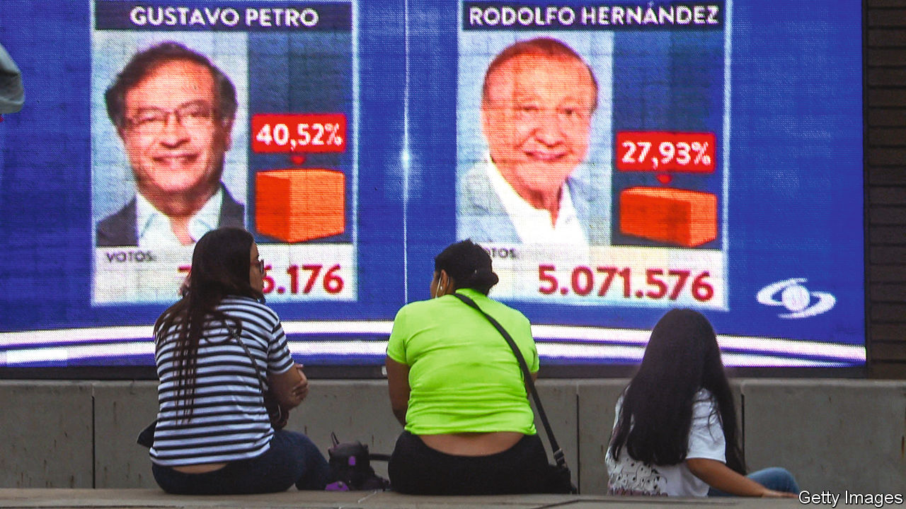

###### Into the unknown

# Two erratic presidential candidates put Colombia at risk 

##### In a run-off in June voters will choose between an ex-guerrilla or a TikTok populist 

 

> Jun 2nd 2022 

Chucking out incumbents and everything they stand for is all the rage in Latin America. Peru did it in June last year. Chile did it in December.  is likely to do it in October. May 29th was Colombia’s turn, when voters plumped for the two presidential candidates who most clearly represent change. , pictured left, is a former guerrilla who got more than 40% of votes (around 8.5m). Rodolfo Hernández, pictured right, is a millionaire who was little-known a few months ago but has fired up devotees with his rants on TikTok. He won 28%. The .

Colombia has long been something of an anomaly in Latin America, a continent where many voters still have a soft spot for . With the exception of a brief period of strongman rule under Álvaro Uribe Velez, who was president from 2002 to 2010, its politics tend to be moderate. For decades, left-wing extremism has been unpopular, as Colombians have related it with the Revolutionary Armed Forces of Colombia (farc), a Marxist guerrilla group. Governments have favoured strong ties with America. Investors flocked to Colombia. 

Growth has been robust in recent years: income per head rose from $4,000 in 2000 to $6,400 before the pandemic. However, inequality is extreme. Few Colombians pay taxes. Discontent fuelled violent protests in 2019 and 2021. Largely thanks to covid-19, an additional 2.8m Colombians (out of a population of 51m) fell below a $38-a-month poverty threshold in 2020. Since then, Colombia’s economy has rebounded more quickly than those of other countries in Latin America, with gdp growing by 10% last year. But a  in 2016 was poorly implemented by Iván Duque, the outgoing president, and parts of the country are still violent. 

Neither Mr Petro nor Mr Hernández looks capable of tackling these complex issues. Both were unimpressive mayors. When Mr Petro ran Bogotá, the capital, he had a reputation for falling out with his staff. He was briefly suspended after mismanaging the municipal takeover of a private rubbish-collection service. Mr Hernández’s record is worse. As mayor of Bucaramanga, a medium-sized city, from 2016 to 2019 he was suspended three times: after slapping a colleague; calling an official corrupt without evidence; and for violating election laws by campaigning for his chosen successor. An engineer by training, he promised to build 20,000 homes for the poor. None materialised. 

Mr Petro has moderated his tone of late, but his policies remain radical. He wants to increase tariffs, renegotiate trade deals and guarantee public-sector jobs for all of the unemployed (around 11% of the labour force). He also wants to end new oil and gas exploration, despite extractive industries accounting for over half of exports.

Mr Hernández is also big on promises and poor on realism. His proposals, often relayed over social media, include such edifying lines as “Fuck fracking”. He, too, has a protectionist streak. He talks often about corruption, and says he would want to have a daily press conference in which he names and shames allegedly dirty politicians. As it happens, he is due to be tried for corruption in July. He denies wrongdoing.

Colombia is taking a step into the unknown. Either candidate could destabilise a country that was on track for at least modest success. Colombians need not look far to see the harm that demagoguery can do. The right-wing sort has marred Brazil since 2019; the left-wing sort has . If elected, Mr Petro may be slightly more likely than Mr Hernández to accept checks and balances. But whoever wins, Colombia’s institutions will have to brace themselves. ■

