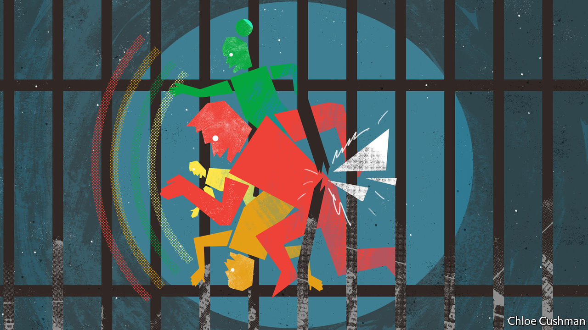

###### On electoral reform, wearable devices, India, business and pleasure

# Letters to the editor 

##### A selection of correspondence 

 

> Jun 2nd 2022 

Letters are welcome via email to 

Fairer elections for Britain

Bagehot set out the democratic tragedy of how millions of British citizens regularly see their votes play a limited role, or no role at all, in general election results (). Elections should be held with a fair voting system where seats match votes. Proportional representation could clear away a lot of the over-thinking and tactical voting that goes into elections. It might also allow parties to see the positive aspects of co-operation (something blindingly obvious to most citizens) and to offer a range of candidates who reflect the actual community, not the fantasy world of strategists obsessing about being seen as the masters of the universe over voters in marginal seats. 

If progressive parties do work together on behalf of their voters then voting reform must emerge to heal British politics. The Conservatives have nothing to fear. We’ve seen how other parties to their right, like ukip, have impacted on election results. After all, it is proportional representation for the parliaments in Scotland and Wales that keep the Conservatives alive as a political force in those places. However, political gamesmanship is a second-order consideration. The most important is to ensure that elections perform their principle function: to translate accurately the democratic will into democratic representation.

darren hughes

Chief executive

Electoral Reform Society


 


Tracking people’s health

As general practitioners and tutors of evidence-based medicine, we found your Technology Quarterly on the future of wearable devices in health care () to be interesting, but also concerning. There is an assumption that more information, whatever it is, must inevitably be good. In the future, evidence might show that the constant monitoring of biometrics makes people healthier. We suggest that this is not the case now. 

Biometric monitoring, as with any testing of the healthy, is a form of screening. History has taught us that it is the exception, rather than the rule, for screening to be of net benefit. The United States Preventive Services Task Force and Britain’s National Screening Committee have recommended screening for only three cancers, and even those are not without controversy. They do not recommend screening for atrial fibrillation, the condition that you mentioned; it seems the risks and benefits are finely balanced. 

The predictive value of any test depends on how likely the condition is to begin with, as well as the characteristics of the test. The rarer the condition is initially, the more likely a “positive” result is a false positive. Atrial fibrillation is rarest in the younger population who use such health-monitoring devices, and the predictive value is probably very low. Even monitoring in symptomatic patients can prove to be unhelpful. A recent randomised control trial found no benefit of saturation monitoring on outcome in people with covid-19. 

We suggest that there is “Fitbit Feedback Syndrome”, which occurs when the awareness of a biological variable being measured causes anxiety in a patient. This then drives a change in the variable, leading to a negative feedback loop. An example would be fitness trackers, where a focus on a fast heart rate causes anxiety, driving that rate ever higher. It is a driver of over-medicalisation. We predict a future increase in incidence. 

dr alex burns

dr edmund jack 

Penarc


Wearables can lead to accurate diagnoses based on small variations in the wearer’s physical condition that wouldn’t cause any harm if undetected. Indeed, unnecessary treatment and being labelled “sick” can cause real harm, including in precisely the conditions you mentioned, such as diabetes, hypertension and kidney disease. Moreover, doctors are not trained to respond to new and often unregulated data. The extra burden of data generated by wearables impacts the amount of time they spend with patients. The rise of wearables is part of the wider datafication of health care. This agenda is being promoted to save money, but there is no evidence to suggest that it does. 

dr christoffer 

bjerre haase

phd fellow in datafication of the clinic

University of Copenhagen

You stated that people with panic disorders “breathe in a particular way that leads to a build-up of carbon dioxide”. Actually, the opposite is true; hyperventilating decreases the carbon level. We can all make ourselves feel very uncomfortable quickly by hyperventilating for a short time.

dr geoffrey ainsworth


 


Notes on India

You acknowledged the progress achieved by India, whoever is the country’s helmsman (“”, May 14th). All the development that is happening is inclusive. But the Western media’s bias against India is well known and you tried to make a mountain out of the molehill of single incidents of communal fracas in India. You painted India as a country not safe for minorities, ie, Muslims. A dispassionate analysis reveals that Muslims are more safe in India than China, France, Germany and other countries. Your convenient polemic ignored the ethnic purging of Kashmiri Pandits (Hindus). 

p.s.s. murthy


 


Only at the end of your briefing do you mention the persecution of the Muslim minority (“”, May 14th). The Hindutva focus and targeted attacks on Muslims and Christians form the Achilles’ heel of Narendra Modi’s autocracy in reality. And there is Kashmir, where the population is held down by a force of approximately 700,000 soldiers. For India to develop on a sustained basis and earn the respect of the world, it deserves an inclusive leader with strong moral standing. Mr Modi is no such leader. 

malik sarwar


 


Put your feet up at work

Bartleby’s take on the mixing of business and leisure () was foreseen by Dave Frishberg, a jazz composer and pianist. His song “Quality Time” is about a couple who combine business and vacation. It ends: “I’ll fax you back with a plan of attack to let the quality time begin; we’ll firm up the timeline, and you can pencil me in.”

james wooster


As portmanteaus go, “bleisure” is certainly word vomit. But Bartleby’s term for the mixing of play and work, “plork”, is also an offensive word in Dutch, an anagram of . The gentlest way of interpreting this in English is “Nice Legs Shame About Her Face” the title of a song by The Monks from 1979 which somehow made the British charts.

damian beasley-suffolk


The mixing of business travel with pleasure, unhappily dubbed “bleisure“, reminded me that many of us have long practised just the opposite. Those who have resolutely remained at the office mix leisure with business and call it “leisiness”.

morgan christen


