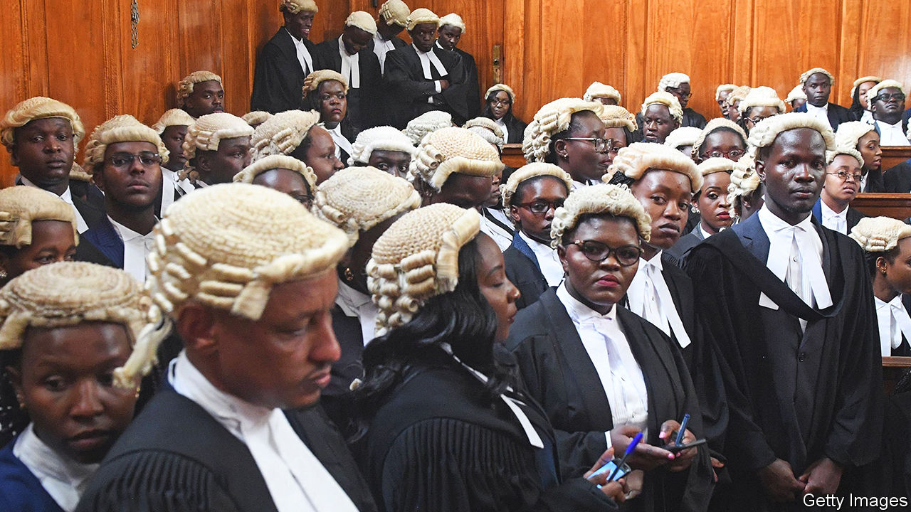

###### Bail for the rich, jail for the poor

# How Kenyan courts benefit the mighty and punish the needy 

##### A benign reform has been gleefully exploited by fat cats 

 

> Jun 2nd 2022 

Fighting an election campaign is a time-consuming business. Prudent candidates therefore like to rid themselves of distractions well beforehand. Aisha Jumwa, an mp running to become a county governor in Kenya’s general election on August 9th, is a model of efficiency in this regard. On April 5th, after a judge ruled that prosecution evidence had been withheld from Ms Jumwa’s lawyer, she secured a five-month delay in a trial where she is accused of murdering a political rival’s uncle. Six days later she persuaded a magistrate hearing a separate case in which she is charged with embezzling constituency funds to grant a similar postponement. Ms Jumwa denies both charges.

Mathew Lempurkel was meant to be missing August’s election since he was in prison after being convicted of assaulting the woman who unseated him as mp the last time Kenyans went to the polls, in 2017. In December, however, a judge agreed to release him pending an appeal. Mr Lempurkel, a populist who is also on trial for hate speech, has been cleared to run against his former victim.

A decade or so ago the idea of Kenyan judges granting bail was as outlandish as the prospect of a politician appearing in their courts. Defendants often languished in custody for years. But since a new constitution was adopted in 2010, judges must now allow bail in almost all cases, no matter how serious the charge. Campaigners have welcomed this move, since it should strengthen the presumption of innocence.

The reality is often different. If you have the misfortune to be hauled before a Kenyan court, your immediate fate often depends on how much cash you have. Magistrates and judges may grant bail, but poor Kenyans often cannot afford to raise it. Bigwigs rarely have this problem. Between 2016 and 2020, official data show that Kenya’s jails held an average of just under 120,000 remand prisoners a year, more than 60% of the total prison population. None was a politician.

Kenya has made impressive strides in improving political accountability in recent years. Anti-corruption agencies and prosecutors have shown greater stomach for pursuing the powerful. Stroll through the corridors of the anti-corruption courts and the list of well-connected defendants is striking. On May 30th, for example, Mohammed Swazuri, a former chief of the National Lands Commission, was facing fraud charges. The ex-head of Kenya’s state power utility was later up before the same magistrate to answer corruption allegations. In a second court a county governor was explaining how he had nothing to do with the disappearance of funds from a World Bank project.

Yet this progress is being undermined because it is still far too easy for big shots to game the system and slow the judicial wheels while out on bail. This is partly because Kenya has too few court officials. Judges with heavy caseloads may hear cases simultaneously, so a trial may stutter along in chunks, lasting several years. A defendant with an expensive lawyer can snag it in endless procedure.

In July 2011 court hearings began into a request to extradite Chris Okemo, a former energy minister, and Samuel Gichuru, another ex-head of Kenya’s state power utility, to Jersey on corruption charges, which they deny. After a series of procedural appeals Kenya’s Supreme Court ruled that extradition hearings could go ahead. But Kenya’s director of public prosecutions reckons it could take another five years before a decision is taken.

Corruption helps bigwigs too. Transparency International, a watchdog, rated the courts as Kenya’s “most bribery-prone institution”. It is easy to slip cash to a court clerk to make a file disappear or a witness turn up on the wrong day, giving grounds for another adjournment. Magistrates, who hear most of the corruption cases, are often thought to be buyable. 

The National Integrity Alliance, a group of watchdogs, has named 25 politicians seeking office in August who, it says, should be barred from running because criminal charges have called their integrity into question. Among them is Rigathi Gachagua, recently chosen as running-mate for Kenya’s present deputy president, William Ruto, the narrow favourite to succeed his estranged boss, Uhuru Kenyatta.

Electing such figures carries with it a threat, says Sheila Masinde, Transparency International’s director for Kenya. Corrupt individuals, if elected, may be loth to enact reforms to create a fairer judicial system because it might harm them.

Gilbert Omware, a crusading lawyer who headed a charity that raised funds to stump up bail for poor defendants, has just completed a typical day at the Makadara law courts in Nairobi. He had defended a young motorcycle-taxi driver arrested for possessing an unlicensed weapon—a used tear-gas canister fired into the slum where he lived by riot police during unrest after the last election, five years ago. Mr Omware’s client has been in custody ever since, because he could not raise the 50,000 Kenyan shillings (£340) set as bail. 

Kenya’s courts, especially the Supreme Court, are more often asserting independence against political interference. Some say the country has too few judges because the executive has retaliated by withholding funds. Yet the endless delays that allow the political elite to wriggle out of justice persist. Too many rich people, from corrupt bosses to dodgy prosecutors and lawyers on the make, benefit from the system. “Criminal justice is a poor person’s problem,” bemoans Mr Omware. “The political clamour to fix it is non-existent.”■

