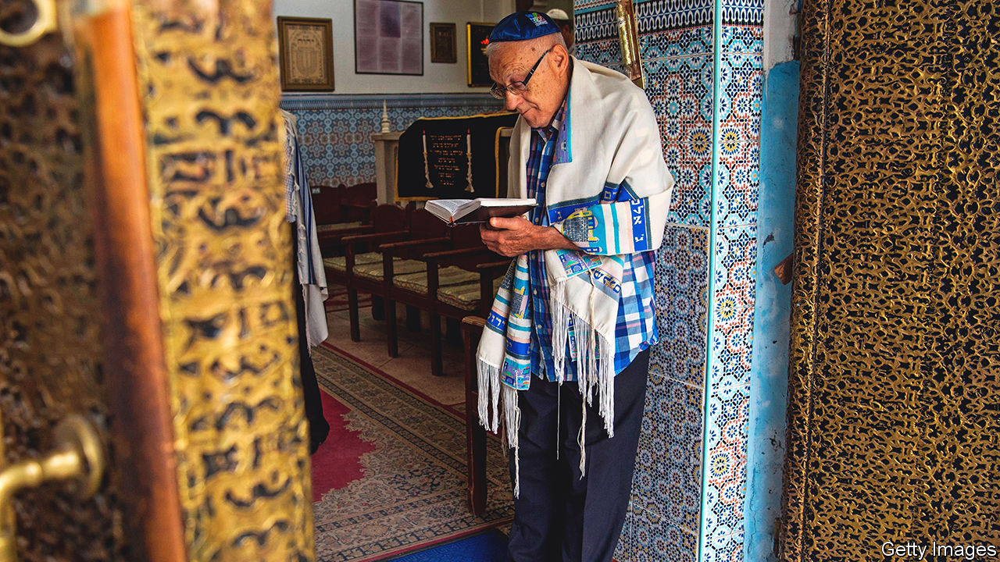

###### More than just business buddies

# Israeli firms and tourists are piling into Morocco 

##### A once-furtive friendship has burst into the open 

 

> Jun 2nd 2022 

In a railway carriage heading towards Marrakech four Moroccan women, all strangers to each other, talk about Israel. “They’re so much more welcoming than the racist, superior French,” says a Moroccan tour guide, recounting her experiences of passport control. An events organiser shares videos of her raves for Israelis in a farm outside Marrakech. A nurse uses the French word for Jerusalem, not the Islamic al-Quds, though all the women are speaking Arabic. “Israel has always protected us,” she says, then has a dig at the Palestinians. “The king gave Yasser Arafat everything and he just betrayed us by siding with Algeria over Western Sahara,” referring to the Palestinians’ longtime leader and Morocco’s dispute over a sandy territory that it occupies. All four applaud the peace deal Israel signed with Morocco a year and a half ago. 

For decades Israel was Morocco’s shadowy secret. Business between the two went through networks of intermediaries, often Jewish-Moroccan exiles in Paris and intelligence agents. Syrian tanks captured by Israel ended up in Morocco. Israelis helped fortify the wall that Morocco built to keep guerrillas out of Western Sahara. 

Now that the secret friendship has become official, the couple are getting to know each other. They have signed a plethora of military, business and cultural deals, often with loud hurrahs. The Arab-Israeli conflict seems like ancient history. 

Israel’s satellite channel, i24, is opening bureaus in Casablanca and Rabat, Morocco’s commercial and political capitals. The gala i24 staged on May 30th had a grander guest list than most Western embassies could hope to muster on their national days. Huge Stars of David flashed on a stage in the heart of the Chellah, Rabat’s crenellated medieval fortress, candle-lit for the occasion. Wine from the Israeli-occupied Golan Heights lubricated a sumptuous five-course meal. 

Israeli tourists, meanwhile, are flocking in. Morocco expects 200,000 this year, up fourfold since the accord, with ten direct flights a week. Some Israelis come to party, others to visit the shrines of what Morocco says are some 600 Jewish saints, or to rediscover family roots, since some 700,000 Israelis are of Moroccan origin. 

Well-organised trade delegations are piling in, too. Officially, trade at last count was worth a modest $131m a year. But that excludes arms, services, a flourishing digital and cyber market and joint ventures with third countries. One deal involving Morocco and Marom Energy, an Israeli company, together with a Spanish consortium, to provide solar and wind power for Spain is worth $1.2bn. Israeli companies are bidding for big water projects, including a desalination plant for Casablanca. They are also looking into fishing, cannabis farming and gas. Morocco has just hosted a three-day parade of Israeli startups, including Supplant, a company that calibrates irrigation according to weather and soil type. “There’s such high interest,” says an Israeli diplomat. “It’s crazy.”

Military deals discreetly dwarf all the others; five of the latest are said to be worth hundreds of millions of dollars apiece. Moroccan officials say Israeli digitisation has given them the edge over Algeria in their row over Western Sahara. Israel Aerospace Industries is building two plants to manufacture drones and may even install a missile-defence system. “Mossad at our borders,” cried an Algerian headline, when Israel’s defence minister arrived in the kingdom last year. 

Morocco may be warier of creating full-blooded political links, as it fears a one-sided deal. King Mohammed suspended plans to open an embassy in Tel Aviv and has yet to accredit Israel’s ambassador. Western Sahara remains a stumbling block. To entice Morocco into its peace deal with Israel, Donald Trump’s administration promised to recognise Moroccan sovereignty over the disputed territory. But President Joe Biden has backed away—and Israel has stopped short of recognition. For full diplomatic relations, Morocco seems to be saying, both America and Israel should fully accept Morocco’s Saharan claim. In other words, land for peace. ■

