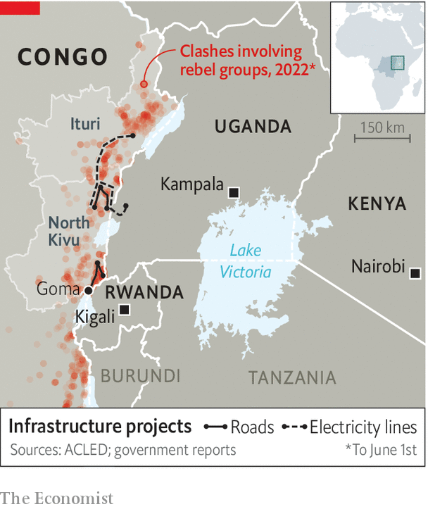

###### Roads to hell

# Men with guns disrupt a plan to link Congo to east Africa 

##### Some suspect the rebels are backed by Rwanda 

 

> Jun 2nd 2022 

Barely two months after the fanfare that greeted the Democratic Republic of Congo as the seventh member of the East African Community (eac), making it a bloc of 300m people stretching from the Indian Ocean to the Atlantic, blood is being spilt again in the troubled north-eastern corner of that vast, mineral-rich but chaotic country. The club’s other members had high hopes that, by pulling Congo’s economy eastwards, an array of infrastructure deals including roads and electric power lines would boost trade and prosperity across the region (see map).

They also agreed to create a joint military force to sweep away the dozens of armed groups that impede such happy progress. But the latest burst of violence shows how hard it will be to fashion the eac into a coherent diplomatic and trading power. Indeed, Congo’s membership may exacerbate rivalries, especially involving Rwanda and Uganda, within the club. 

The latest ructions have been caused mainly by a group of rebels known as the m23, named after an earlier Congolese peace deal signed on March 23rd 2009. Largely dormant since their defeat in 2013, they are on the move again from their hideouts in the volcanic mountains of Congo’s North Kivu province which abuts Rwanda and Uganda. On May 26th they attacked a military base 40km (25 miles) from Goma, north-eastern Congo’s commercial hub, grabbed a swathe of territory and forced thousands of terrified civilians to flee.

 


Congo’s government has blamed Rwanda for inciting the rebels, who are led by ethnic Tutsis and whose previous insurrections relied on support from Rwanda, whose strongman president, Paul Kagame, is a fellow Tutsi. His people in turn accuse Congo’s army of firing across the border with Rwanda. Another blow-up between Congo and its neighbour would renew havoc in the region, which has suffered a string of devastating conflicts in the past quarter of a century.

Mr Kagame, who has led Rwanda since overthrowing the government that committed the anti-Tutsi genocide of 1994, presents his tiny country as a peacekeeper. Last year he deployed his army, one of the most effective in the region, to the north of Mozambique, to help quell a jihadist revolt there. He resents competition for status and influence, especially from his next-door neighbour, Uganda, which in the past has backed its own favoured Congolese rebel factions. The m23’s latest surge may have been sparked by Mr Kagame’s anger at a recent Ugandan military operation, at Congo’s request, to attack the Allied Democratic Forces (adf), a Ugandan jihadist group allied to Islamic State that has also been lurking in north-eastern Congo. Last year the adf carried out suicide-attacks in Kampala, Uganda’s capital. 

The Ugandan army has so far failed to hunt down and nail its leaders, instead pushing them farther north-west into Congo’s Ituri province. Uganda’s bigger aim is to provide security for building roads into eastern Congo, including territory close to the area where Rwanda and Uganda converge. Uganda’s president, Yoweri Museveni, hopes to draw more of eastern Congo’s trade, including the illicit flow of minerals, through Uganda rather than Rwanda. But in February Mr Kagame sneered at Uganda’s operations in Congo and implied that the adf had linked up with Rwandan Hutu rebels implicated in the genocide. “We will wage war where it started,” he said. “We do what we must do, with or without the consent of others.” 

To get his way Mr Kagame may try to exploit divisions within Uganda’s ruling circle. While at loggerheads with President Museveni, he has been cosying up to the Ugandan leader’s son, Muhoozi Kainerugaba, who commands Uganda’s land forces. Lieutenant-General Kainerugaba has hinted on Twitter that he might like to succeed his ageing father at the next election, in 2026. He has also advertised his warming friendship with Mr Kagame. 

Uganda’s president is plainly annoyed by Mr Kagame’s ploys. The father can still, it seems, make his son jump. On May 17th, just hours after the Ugandan general said he would withdraw his troops from Congo, he abruptly changed his mind and said on Twitter that the mission would carry on for at least another six months. Mr Museveni, not to be outdone by Mr Kagame, or by his own son, has said he too would send troops to Mozambique. 

The un, which has been trying in vain to keep the peace in Congo for more than 20 years and still has 16,000 soldiers and police there, has already been drawn back into the fray—and is hitting the m23. But the un’s special envoy needs first of all to make Congo’s competing eastern neighbours accommodate each other. Otherwise, the eac’s hopes of becoming an economic powerhouse may be dashed within months of its enlargement. ■

