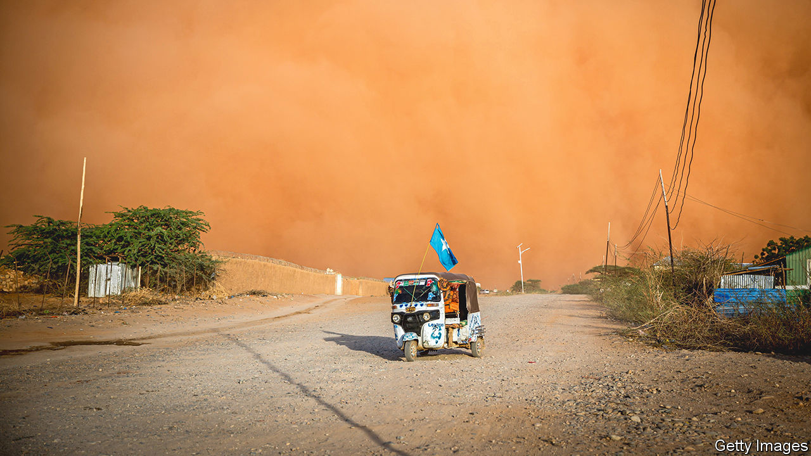
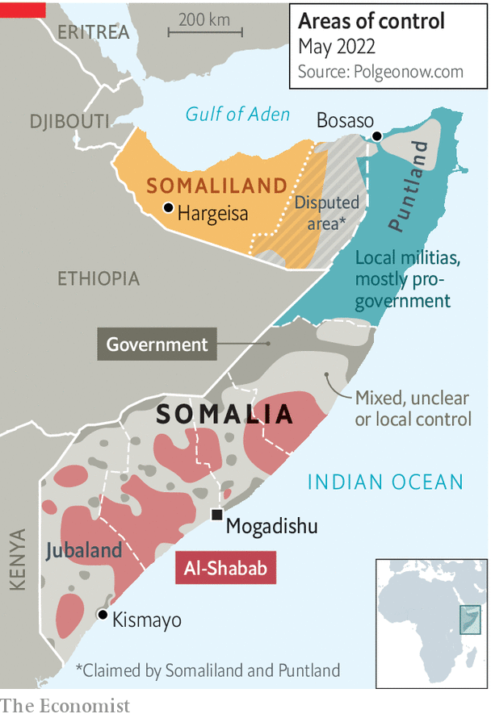

###### Better luck this time

# Somalia’s new president vows to beat back jihadists, then talk to them 

##### An interview with Hassan Sheikh Mohamud 

 

> Jun 2nd 2022 

When hassan sheikh mohamud entered Villa Somalia as president in 2012, his writ ran little farther than the sandbagged gates of the bullet-pocked, Italian-built, Art Deco palace of the head of state. Though the central government had recently wrested control of most of Mogadishu, the capital, and had recaptured some strategic towns here and there, vast swathes of the country’s centre and south remained in the hands of al-Shabab, a jihadist group with links to al-Qaeda.

Terrorist attacks were routine: just two days after his election, Mr Mohamud narrowly survived an assassination attempt. After two decades of anarchy and civil war, Somalia then looked less like a country than a gaggle of warring fiefs. “We started from scratch,” says Mr Mohamud of his first term as president. 

Today he finds himself in a similar position. On June 9th he will be sworn in as president again, the first time since independence in 1960 that a Somali has held the office twice. But since he handed over the reins in 2017 to Mohamed Abdullahi Mohamed, better known as Farmaajo, the country has slid backwards. Last year a crisis sparked by Farmaajo’s attempt to stay in office by delaying elections threatened a return to full-scale civil war. Though the outgoing president eventually handed over power peacefully, he left behind a country more divided, more diplomatically isolated and less secure than it has been for years. Many Somalis and their country’s foreign allies have welcomed the return of the seasoned Mr Mohamud as the man to fix the violent mess. Can he do so?

Speaking to  in a heavily fortified hotel in Mogadishu, he says it was the sight of his successor ripping up the fragile gains of the previous decade that prompted him to run for office again. The populist Farmaajo sidelined the leaders of Puntland and Jubaland, two powerful regional states, and wangled loyalists into running the other three. He lashed out at critics and packed his cronies into the federal security forces, which then threatened to disintegrate violently along clan lines. Whoever has run Somalia, a labyrinth of clan loyalties has long prevented the emergence of a true sense of national unity. 

Farmaajo upset foreign allies, too. He drew closer to Qatar and Turkey at the expense of other influential states in the Gulf. He picked fights with neighbouring Kenya and Djibouti. His cosying up to Eritrea and its vicious dictator, Issaias Afwerki, was particularly unpopular. 

By contrast the avuncular Mr Mohamud, an academic and civil-rights campaigner, has a more conciliatory flavour. He has moved fast to mend bridges with opponents at home and abroad. Said Deni, president of Puntland, the oldest and strongest of the five federal states (excluding the breakaway would-be country of Somaliland), notes that one of Mr Mohamud’s first moves after winning the election was to invite all Somalia’s regional leaders to a meal together. He promised them he would share power and complete a new federal constitution. “It was a good speech,” concedes Mr Deni grudgingly (the two ran against each other in the election). 

Foreign leaders have also rushed to support the new man. Kenya’s president is to attend the inauguration—a sign that diplomatic relations, so prickly under Farmaajo that they were severed entirely for several months, may be on the mend. “We cannot afford any outside enemies,” Mr Mohamud explains. Meanwhile America, which in February took the unusual step of banning visas for Somali officials who disrupted the electoral process, says it will send hundreds of troops back into Somalia to help the government fight al-Shabab. “[Mr Mohamud] is somebody we can work with,” says an American official.

 


But he can expect a rough ride. Al-Shabab, which was knocked back in his first term, is resurgent and still controls much of the countryside (see map). “Most of the districts we liberated have been lost again,” he laments. Though al-Shabab rejected the election, it may well have hoped that Farmaajo would win. On his watch it was widely believed that the jihadists had infiltrated state institutions, especially the security apparatus. “The previous government had no plan to fight al-Shabab,” says Mr Deni. The group has spread across the country. Few places are safe from the jihadists. To journey just a few hundred metres down the road from the international “green zone” by the airport to meet the president, your correspondent had to be accompanied by seven soldiers in a jeep and a mounted machinegun. 

Al-Shabab is well entrenched in the territories it controls. Its people still extort cash from businesses and conscript children into their guerrilla units. They also run courts and provide basic goods and services. The new president says that al-Shabab today collects more tax revenue than the federal government does. Local businessmen say the group mediates legal disputes more cleanly and efficiently than the official courts. “They’ve established a state within a state,” says the president. 

So does he have a coherent plan for fighting them? “To defeat al-Shabab the government must out-compete it on service delivery,” argues Ahmed Abdullahi Sheikh, a former commander of the Danab, an American-trained fighting unit. Mr Mohamud, a moderate Islamist with links to the Muslim Brotherhood, also stresses ideology. “Our vision is to take the Islamic narrative from al-Shabab and show the people that the state protects their faith. This means waging a multi-front war.”

That may be a bit glib. A lasting solution will probably also require negotiations with al-Shabab. During his previous term Mr Mohamud tried to win over defectors with promises of an amnesty, mainly in vain. Now he concedes that the battle will end at the negotiating table—but not yet. The last big offensive against al-Shabab was in 2019. Mr Mohamud says he intends to launch a new one, first to contain the jihadists, then to push them back deeper into the countryside. In theory talks could then begin. In practice this could take years. Al-Shabab has certainly proved resilient as well as ruthless.

Mr Mohamud’s previous term was a mixed bag. His cabinet was fractious and unstable. Corruption was especially rampant. Like his successor he failed to organise a direct election on time, settling instead for an indirect one whereby members of parliament were elected by delegates chosen by about 14,000 clan elders. He too was indirectly elected. This time, though, he comes armed with experience and a reservoir of goodwill. He will need to seize advantage of both. ■

