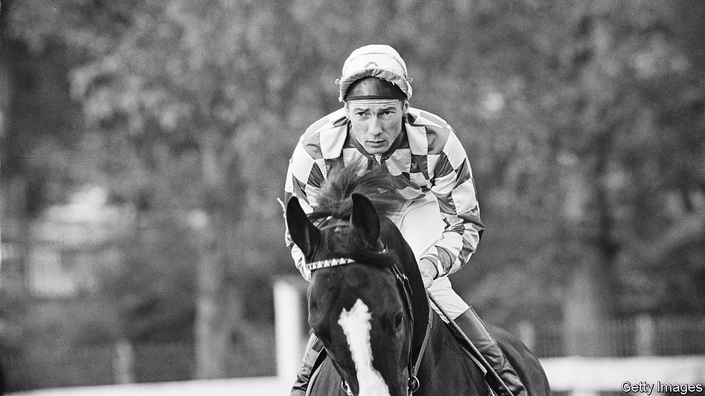

###### To ride, to win

# Lester Piggott had only one aim in view 

##### The best flat-racing jockey of the 20th century died on May 29th, aged 86 

 

> Jun 2nd 2022 

The cheekiest thing Lester Piggott ever did in racing happened during the Grand Prix de Deauville in 1979. A bit over a furlong from the finish he dropped his whip, so he did what he had to, and stole another. His right hand went out, as he drew alongside at full gallop, towards the left hand of Michel Lequeux, and plucked his whip away. Thus armed, he whipped a path to the finish line.

This combination, exquisite balance and ruthless will, typified his whole career. He won 4,493 races in Britain, including 30 Classics. Among them were eight St Legers, six Oaks, five 2,000 Guineas, two 1,000 Guineas; and, nine times, the Epsom Derby, then the world’s foremost race on the flat. When he won it first, in 1954 on Never Say Die, he was just 18; when he reached his ninth, in 1983, he set a record that still stands. At Royal Ascot, usually in front of the queen, he rode 116 winners. All these were on the flat, but he excelled at hurdles too, winning 20 from 56 rides. Eleven times he was Champion Jockey, with the most wins in a season. 

Racing pundits said he thought like a horse, and there was some truth in that. He knew how horses felt. As an only child, and partially deaf, he had found it hard from childhood to make friends and get on with people. As an adult he was mostly silent, “Old Stoneface” as some called him, but he could mumble a good riposte if he wanted to. And with horses he had an understanding. He had grown up with them, his family involved in racing and training on both his father’s and his mother’s side, and at seven had been lifted onto his first racehorse to feel the raw quivering power of it. He could be almost eloquent as he described the secret of his riding: how, because a horse could not change the centre of gravity that lay behind its shoulders, he would adjust his own centre of gravity at every second and with every stride. 

 To achieve that he first starved his body, keeping it roughly two stone below his natural ten-stone weight: dry toast for breakfast, scraps of protein, no carbs, until his frame, tall for a jockey, was lean as a rake. Then he hit on the idea, when he was still a schoolboy racer, of shortening his stirrups and perching high above the saddle, almost bent in two. There, even at speed, he could keep his balance like a circus rider. Most other jockeys tried to copy him, but he was the first. Having mastered that extraordinary technique, he would then “encourage” a horse, as he thought of it, by laying on the whip in the last stages with a ferocity that could shock spectators, as when he bludgeoned his mount Roberto past Rheingold to win the Derby by a short head in 1972. 

Yet it did not always work. Despite his 1979 whip-stealing he came second in that race, later relegated to third, to his disgust. You went out to win. That philosophy was his father’s, whom he trotted after round the stables in the same flat cap and jacket: win, win, win. He won his first real race at 12, at Haydock Park, and was set like an arrow from then on. As a teenager he was often penalised for bumping other riders; he cut them up, they cut him up back. There were fewer cameras in those days. At Royal Ascot in 1954, when he was 18, he was suspended by the Jockey Club for reckless riding (“nothing really”). He was also ordered to leave his father’s stable and serve his apprenticeship somewhere else. 

This made no difference to his attitude. He was never a complacent stable jockey, content to do what trainers or owners wanted. He knew horses, and a rider like him did not need instructions. His best seasons were with Noel Murless, a royal trainer, in the late 1950s and Vincent O’Brien in the 1970s, but he left both in bitterness and, each time, went freelance. For him the only point of a stable connection was to find and ride the fastest horse. If that horse threw him, as one did at Longchamp, giving him a hairline skull fracture and headaches for years, he would be back riding, and winning, much sooner than doctors recommended. 

About his mounts he was not sentimental. “He’s a good horse” was his highest praise. Even the famous cruising Nijinsky, on which he won the Derby in 1970, “never felt as good to ride as he was”. He liked Petite Etoile, a grey filly, for her flying speed as she won two Coronation Cups; The Minstrel, a brave little chestnut, because he triumphed in the Derby with no fear of the whip. On the gallops, rather than carefully assessing how much exercise the horses needed, he just wanted to test their best speed. When an exceptional mount appeared, he insisted on riding it in the next big race—no matter whether it was being kept for another jockey, or not. “Jocking off” was his speciality, and he felt no compunction about picking up the phone to plead his case to the owner. 

In search of wins he travelled round the country, from racecourse to racecourse, riding through muck and rain, to win the Champion Jockey title, even though he got nothing for it. It peeved him intensely that in 1963 he lost the title by one race, on the last day of the season, to the great Australian jockey Scobie Breasley, and he made sure he won it for the next eight years. Money, though, was also an obsession. His mother had stressed the importance of getting cash and hanging on to it. If anyone asked him for any, he liked to joke that they were talking into his deaf ear. He gambled, too, and in 1985, after he had retired to be a trainer, he was found to have evaded tax for a decade and a half, which earned him a sentence of three years in jail. 

It was all a great waste of time, he thought. The greatest waste was that, adding prison to retirement, he was out of the saddle for almost five years. Meanwhile, the racing world had expanded to take in America and even Hong Kong. He had bristled at the arrival in England of Steve Cauthen from the States in 1979, though he came to respect him. And in 1990 he staged his own remarkable comeback in the Breeders’ Cup Mile at Belmont Park, New York. 

He was 54, 42 years older than when he had lifted his first cup at Haydock. For a while, on Royal Academy, he dawdled at the back of the field. Then he picked up speed and finished, by a neck, ahead of everyone else. Confident as ever, plucking the sting of age and disgrace, he won, as he had to. He said it was the most satisfying ride he had ever had. ■

