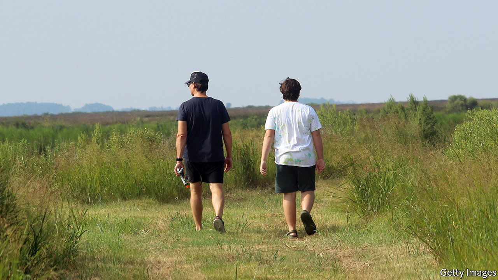

###### Testosterone and family life

# Fatherless sons have more testosterone 

##### That has implications for paternal care 

 

> Jun 1st 2022 

Most males in the animal kingdom do little . Their strategy is simple: inseminate as many females as possible and hope for the best. Sometimes, though, parental investment by a male pays off. Songbird chicks are usually tended by both mother and father. Wolf packs see alpha males and females collaborate to raise the cubs. And in human beings, too, the children’s father hangs around to lend a hand in bringing up the kids.

Sometimes.

Understanding why some men settle down to form families with the mothers of their children, and others don’t, is normally seen as the prerogative of social science. But biology has a role, too. And work just published in the , by Lee Gettler of the University of Notre Dame, in Indiana, clarifies how part of that biological mechanism, testosterone, operates. 

Previous studies suggest that high levels of testosterone, the , are bad for family life. Fathers with lower testosterone levels provide  and are better partners to the children’s mothers. Indeed, fatherhood is often associated with a drop in testosterone levels. Conversely, high-testosterone males are less likely to stick around. 

Dr Gettler has shown something further. This is that a man’s adult testosterone level seems correlated with whether his father was present during his teenage years. His data come from a survey begun in Cebu City, in the Philippines, in 1983. This monitored the health and nutrition of 966 men enrolled as babies. It also collected extensive information on whether the fathers of these men were around and providing parental care in the households in which they were brought up. It further documented whether participants got married, had children and, if they did, whether they participated in child care. Crucially, it also measured their testosterone levels at the ages of 21, 26 and 30. 

Overall, Dr Gettler and his colleagues found that on becoming fathers, men had lower testosterone levels if their own fathers had lived with them and been involved in their care during their teenage years. Specifically, if that had happened, testosterone levels in their saliva were 16% below those of men whose fathers had not stuck around to help raise them. 

This difference has two possible explanations. One is that it is directly genetic, with high-testosterone fathers (those least likely to stick around) begetting high-testosterone sons. In this case the correlation with paternal absence would be a coincidence. The other is that teenage experience actually modulates testosterone levels. This explanation, which Dr Gettler favours, could lead to a vicious circle of high-testosterone men abandoning their sons, who thus become high-testosterone in their turn.

Testosterone levels are not, Dr Gettler found, completely deterministic in the matter of parental care. Some of those in the survey whose fathers were absent during their adolescence, and who ended up with high levels of the hormone, did nevertheless became nurturing parents. But they are indicative.

Why this pattern should pertain is an unanswered question. But a zoologist looking at these data might be tempted to see in them an example of developmental plasticity, in which the same genes produce different, but appropriate, outcomes in different circumstances. 

If nurturing young carries a cost in reproductive opportunities foregone elsewhere (which it presumably does), then it would not have been favoured by evolution in times of uncertainty—the sorts of times that lead to early death. A dead man cannot care for his children, and dead children cannot be cared for. Better, evolutionarily speaking, to spread your genes far and wide while you can. Since the absence of a father could, in turn, mark such uncertain times, for that absence to trigger a high-testosterone developmental pathway encouraging this would make sense, even if it is not appropriate to the modern world.

That is speculation. But whatever the truth, Dr Gettler’s discovery surely throws a useful light on the problem of fatherless families, and how to try to end it. ■


