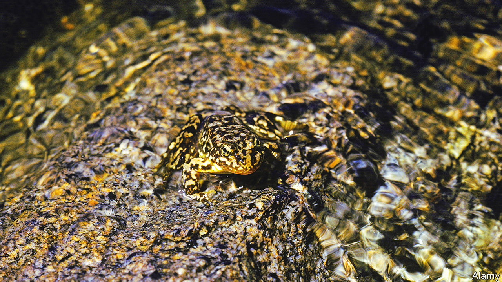

###### Conserving amphibians

# The health-giving benefits of Jacuzzis—for frogs 

##### How to toughen up captive-bred animals for release into the Big Bad World 

 

> Jun 1st 2022 

Captivity is a cushy number compared with the rigours of the wild. No predators. Little risk of disease. And a guaranteed food supply that you don’t have to work for. But that makes you soft. And if the purpose of your captivity is eventual reintroduction into a natural habitat, because you are a member of a rare species that human beings would rather did not become extinct, then having to make your own way in the world when that moment arrives can come as a rude awakening.

This is a problem faced by the mountain yellow-legged frogs which are part of a captive-breeding programme run by San Diego Zoo that is intended to boost that species’ numbers in the mountain streams of California. But, as she reports in the , Talisin Hammond of the San Diego Zoo Wildlife Alliance, the arm of the zoo in charge of the programme, has a plan to do something about it. She is limbering up her charges prior to their release by putting them on the aqueous equivalent of a treadmill.

Ecologists have long understood that animals raised in captivity can be confused and disoriented when liberated. Breeding programmes therefore go out of their way to provide artificial habitats that are as naturalistic as possible. Amphibian vivaria intended for this purpose are thus supplied with plants, branches, soil and water similar to those found in the wild. Yet Dr Hammond and her colleagues suspected they might need something more: a Jacuzzi.

In the wild, yellow-legged frogs live in streams that, in the summer at least, have powerful currents. So presumably they have to develop the strength to swim against these. She therefore set about introducing such currents in captivity. She took 146 one-year-old (ie, juvenile) captive-bred frogs and 110 two-year-olds (ie, sub-adults), tagged them all and divided each group in two. She then put half into enclosures equipped with a Jacuzzi jet that acted as a sort of aquatic treadmill; the others, which served as controls, had a conventional filtration pump.

Five weeks later, she and her colleagues measured the amphibians and gave them a 30-second swimming test, which they filmed. The resulting videos recorded how far each frog travelled per stroke of its limbs, and also the total distance it moved in the half minute available. Shortly thereafter, they released their charges into the wild and monitored them for four subsequent months.

The results were striking. Though the two-year-olds gained no noticeable benefit from having an aquatic treadmill in their enclosure, the one-year-olds definitely did. After just five weeks in the Jacuzzi-jet enclosures, their legs were proportionally longer, compared with the sizes of their bodies, than the limbs of one-year-olds raised in the control enclosures. The one-year-olds from the Jacuzzi-jet enclosures also became better swimmers, travelling more per stroke in the test, relative to their overall body size, than the control frogs.

Crucially, one-year-olds that had had access to the aquatic treadmill also survived better in the wild. Monthly attrition rates were 65% for the control juveniles but only 49% for the Jacuzzi-jet juveniles. Though the two-year-olds had a better overall prognosis after release than the one-year-olds, which was expected, because they were bigger, and so better able to look after themselves, there was no significant difference between the attrition rates of the Jacuzzi-jet animals (38% per month) and the controls (40%).

These findings lead Dr Hammond and her colleagues to suggest that there is a critical developmental window, closed by the time an animal is two years old, when frogs’ anatomies can change in response to their circumstances, and that this knowledge can be used to toughen them up for release at an appropriate moment. 

Strictly speaking, the researchers would, to prove the point, need to repeat the experiment, having first allowed both sets of one-year-olds to mature into sub-adults, to see if the survival difference persisted. But, on the face of things, it looks as if a regular workout in a Jacuzzi does indeed improve a yellow-legged frog’s prospects of making it in the real world. ■


