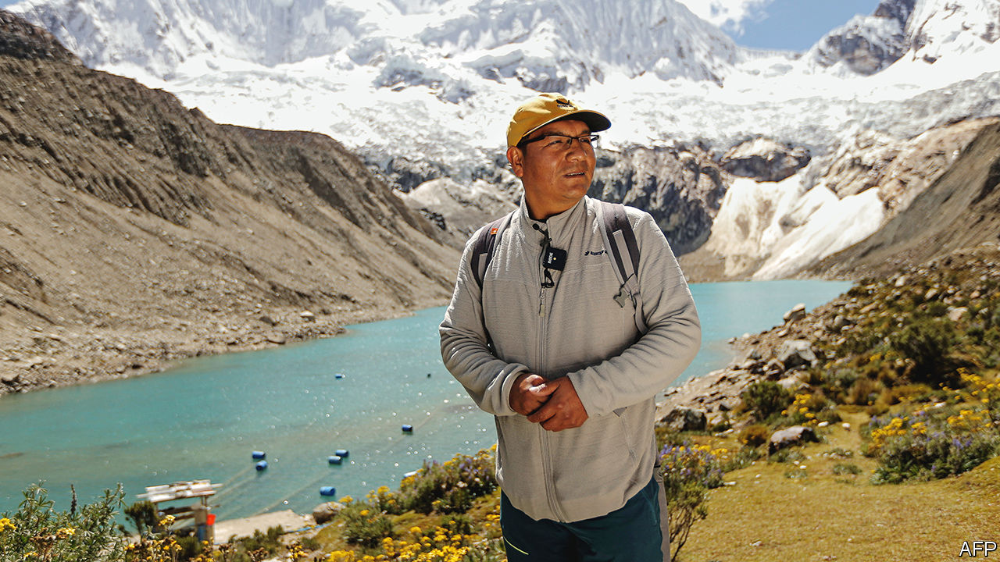
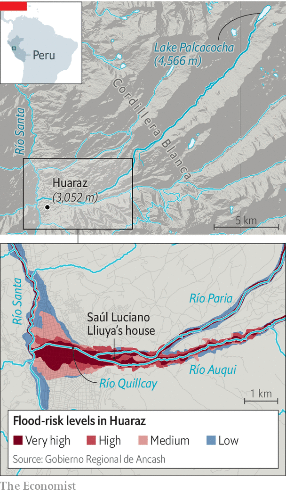

###### Fight the power company

# A Peruvian farmer takes on Germany’s largest electricity firm 

##### The outcome of the climate lawsuit will have global implications 

 

> Jun 2nd 2022 

It takes two bumpy hours in a 4x4 to climb from the city of Huaraz, 3,000 metres up in Peru’s Cordillera Blanca mountain range, to the turquoise puddle of Lake Palcacocha, 1,500m higher. On May 25th a convoy of 16 vehicles made the ascent, kicking up dust as it went. It carried an unusual group of people, including a Huaracino farmer, his lawyers, judges from Germany and Peru, and climate scientists. 

It was the farmer, Saúl Luciano Lliuya, who had brought them together. In 2015, Mr Luciano Lliuya (pictured) teamed up with Germanwatch, a German green ngo, to sue rwe, Germany’s largest power company and Europe’s second-largest emitter, for belching nearly 7bn tonnes of greenhouse gases between 1854 and 2010. This, he says, has put his house at risk of a devastating flood. Last week’s expedition marked the first step of his claim. If he wins, there would be global implications.

Mr Luciano Lliuya, his lawyers and Germanwatch say that the pile-up of greenhouse gases in the atmosphere has accelerated the melting of the glaciers above Palcacocha, causing the lake to swell dangerously. They say there is an imminent danger that an avalanche, landslide or both will send hundreds of thousands of cubic metres of snow, ice, rock and dirt crashing into the water, causing a tsunami-like wave that will break through the lake’s barriers and rush downstream, destroying and burying everything in its path. Scientists call such events “glacier-lake outburst floods”. They are a growing concern in the Himalayas as well as the Andes. 

In 1941 the second-most deadly such glacier-lake outburst flood on record submerged large parts of Huaraz when Lake Palcacocha burst through the natural dam that held it back. Between 1,800 and 4,000 people died. The lake now holds 34 times more water than it did before 1941—water that was previously solid ice. By destabilising the glaciers, climate change has also increased the risk of an avalanche or landslide big enough to trigger another flood. Officials say that 50,000 of Huaraz’s 120,000 inhabitants are at risk, including Mr Luciano Lliuya. 

Engineering solutions do exist. Ones put in place after 1941, intended to be temporary, include two modest dams and ten large pvc pipes to siphon water away from the lake. A more ambitious plan, involving higher dams and better siphons, lingers in government files. Mr Luciano Lliuya’s claim asks rwe to pay 0.47% of the costs of implementing it. 

The landscape is changing

That calculation comes from a study published in 2014 by Richard Heede of the Climate Accountability Institute, an American environmental organisation, which found that the activities of 90 large industrial emitters collectively accounted for 63% of the carbon dioxide and methane emitted between 1854 and 2010. This share is further broken down to the company level, laying the responsibility for 0.47% of historical emissions at rwe’s door. 

 


The case was thrown out in 2016. But in a surprise appeal ruling in November 2017, the higher regional court of Hamm, in Germany, decided it merited going one step further. The case rests on being able to convince the court of two key points: that Lake Palcacocha poses an imminent threat to Mr Luciano Lliuya’s property and that rwe bears some responsibility. 

If Mr Luciano Lliuya’s team are successful with the first point, they will then have to demonstrate a complex chain of cause and effect. This will test the legal vigour of attribution science, a booming discipline which allows researchers to detect the influence of human emissions in specific climate events using repeated model simulations. (rwe’s lawyers argue that legally establishing facts precludes the use of “general modelling”.) 

Despite repeated warnings

In addition to demonstrating a causal link between the risk of a glacier-lake outburst flood and climate change, Mr Luciano Lliuya’s lawyers will also have to convince the court that rwe’s emissions can be held partly responsible, in a quantifiable manner. rwe’s lawyers have questioned whether 0.47% of historical emissions (which they also argue is an over-estimate of their share) would cause 0.47% of the risk that Mr Luciano Lliuya faces. The lawyers also say that it is impossible to attribute climate change “to a single person or company”. The rise in global temperatures, they argue, is caused by “innumerable sources”. 

On top of this, rwe’s emissions were and continue to be legal. They were generated as a by-product of electricity that was used by millions of Europeans to power their homes and businesses over decades. Most of the emissions were produced before the age of cheap solar and wind power, and before net-zero targets. 

However, Germanwatch notes that rwe was run in the 2000s by a climate sceptic, in spite of scientific evidence available at the time. Court documents suggest that the German judges may consider that climate impacts were foreseeable from 1958, when the amount of CO in the atmosphere began to be recorded each day.

Even if Mr Luciano Lliuya wins and rwe is ordered to pay up, the risk to his property will be unchanged. Funds covering 0.47% of the project to reinforce the lake’s defences will leave 99.53% outstanding. And in any case that project is well within the local government’s budget. The fact that it has sat around for six years has more to do with bureaucracy and corruption. Local beliefs complicate matters. When sophisticated  were installed in two neighbouring villages, threatened by different lakes, the locals destroyed them. 

Why, then, pursue a case? Part of the answer lies in the un climate talks. For years, rich and poor have been at loggerheads over “loss and damage”, a poorly defined concept that revolves around the fact that rich nations have historically emitted more and poor ones have suffered the most. The poor want the rich to pay; the rich refuse to do so. Now the issue is being thrashed out in the courts, as well. If Mr Luciano Lliuya wins, his lawyers stand ready to sue other big fossil-fuel companies. 

But even if Mr Luciano Lliuya loses, there are likely to be more cases. Perhaps that would accelerate a green transition. Some poor governments may even decide to sue richer counterparts. Long before that happens, however, Mr Luciano Lliuya will need options to protect his family, property and livelihood. At the moment all three are precarious, through no fault of his own. ■


