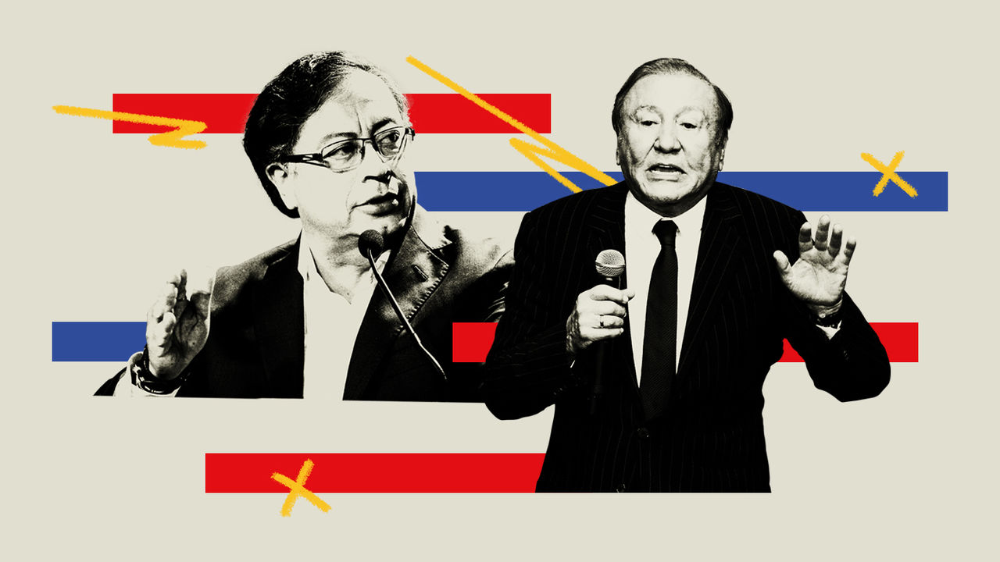

###### A change is gonna come

# A leftist ex-guerrilla and a populist face off for the Colombian presidency 

##### Voters rejected safer options on May 29th 

 

> Jun 2nd 2022 

For most of the past century, Colombia was unaffected by the shifting tides of Latin American politics. During the 1960s and 1970s, when right-wing military dictatorships swept across the region, it had a restricted democracy in which two parties, the Liberals and Conservatives, agreed to share power every four years. As the pendulum swung towards the left in the late 1990s and early 2000s, Colombia elected a right-wing strongman. But now Colombian exceptionalism seems to have run its course. In the first round of presidential elections on May 29th, voters delivered a blow to the established parties that have ruled the country for most of its history.

A leftist ex-rebel and a populist outsider will compete in a run-off on June 19th. Gustavo Petro, the leftist, won 8.5m votes, or 40% of all ballots cast. Rodolfo Hernández, a former mayor who was little-known until a few months ago, took almost 6m votes, or 28%. Federico Gutiérrez, who was backed by the country’s traditional parties, managed just 24%. The election appears to be part of an anti-incumbent wave that is upending politics across Latin America. 

Mr Petro’s path to power had seemed clear. He was expected to face Mr Gutiérrez in the run-off, where his anti-establishment credentials would have given him an edge. But the rise of Mr Hernández has complicated matters. The 77-year-old construction magnate has a stronger claim to be a political outsider than Mr Petro, who has been a congressman for decades and has run for the presidency twice before. Mr Gutiérrez has already said he will vote for Mr Hernández in the run-off; his supporters are expected to follow. 

One of the few things that Mr Petro and Mr Hernández have in common is that they were shoddy mayors. Both were suspended from office. Mr Petro, who ran Bogotá, the capital, from 2012 to 2015, was briefly removed in March 2014 after mishandling the municipal takeover of a private rubbish-collection service. He was reinstated a month later when the Inter-American Court of Human Rights ruled that his dismissal had been unfair. 

Mr Hernández, who was mayor of Bucaramanga, a city in the north, from 2016 to 2019, was removed three times: for slapping a city councillor, for denouncing a public official for corruption without proof and for using public office to campaign for a candidate he wanted to be his successor. He resigned before the end of his term. He also has a rubbish problem. In July, two weeks before the new president is supposed to take office, Mr Hernández will stand trial on a corruption charge involving the licensing of a refuse-collection service which allegedly would have benefited his son (he denies any wrongdoing). 

Apart from his stint as mayor, little is known about Mr Hernández. His policy programme is thin, and he has refused to attend the presidential debates. He promises to slash vat, which makes up the bulk of Colombia’s tax revenues, from 19% to 10%. That could overheat the economy, which is suffering from 9% inflation, the highest since 2000. And, like Mr Petro, he wants to increase trade barriers and “review” free-trade deals in order to strengthen agriculture and manufacturing, potentially hurting productivity. None of this would reduce the budget deficit, which is expected to be 6% of gdp this year. 

Mr Hernández blames corruption for most problems. As mayor he promised to build 20,000 homes for the poor. Yet not a single one was completed—because, he says, his predecessor had pilfered the municipality’s coffers. He says he wants to follow in the footsteps of Andrés Manuel López Obrador, Mexico’s populist leader, and host a daily press conference in which he would show pictures of politicians he deems corrupt, regardless of evidence. He thinks the courts take too long.

But in other ways Mr Hernández is difficult to place on an ideological spectrum. He supports gay marriage and abortion, and thinks drug prohibition has not worked. He says he would slash salaries for elected representatives. A basic-income grant would replace welfare programmes. 

Mr Petro’s programme is more grandiose. While he also wants to increase tariffs and renegotiate trade deals, he plans to increase tax collection by 5.5% of gdp over four years, through pension reform and by clamping down on tax exemptions. He would ban new licences for oil exploration even though crude oil, coal and minerals account for more than half of Colombia’s exports. He promises to make university education free and to guarantee state jobs for all the country’s unemployed—around 11% of the labour force.

Both candidates would have to rule with a divided Congress. Mr Hernández’s self-styled League of Anti-Corrupt Rulers won only two seats in legislative elections in March. He did not propose a list for the Senate, and has vowed not to make alliances with politicians of any stripe. Mr Petro would have an easier time. Though his coalition does not have a majority, it has the largest bloc of seats in the Senate. Mr Petro has also included politicians from traditional parties in his campaign. 

If elected, Mr Hernández may try to forge a direct connection with the people, bypassing the normal institutions. He has a fondness for tweeting out policy pronouncements. As mayor, he hosted Facebook Live events every week in which he lambasted other politicians and hailed his own achievements. In an interview with the  he likened his followers to the “brainwashed” terrorists who committed the September 11th attacks on the United States, because, he says, he has a “messianic” effect on them. Such gaffes have allowed Mr Petro to present himself as the “safe” candidate. That may convince a few voters. But for now it seems that Mr Hernández has the edge. ■

