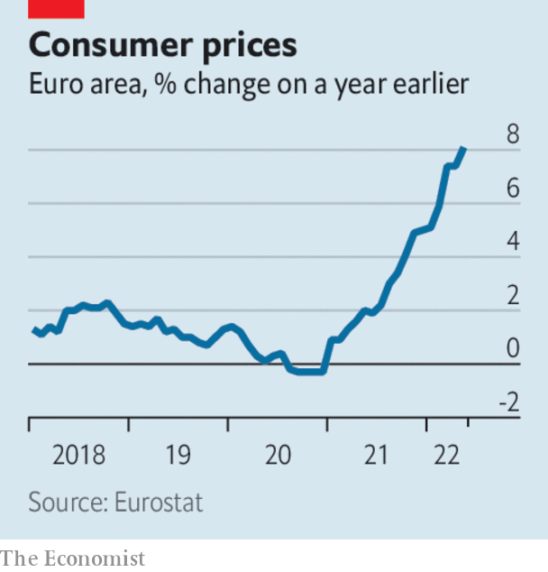

###### The world this week

# Business 

#####  

 

> Jun 2nd 2022 

 


The  annual inflation rate leapt to 8.1% in May. The European Central Bank is expected to raise interest rates for the first time in a decade in July and again in September. Surging prices may mean that it will opt for bolder increases than currently envisaged, perhaps of half a percentage point. 

If I knew then…

In America Janet Yellen admitted that she had been wrong to think that  would be temporary. The treasury secretary said that in 2021 she “didn’t fully understand” the risks from supply-chain bottlenecks and other factors that have driven America’s inflation rate to a 40-year high, but that the government recognised them now. Joe Biden said that “fighting inflation is our top economic challenge”. The issue could hurt the Democrats in the mid-term elections. 

 grew by 4.1% in the three months ending March 31st, year on year, a slower pace than in recent quarters. After rebounding from covid-19, the country is now beset by rising prices. Annual inflation reached an overall 7.8% in April, but the category for food, which accounts for half the consumer price index, hit 8.4%. 

 rose sharply, in part because of the eu‘s long-delayed agreement to place an embargo on Russian oil. The price of Brent crude closed above $120 a barrel for the first time in two months. Some members of opec are reportedly willing to exclude Russia from oil-production targets agreed to under opec+, because Russian volumes have been hampered by sanctions. 

Police raided the headquarters of dws Group, a big German asset-management firm, amid allegations that it misled investors. A whistleblower has claimed that dws exaggerated the amount it held in esg (environmental, social, governance) assets. Such embellishment is known as , and is a growing problem in the esg industry. America’s Securities and Exchange Commission is preparing to tighten the rules on how esg products are defined and marketed. 

There was speculation that another bidder could emerge for , an enterprise-software firm. , a chipmaker, recently agreed to pay $61bn for vmware in a friendly takeover. 

America’s Supreme Court put a temporary hold on a law in Texas that would have stopped  from removing content they label as misinformation or extremist. Industry groups challenged the legislation, saying it would damage the effort to scrub hate speech and propaganda from the sites. In a 5-4 decision the court did not rule on the constitutionality of the law, but decided to send the issue back to the lower courts. 

 unexpectedly decided to step down as chief operating officer of Meta. Ms Sandberg joined Facebook in 2008, helping Mark Zuckerberg transform it into the behemoth social-media platform that it is today. She is one of Silicon Valley’s most influential executives and is expected to spend more time working on her charitable causes. 

Share prices in  rallied as the two-month lockdown in Shanghai came to an end. Nasdaq’s Golden Dragon China Index of Chinese companies that list shares in America recorded its first monthly gain in May since October. Sentiment was also boosted by Alibaba’s solid growth in quarterly sales. 

, a gold-mining company based in South Africa, agreed to buy , a Canadian rival, for $6.7bn. The combined firm will be the world’s fourth-largest producer of gold. The price of the precious metal has been volatile this year as central banks raise interest rates. Gold Fields was founded by Cecil Rhodes in 1887, but has just one mine left in South Africa after expanding to Australia, Peru and west Africa. 

 appointed  to its board, after the activist investor’s fund accumulated a 1.5% stake. Mr Peltz has sat on the boards of other big consumer-goods companies and is credited with helping to turn around Procter &amp; Gamble by pushing a cost-cutting agenda there. Unilever’s shareholders hope their stock will do as well as p&amp;g’s, which has risen by 83% since Mr Peltz joined the board in 2018 (he left last year). 

The need for speed

 made $156m at the American box office over the Memorial holiday, breaking the record for the four-day weekend. Over its first five days the film raked in $320m worldwide. The producers delayed its release when cinemas shut during covid, preferring it to be viewed on the big screen rather than on streaming devices. Top Gun 2 is tapping into nostalgia for the 1986 original. Around 55% of tg2’s audience in America is aged 35 and over, a demographic often overlooked in the blockbusters market. 

