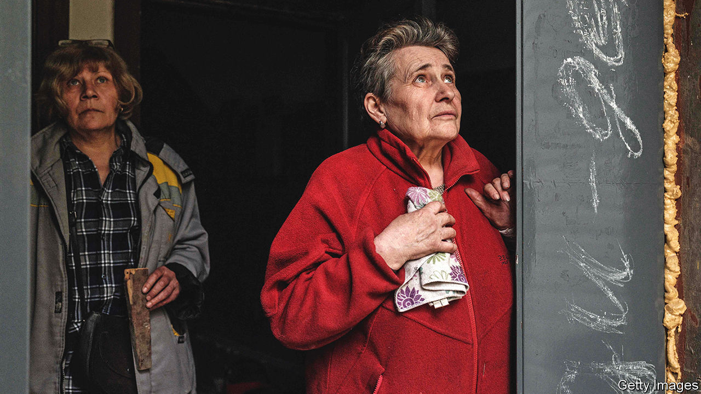
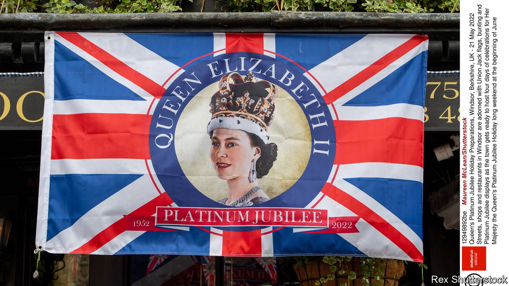

###### The world this week

# Politics 

#####  

 

> Jun 2nd 2022 

Russian forces captured parts of , a town in eastern Donbas region. Some Ukrainian defenders were holding on, but many of the 10,000 thought to have been stationed there retreated. Russian troops have been advancing slowly in the east of the country, assisted by heavy artillery. 

America said it would send more , including long-range rocket launchers that will help the country’s defenders shoot back at the Russian artillery pounding their positions in the east. The Pentagon is supplying the new kit on condition that it not be used to strike targets in Russia. President Joe Biden reiterated that America does not seek war with Russia, and does not aim to oust Vladimir Putin, Russia’s president.

In an interview on French television  foreign minister, Sergei Lavrov, said that capturing Ukraine’s Donbas region (he termed it a “liberation”) was an “unconditional priority” for the Kremlin. He denied that Russian soldiers were attacking civilian infrastructure, despite copious evidence that they are. Mr Lavrov also denied rumours that Mr Putin is seriously ill. The Russian president “appears in public every day”, he insisted. 

The European Union agreed to ban most. However, the ban will not cover piped oil, an exemption sought by the Czech Republic, Hungary and Slovakia, which rely heavily on pipeline supplies, and it will be phased in. At first it will block around 65% of total Russian oil exports to Europe; by the end of the year it will block 90%. 

The m23 rebel group, which has long lurked in , clashed with the army near the city of Goma. Congo’s government accused president, Paul Kagame, of inciting the violence. Congo has been trying to build new roads and trade links with east Africa, which the mayhem threatens. 

Around a hundred people, mostly informal goldminers, were killed in clashes in the north-western desert of , close to the border with Libya. The violence began as “a mundane dispute between two individuals”, said the country’s defence minister. 

Off your bike

Lagos,  commercial capital, started enforcing a ban on motorcycle taxis. The governor says they endanger road users and enable crime. For many locals, they are a cheap and effective way to beat the city’s awful traffic.

A leaked report soon to be issued by the International Atomic Energy Agency, the un nuclear watchdog, said that unexplained nuclear material had been found at three undeclared sites in , and that Iran had “not provided explanations that are technically credible”. 

A former presidential candidate in , Abdel Moneim Abul Fotoh , a 70-year-old Islamist, was sentenced to 15 years in prison with hard labour for disseminating “fake news” and for joining a “terrorist” group, the government’s term for the banned Muslim Brotherhood. 

 eased covid-related restrictions, allowing most people to move freely around the city. China’s financial hub, home to 25m people, had been locked down for over two months. Restrictions were also eased in Beijing, the capital, which reopened parts of its public-transport system as well as some malls, museums and other gathering places. Both cities have seen a decline in infections recently.

 said 30 Chinese warplanes flew close to its airspace, prompting it to scramble its air force. The incident came less than a week after Joe Biden vowed that America would defend Taiwan, were it to be invaded by its giant neighbour. 

 economic situation showed no signs of improvement, as the government continued negotiations for a bail-out. A food shortage is worsening. The agriculture minister has urged farmers to plant more rice. The government has asked for aid from its South Asian neighbours. Inflation hit a new high of 39%. Last month Sri Lanka defaulted on its debts and riots prompted the president to sack the prime minister, his brother. 

 is also facing an economic crisis. Foreign-currency reserves are down to just $10bn and inflation reached nearly 14% in May. The government is in talks with the imf for a bail-out, and has raised the price of fuel by 20%. Meanwhile, Imran Khan, the ousted prime minister, has been leading protests to demand fresh elections. He claims, without evidence, that parliament sacked him at America’s behest. 

Populists triumphed in the first round of . Gustavo Petro, a left-wing ex-guerrilla, won 40% of the vote. Rodolfo Hernández, an ex-mayor who likens his supporters to the “brainwashed” terrorists of September 11th 2001, came second. A run-off will be held on June 19th. 

At least 106 people were killed in north-east  when heavy rains swept through the region, causing floods and landslides. It was the fourth big flood in the country in five months.

British Columbia said it would temporarily decriminalise the possession of some . People caught with up to 2.5 grams of opioids, cocaine, methamphetamine or mdma will not be prosecuted. They will instead be offered treatment. The experiment, the first of its kind in Canada, will run for three years from January. 

Also in  Justin Trudeau, the prime minister, proposed ways to toughen gun-control laws. He wants to freeze sales and transfers of handguns and revoke the firearms licences of people who commit domestic violence or criminal harassment. 

America’s Justice Department said it would conduct a review of the police’s slow response to the  in Uvalde, Texas on May 24th. An 18-year-old gunman murdered 19 children and two adults. Police cordoned off the school but took more than an hour to confront the gunman, who was shot dead by a Border Patrol agent. 

Pomp and circumstance

 


Britain started four days of celebrations to mark the . When she came to the throne in February 1952 Winston Churchill was prime minister and Harry Truman was president of the United States. Seventy years and 150 foreign visits later, it was hoped the 96-year-old monarch would attend at least some of the festivities. An official jubilee pudding was named: a trifle with lemon curd. The British weather was forecast to be unsettled. 

