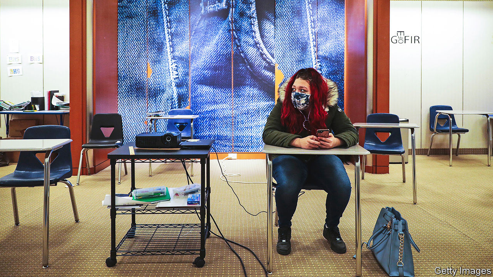

###### Mall makeovers

# Changing shopping habits are transforming America’s shopping malls 

##### Department stores are becoming schools, clinics and even cannabis farms 

 

> Jun 2nd 2022 

In 2018, like many other department stores, Macy’s in Burlington, Vermont, closed its doors. In 2021 it reopened as a school. Toxic chemicals had been found at Burlington High, and the empty Macy’s offered an airy stopgap until a new building could be ready in 2025. Pupils have grown used to studying in a library created out of the china department, where books sit on backlit display shelves, and eating lunch below a Michael Kors sign (a teacher has stuck a “café” sign next to the designer’s name). They especially like riding on the vast glass escalators, says Lauren McBride, the principal.


Across America empty shops in malls, notably the “anchor” spaces once filled by department stores like Macy’s, are being put to new use. As people spend more on dining out and holidays and less on clothes, such stores’ sales have shrunk. The pandemic, which drove shoppers online, accelerated that decline. Macy’s in Burlington was one of 100 or so closures announced by the retail chain in 2016; more followed. JCPenney has shut 175 shops since 2020. Lord &amp; Taylor has gone online-only.

Green Street, an analytics firm, estimates that of more than 1,000 empty anchor boxes in America around 80% are in “b” and “c” malls (with lower sales per square foot than high-performing “a” malls). More malls were downgraded during the pandemic, says Vince Tibone, an analyst. Because some tenants have lease clauses that allow them to pay less rent if anchors depart, and an empty shopfront is off-putting, mall landlords are eager to get new tenants “even if they aren’t the sexiest”, he says.

Those now inhabiting old department stores range from offices to theatres. In March the city council in Springfield, Massachusetts, approved plans to grow cannabis on the second floor of an old Macy’s in the city’s Eastfield mall (and sell it on the first). The Medical University of South Carolina has set up clinics in the old JCPenney at the Citadel Mall in Charleston, which still has shops. Ellen Dunham-Jones, a professor of architecture at Georgia Tech, who keeps a database of retrofitted malls, says 32 enclosed malls have been wholly or partially redeveloped for health care. (Most redeveloped malls, she says, are mixed-use.)

Health-care businesses can make good use of large stores and malls because many hospitals were built in places where there is little room to expand. Malls offer a lot of parking space (a benefit enjoyed by Burlington High’s pupils and teachers). In suburban areas malls are often well placed for ageing populations that need more doctor’s appointments and fewer new shoes.


