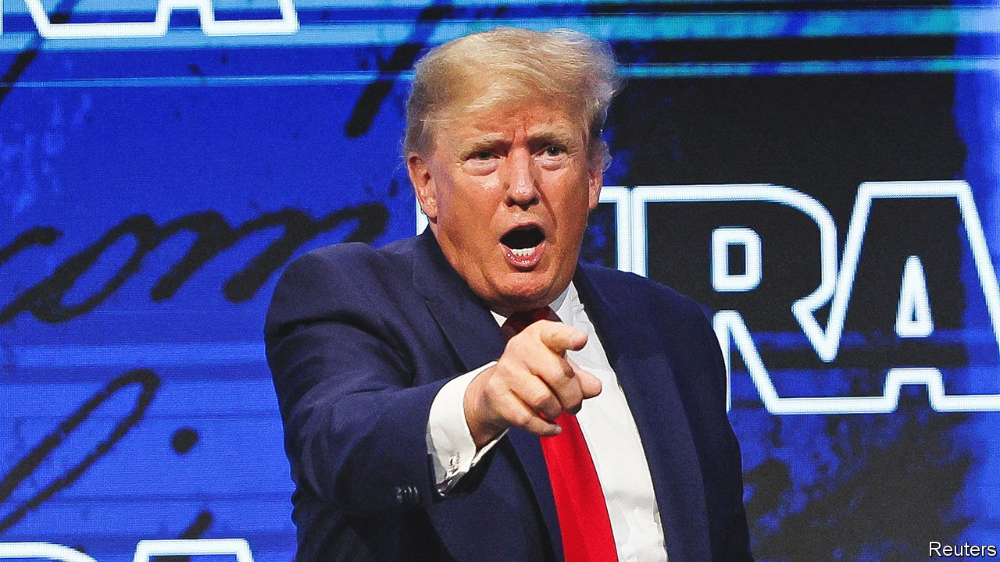

###### Alternative narratives

# Gun groups have their own ideas for preventing mass shootings 

##### None involves more gun control 

 

> Jun 2nd 2022 

At the annual meeting of the National Rifle Association (nra), in Houston on May 27th-29th, members listened to speeches and milled around booths, as they contemplated buying their next gun. A salesman for Glock, a manufacturer of handguns, categorised his pistols according to the amount of flesh they penetrate: 20 inches (51cm), in the case of the Glock g40, priced at $750. He hopes his daughters will soon have the sharpshooting acumen to carry one round for self-defence.

A different sort of self-defence is on the minds of some gun enthusiasts, who are feeling besieged by efforts to regulate firearms. The nra met three days after an assailant in Uvalde, Texas, killed 19 children and two teachers at an elementary school. It was the most lethal school shooting since six- and seven-year-olds were massacred a decade ago at Sandy Hook Elementary in Newtown, Connecticut. Democrats, including President Joe Biden, have urged colleagues to pass laws to regulate gun sales further. Proposals include restricting sales of high-capacity magazines, though their fate is uncertain in a divided Senate. 

Gun advocates have shot back at any new restrictions and stressed other ideas for preventing mass shootings. Broadly, they offer four. One is to “harden” schools so they look more like government buildings, with an expanded police presence, security-screening and a “single point of entry”, to stop shooters from coming in through back doors, as happened in Uvalde. In Houston former president Donald Trump advocated “strong exterior fencing”. Yet even if all schools could somehow be “hardened”, a shooter could still target children in a playground, says Adam Winkler, of the University of California, Los Angeles, the author of a definitive history of the right to bear arms. 

A second line of argument is that the only way to stop a “bad guy” with a gun is a “good guy” with a gun, so teachers, guards and more people should be armed. Wayne LaPierre, the nra’s boss, trotted out this line after Sandy Hook, and it has become as common and unscrutinised as folklore. “If guns made us safer, America would be the safest country in the world,” considering how many guns are in circulation, says Mr Winkler. At Uvalde, plenty of “good guys” with guns were present anyway: at one point, as many as 19 officers waited in the hallway to confront the shooter, finally doing so more than an hour after he arrived. (The Department of Justice has launched an investigation into the police response.)

Gun proponents also argue that the real culprit in shootings is not guns but mental disorder, and the solution should be to focus efforts there. Yet many of the people who make this point, including Senator Ted Cruz and Governor Greg Abbott of Texas, have opposed the expansion of Medicaid, a government health-care scheme for the poor, which would provide funds for mental-health services in the state, says Mark Jones of Rice University in Houston.

Lastly, “gun rights” proponents argue that new restrictions would do nothing. They point to high crime rates in cities with strict gun laws, such as Chicago. This ignores the deadly interstate flow of firearms. Most of the guns found in crime scenes in Chicago are from places with loose gun laws, says Kris Brown of Brady, a gun-control organisation. 

Gun groups say that no new restrictions could have avoided what transpired at Uvalde. But Uvalde is, in fact, a “difficult case for the pro-gun groups”, says Mr Jones of Rice: if Texas limited sales of rifles to those 21 and over, instead of 18, the assailant would not have been able to buy two assault rifles within a week of his 18th birthday, one of which he used in the massacre. Mr Jones predicts that Republicans in Washington are going to be “under increasing pressure” to raise the minimum age to 21 for gun purchases.

Families of the victims in Uvalde will certainly push back against the anti-gun-control arguments of the nra and the politicians it funds. Youth marches are planned for June 11th in Washington, dc, and across the country. Too many lives have been upended by firearms. After the nra convention your correspondent headed by Uber to Houston airport. Her driver mentioned he was going to a funeral: his brother had accidentally shot himself. ■


