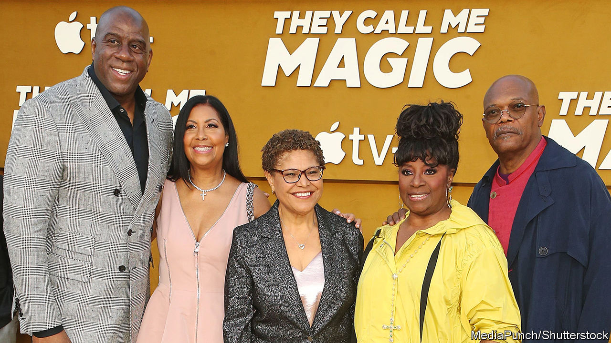

###### Hey, big spender

# LA’s mayoral race may reveal the limits of progressive politics 

##### Voters are fed up with homelessness and crime. Will they turn to a billionaire former Republican? 

 

> Jun 2nd 2022 

An election in Los Angeles is not complete without celebrities weighing in. For the mayoral contest on June 7th, Snoop Dogg, a godfather of gangsta rap, has endorsed Rick Caruso, a billionaire former Republican who has vowed to clean up the city’s homeless encampments but offers few details on how he will do so. Kris Jenner, matriarch of the Kardashian clan, is also stumping for Mr Caruso. Karen Bass has Magic Johnson, a Los Angeles Lakers basketball legend, on her team. Ms Bass, whom Joe Biden considered for the vice-presidency, wants to leave Congress to set up shop in City Hall. 

The contest is arousing more interest than usual, for two reasons. Eric Garcetti, the current mayor, is term-limited, making this the first open race since he took office in 2013. Second, turnout is expected to balloon. This is not because the candidates inspire particular devotion or ire, says Fernando Guerra, director of the Centre for the Study of Los Angeles at Loyola Marymount University (lmu). Rather, it is the first time California has mailed ballots to all registered voters—and the first election in more than a century that coincides with statewide races. Angelenos voted in 2015 to move local elections to even-numbered years from 2020, giving Mr Garcetti an extra-long second term. 

This is a big change for Los Angeles. The city’s leaders in the early 20th century set up local elections to be non-partisan and as isolated as possible from national politics, says Raphael Sonenshein of California State University, Los Angeles. Some of that non-partisanship remains. The top two finishers on June 7th will advance to a run-off in November regardless of their party affiliation. Only if a candidate receives more than 50% of the votes will they win outright. The chances of that are slim. Polling from a pro-Bass political-action committee shows Mr Caruso and Ms Bass with 37% and 35% of the vote respectively. Kevin de León, a city councilman and former leader of the state Senate, is a distant third. 

Electoral reforms a century ago also left their mark in another way. New York City’s charter gives to its mayor any powers that are not assigned elsewhere, whereas Los Angeles disperses power between the mayor, city council and Los Angeles County—which is nearly the size of Connecticut and home to a quarter of Californians. The region’s sprawl and political fragmentation make tackling complex issues harder. 

Consider homelessness, which has dominated the campaign so far. About 66,000 homeless people—or 11% of America's homeless—live in Los Angeles County, many of them in tent encampments on the streets. Angelenos are furious that the city has been unable to house more people, despite voting in 2016 to tax themselves to create more housing for the chronically homeless. Proposition hhh, a $1.2bn bond, was supposed to help build 10,000 units; 1,500 had been built as of April. 

Frustrations over homelessness, plus spiralling housing costs and rising violent crime during the pandemic, have cast a pall over a usually sunny city. Last year, for the first time since 2014, when lmu began polling, a majority of Angelenos thought the region was heading in the wrong direction. “I think the city just feels harder,” says Mr Garcetti. Nearly 400 people were murdered in the city in 2021, the highest toll since 2006. 

Though grisly, that is still far below the levels seen in the 1990s. Some 2,600 people were killed in 1992, the year South la erupted after four police officers were acquitted of beating Rodney King, a black man. Mr Guerra sees parallels with mayoral elections that followed the Watts riot in 1965 and Rodney King riots in 1992. In 1969 Angelenos re-elected Sam Yorty, a race-baiting incumbent with ties to the police. In 1993 they opted for Richard Riordan, a Republican who has endorsed Mr Caruso. “There are great similarities where the liberal democratic regime doesn’t have an answer to the question of public safety and it opens the door for the opposition to make a succinct argument and walk into the mayor’s office,” says Mr Guerra. 

Mr Caruso, who registered as a Democrat in January, is betting that pattern will continue. The property developer has poured $37.5m of his $4.3bn fortune into the race thus far, and suggests he will spend what it takes to win. His message is simple: clean up encampments and get more police on the streets. Ms Bass says she decided to leave Congress to run, in part, because she doesn’t want to see the confluence of crises move Los Angeles in “a conservative direction”. Voters cannot punish Mr Garcetti at the ballot box—he might quit la entirely if his nomination to be Mr Biden’s ambassador to India comes good—so they may take their frustrations out on Ms Bass, who has represented parts of Los Angeles in Congress since 2011. 

The primary is just an appetiser for the main course in November if Ms Bass and Mr Caruso advance, as is probable. Even if Mr Caruso eventually loses, the success of his campaign so far suggests the lure of progressivism fades when public safety is the top concern. What does it mean for Democrats that Los Angeles, a bastion of the left, is seriously contemplating a billionaire ex-Republican as mayor? ■


