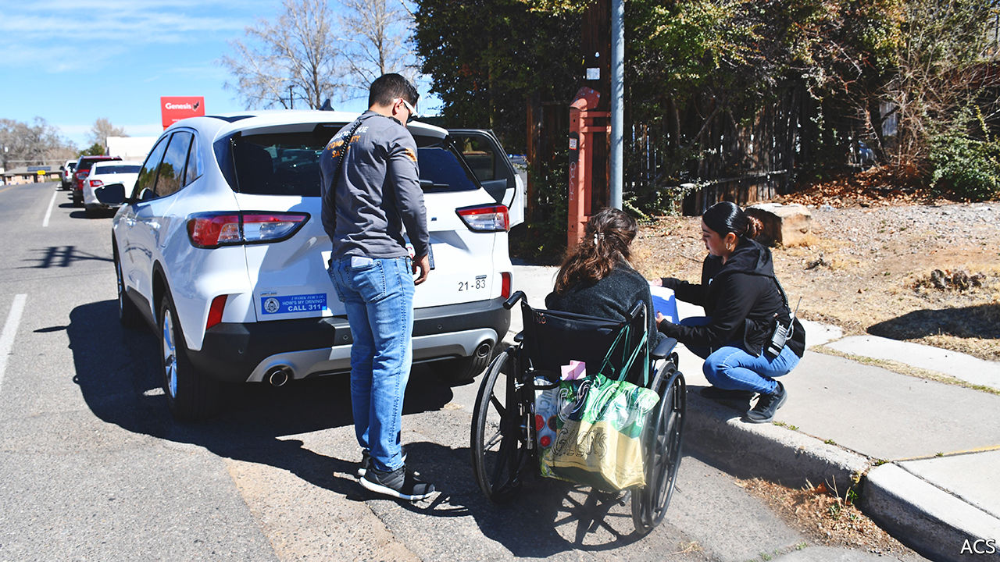

###### Policing differently

# Since George Floyd’s murder, new ways of policing have been spreading 

##### “Defunding the police” is defunct; reforming policing is not 

 

> May 29th 2022 

“I need to know what’s going on says a distressed middle-aged woman with light-brown skin and dark curly hair. She is standing in the courtyard of a run-down apartment complex, gesturing towards a flat on the ground floor. The door is locked, the lights are off and the window coverings are drawn. Flies buzz between the covering and the window panes. The woman fears her elderly friend is dead inside.

Three civilians in grey-uniform t-shirts and jeans have arrived. Colin, a young former police officer, squats by the window and sniffs. Many first responders are familiar with the distinctive odour of death. A call to management confirms that the friend had died and was taken away two weeks ago. “The leasing office would not even tell me if she still living there or not. They know that she’s not there!” the woman exclaims. “Why did they do that?” The team comfort her and walk back to their vehicle, with “Albuquerque Community Safety” (acs) on its doors, and drive away.

After George Floyd’s , protesters called for police reform. On May 25th, the second anniversary of his death, President Joe Biden signed an executive order aimed at improving accountability for federal law-enforcement agencies. But Congress has yet to pass the George Floyd Justice in Policing Act, a bill aimed at improving police accountability. 

Numerous protesters also demanded that municipal governments “defund the police”. The slogan is now defunct. Many police departments that lost funding saw their budgets as a share of overall spending rise slightly in 2021. 

However, if the silly slogan has gone, the push for reforms has not. Many reformers were hoping for a reallocation of funds and responsibilities. Quietly, some local governments have been doing this.

A few have created a unit that is separate from the police and fire departments. In New Mexico, Albuquerque’s government set up acs as a third branch of public safety, devoted to behavioural troubles. Its teams vary: some have a police officer and others not. They respond to emergency calls involving issues ranging from mental health to substance use and homelessness.

An hour’s drive away, Santa Fe launched an alternative response unit (aru) within its fire department last May. Rather than being completely separate from the police, a group of responders (a case manager, a paramedic and sometimes a police officer) answer calls related to mental health together. Sometimes they take people to the safety of shelters or crisis-intervention centres. The case manager will follow up to help some people with the services they need. This can involve anything from getting government identification to placement in a rehabilitation facility.

These units provide welcome relief for police. Most police calls do not involve a crime. The situation described above at the apartment complex is known as a welfare check, and it is one example of a non-criminal call typically handled by a police officer. A  analysis of three areas (Montgomery County in Maryland, New Orleans and Sacramento) found that one-third or more of police time is spent on these types of calls. About 13-19% of time went on routine traffic matters. Only 19-31% was devoted to property violations or other low-level crime—such as drug use, disorderly conduct and the like—and just 4% to violent crime.

That police have wide-ranging responsibilities beyond crime is not a problem in itself. But many departments are overstretched. Recruitment and retention have been poor for years, well before demands to “ the police” began. Officers are overworked. An investigation in 2019 by Boston 25 News, a television channel in that city, found that many officers in the area worked 40-50 hours of overtime a week, in some cases tripling their base pay. The police department in Albuquerque is short of 400 out of 1,400 officers; in Santa Fe 34 of 169 positions are currently vacant.

“On a normal ‘man-down’ call, when the aru is not working, it’s two police cars, a fire truck and an ambulance—seven people,” says a Santa Fe fire chief, Andres Mercado. This is a waste of resources for a person who is on the ground due to intoxication or illness, he explains. He plans to expand the aru, which currently operates only on weekdays from 8am until 6pm.

Softly, softly—and safely

Albuquerque’s police department has also got some relief thanks to the acs. “It’s working very well for us as police because we chronically have calls…it never stops,” says Matt Dietzel, a lieutenant in the police department. If acs responds, then a police officer does not need to go. And it seems to be easier to recruit people for these roles. 

Reformers argue that having unarmed personnel arrive to calls could help reduce violence. Among rich countries, America has the highest annual rate of civilians killed by police (34 per 10m people, more than triple the rates in Canada and Australia). Black Americans are more than three times as likely as white people to be killed. Reducing interactions with armed officers could be part of the solution, the thinking goes. “They’re not showing up guns drawn,” says Daniel Lawrence of cna, a think-tank. “They’re coming in a way that’s meant to show you, hey, we’re not here to arrest you. We’re trying to help you.”

More time is needed to determine which type of programme is the most effective and how much police intervention is still required. These experiments also require more money, not less, to get started, which may inhibit their spread. Other areas trying similar things include Eugene, Oregon (a pioneer) and Chicago, as well as Charlotte-Mecklenburg in North Carolina and Phoenix, Arizona. In New Mexico, the innovative approaches look promising.■


