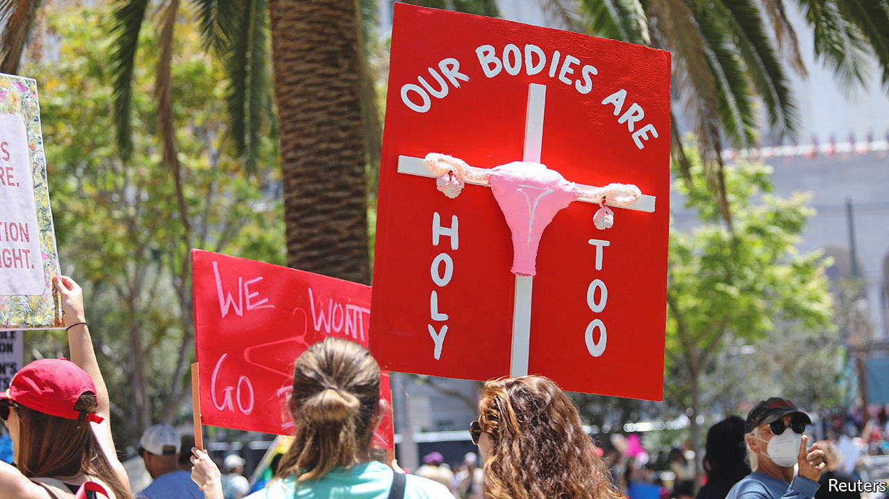

###### Pro-choice priests

# The many clergy in America who support abortion rights 

##### Religious activists may again help women with unwanted pregnancies 

 

> Jun 2nd 2022 

When an episcopal priest, Katherine Hancock Ragsdale, was appointed interim president of the National Abortion Federation (naf) in 2018, her detractors dusted down the insults they had thrown at her when she declared abortion “a blessing” outside a clinic in Alabama in 2007, and when she was appointed the first openly gay dean of an Episcopal seminary, Episcopal Divinity School, in 2009. “High priestess of abortion”, they called her, “lying baby-killing witch” and “fat, angry dyke”—“to which I was so tempted to respond, ‘I’m not angry’,” she recalls.

The Rev Ragsdale, who retired from the naf last year, but remains on the board of naral Pro-Choice America where she has been for 20 years, says she considers her abortion-rights activism part of her duty as a minister. There is nothing in the Bible, nor most of the 2,000-year-old teachings of Christianity, that proscribes abortion, she says. There is plenty in both about standing up for the poor, who bear the brunt of any loss of abortion rights.

Opposition to , the Supreme Court ruling which in 1973 declared abortion a constitutional right, has chiefly come from Christian groups. If  is overturned soon it will be the result of half a century of religious activism. Yet most American Christians want it to stand. Data from the Public Religion Research Institute (prri) suggest that a comfortable majority of mainline Protestants and Catholics believe abortion should be legal in all or most cases (30% of white evangelicals think it should be legal). This reflects the teaching of most churches in America.

The Catholic church has long held that abortion is murder. But since 1967 the Episcopal church has maintained its “unequivocal opposition to any legislation on the part of the national or state governments which would abridge or deny the right of individuals to reach informed decisions [about abortion] and to act upon them”.

Even the Southern Baptist Convention, which today roundly condemns , once called for legislation to allow access to abortion in some circumstances. It continued to do until the late 1970s, when Jerry Falwell, a Southern Baptist televangelist, and Paul Weyrich, a Catholic strategist, established the Moral Majority to mobilise Christian voters. The success of that movement has obscured an earlier, pre- tradition, in which liberal clergy helped women obtain abortions. 

In 1967 a group of ministers in New York formed the Clergy Consultation Service, to help women with unwanted pregnancies. More than 1,000 ministers (and some rabbis) became involved in the service, which referred women to safe abortion providers across America. After abortion was legalised, several Christian and Jewish groups established the Religious Coalition for Reproductive Choice, which the Rev Ragsdale chaired for nine years.

If  is overturned she says she hopes that “clergy will rise to the occasion again, getting people to safe places or helping them find illegal abortions where they are, taking advantage of medication abortion to make that possible”. She recognises that the extreme polarisation that now surrounds the issue will make this a lot harder. “Will I be disappointed? Oh I hope not, but I fear so.” ■


