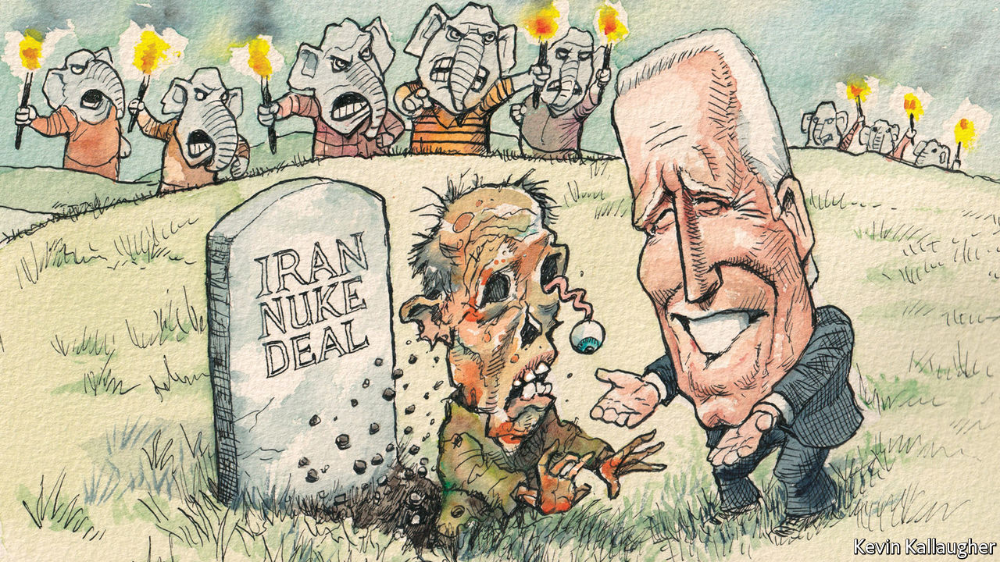

###### Lexington

# The zombie nuclear deal 

##### Iran’s defunct nuclear-containment pact has contaminated American politics 

 

> Jun 2nd 2022 

Four months ago the Biden administration appeared to have decided it was now or never for Iran’s blighted nuclear-containment deal. Negotiated under Barack Obama then abrogated by Donald Trump, the Joint Comprehensive Plan of Action needed to be salvaged—as the administration hoped it would be—or else abandoned. Because time-limited, the strictures that the seven-party agreement placed on Iran’s nuclear programme would have had diminishing utility even if the Iranians had abided by them after America walked out. And they did not. Iran has enriched 18 times the quantity of uranium permitted under the deal, some of it to weapons-grade levels. “You can’t revive a dead corpse,” warned Rob Malley, Joe Biden’s chief negotiator on the issue.

The jcpoa now looks even more terminally challenged. Instead of returning to mutual compliance with America, the Iranians issued a new demand: that Mr Biden remove their Islamic Revolutionary Guards Corps from a list of terrorist organisations. He balked at that, and the negotiations, conducted by European third parties, have since been stuck, even as Iran’s illicit centrifuges continue to whirr. Appearing before the Senate Foreign Relations Committee on May 25th, Mr Malley said the prospect of Iran returning to the jcpoa looked “at best, tenuous”.

The deal’s potential benefits have continued to shrink, meanwhile. Its “sunset clauses”, which from 2025 onwards would steadily free the Iranians of most constraints on their nuclear programme, are not the only reason for that. The nuclear know-how they have accrued over the past three years would ensure that, even if persuaded to give up their uranium pile, they could reassemble it twice as fast.

Back in 2015, when the jcpoa was signed, the Shia state was thought to be potentially months away from a nuclear breakout (that is, from having enriched enough uranium to make a nuclear bomb). The deal was expected to extend that time-frame by a year, with intrusive international surveillance that could alert the world to any breaches. If Iran wanted to break out today, it is estimated that it could do so now in a few weeks. Returning to the deal could at best stave that off by around six months.

Yet instead of ditching the moribund deal, the administration is still pursuing it. “We thought that, by February or early March, the deal would no longer be worth the sanctions relief. We have reached a different assessment,” says a senior administration official. What explains this apparent change of heart?

In part, the war in Ukraine, which has made the administration especially averse to risking conflict in the Middle East. Three simultaneous nuclear dramas, in North Korea, Ukraine and Iran, would be a lot. Yet the administration’s shifting rhetoric mainly denotes a failed negotiating tactic. Modest, and unlikely, as a warmed-up jcpoa would be, the administration has seen no good alternative to it. The evidence suggests there isn’t one.

For the jcpoa’s detractors—including almost all Republicans and some Democratic senators—the opportunity cost of the arrangement, as they viewed it, outweighed the gains. In return for constraining its illicit nuclear programme, Iran was given sanctions relief; it was meanwhile free to engage in all sorts of rogue-state behaviour outside the ambit of the jcpoa. The rationale for Mr Trump’s decision to scrap the deal and load Iran with new sanctions—a policy he described as “maximum pressure”—was that this would force it to mend its ways generally. Yet Iran’s consequent rush to nuclearise is only one of the ways in which it has not done so. It also doubled down on its ballistic-missiles programme and regional troublemaking—including attacks on Saudi Arabia and on American and allied troops based in Iraq. “The alternative theory jcpoa critics advanced was given a chance,” Mr Malley said in his testimony. “It failed.”

The deal’s critics are undaunted by that reality. Senate Republicans have introduced bills to re-politicise the issue, including one by Ted Cruz forbidding Mr Biden to re-enter the jcpoa. It got nowhere; yet he and other hyper-partisan Republicans view the issue as a win however it turns out. Failure to resuscitate the pact would make the Biden administration look ineffectual. And if it succeeds it will not only have recommitted itself to a weaker version of what Mr Trump described as “the worst deal ever”. Mr Biden would also be forced to give away more leverage than Mr Obama did—in the form of Mr Trump’s many additional sanctions, which are still in place. The Republicans, concedes the senior official, are “licking their chops” over the prospect of such a gift.

This represents more than an argument about leverage and America’s dwindling ability to impose its will on the world (though it is certainly that). Democrats consider it merely the latest example of Republicans ducking responsibility for serious problem-solving in favour of a relentlessly oppositional search for political advantage. As on gun control, climate change, health-care reform and other big issues, this has led to another sort of diminishing return. Democrats earnestly cobble together an imperfect solution; Republicans trash it, making the problem worse; which in turn makes the Democrats’ follow-up solution even feebler, so even easier for the Republicans to trash. And thereby America’s—and in this case, the world’s—problems mount.

There is no Plan B

The Biden administration is plainly committed to reviving the imperfect, now weakened, nuclear deal. That is commendable—there is indeed no good alternative. At the same time, it must half-dread the issue being brought to a head, either way, ahead of this year’s mid-terms. There is no political advantage in it, only rancour. This would appear to present the Iranians, in whose court the jcpoa ball now lies, with an interesting choice. If they wanted to exert maximum pressure on the creaking American political system, they should probably re-enter the deal pronto.■


