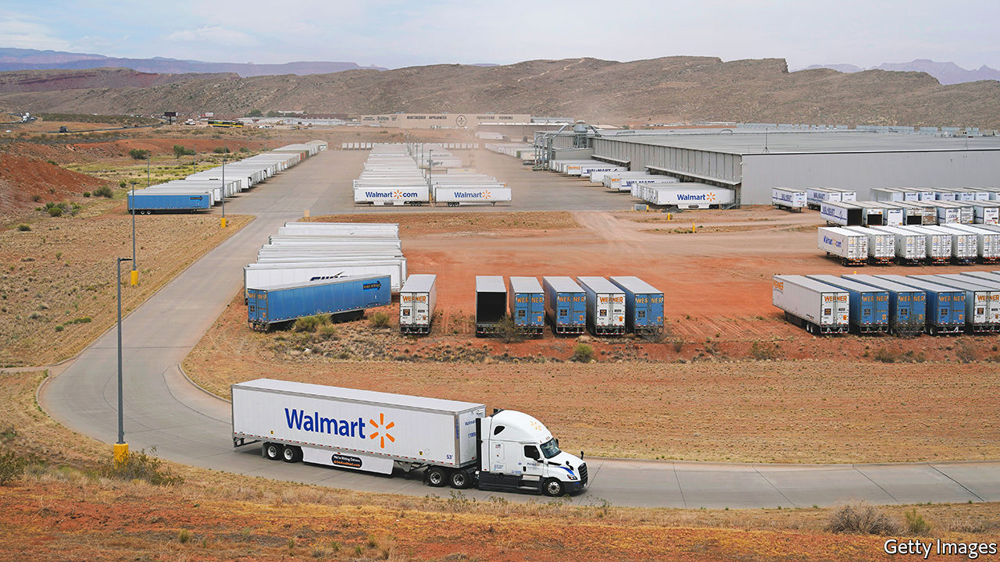
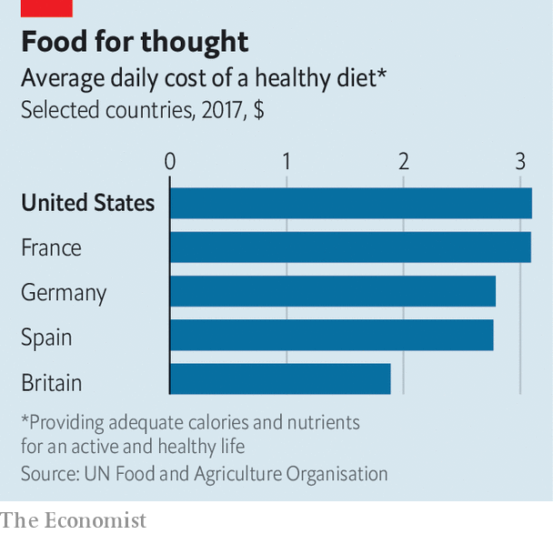

###### American supermarkets

# Why Americans are poorly served by their grocery stores 

##### Food shopping is expensive and inefficient, but change is coming 

 

> Jun 2nd 2022 

Americans have long been proud of their supermarkets. The first grocer with food in aisles, to be picked up by shoppers rather than kept behind a counter, opened in Memphis, Tennessee, in 1916. In Bentonville, the hometown of Walmart in north-west Arkansas, Americans flock to a bombastic museum celebrating the firm’s founder, Sam Walton, and his commitment to “bringing low prices to underserved rural communities”. 

Today Americans spend a smaller share of their income on food to be cooked at home—about 6%—than people in almost any other rich country. Low prices are reflected in low profit margins. At Kroger, America’s second-biggest supermarket chain, the net margin, after taxes, is about 1.2%; at Walmart, the biggest, it is 2.3%.

Yet Americans are finding themselves served less and less well by their supermarkets. Food prices have risen by 11% over the past year, which is sharply more than in other rich economies. As customers change their shopping habits in response, that in turn is shaking up the grocery business. A fall in the share prices of big supermarket firms last month, as several reported they had overestimated demand and stocked too much, hints at the effect.

 


Even before the current bout of inflation, food prices in America had been rising faster than most other prices for the previous 20 years. A study in 2017 by the un’s Food and Agriculture Organisation found that the cost of eating healthily in America was 65% more than in Britain, and among the highest in the rich world (see chart). The inflation figures suggest that this will, if anything, have worsened since. Though Americans still spend a smaller proportion of their income on supermarket food than Europeans, the gap has been narrowing. In absolute terms they spend more, even though they also eat out more, and eat less healthy, cheaper foodstuffs.

Why are American consumers not getting a better deal? A transatlantic comparison is revealing. Walmart, which accounts for about 26% of the American market, has a gross margin (its profit before fixed costs like rent and labour are taken into account) of about 25%. For Tesco, Britain’s largest chain, which has 27% of its home market, the equivalent figure is 8%. Since the two firms both have low net margins (overall profitability), this suggests that Walmart has higher fixed costs, and has to charge a big mark-up. American retail is “high cost, high touch”, says Simeon Gutman of Morgan Stanley, a bank: customer experience is prioritised over price.

Walmart’s shops are enormous, selling plenty besides groceries. Tesco operates over 4,000 shops, the bulk of which are its smallest. Walmart has only 4,700 shops in total, despite serving a population about five times larger. On average, its supermarkets are ten times larger by floor space than Tesco’s. Bigger stores increase consumer choice. A Walmart supercentre might stock 140,000 different items, compared with just 40,000 at Tesco’s biggest branches. But it also means they may be wasting a lot of space by stocking products that do not sell, adding to costs. American supermarkets sell far less per square foot of shop space than British supermarkets, notes Bryan Roberts, a consultant based in London.

Americans are used to perks such as having someone to bag their groceries for them. “There is an almost old-school service that has been a part of the model that hasn’t really existed in Europe for some time,” says Simon Johnstone of Kantar, a research firm. But this does not come at no cost. Cheaper own-brand products have penetrated less, making up less than a fifth of sales by value, compared to more than 40% in Europe. “We know that American supermarkets have to start cutting down the assortment, we know that they have to start moving to more automated processes,’‘ says Mr Johnstone. 

Another problem is that America’s supermarkets, despite often lacking competition locally, are less concentrated nationally. Regional firms may have the power to squeeze customers, but they do not have the size that European supermarkets have to resist price increases by suppliers. Their suppliers are raking it in. Last month Tyson Foods, America’s biggest meat supplier, announced its latest quarterly profits were 74% higher than in the same period last year. Meat prices have spiked so much that in January the Biden administration announced a plan to try to boost competition in the industry. 

For retailers, however, sharper competition is now arriving. Last month Walmart’s chief financial officer, Brett Biggs, told cnbc, a broadcaster, that its customers are increasingly looking for cheaper products, squeezing margins, which in turn squeeze the firm’s profits. Shops such as Costco, and Walmart’s Sam’s Club, where customers can buy in bulk more cheaply, are thriving. 

Among the supermarket chains expanding fastest in America is Aldi, a German discounter, which has more than 2,000 shops. They are Spartan but affordable. Another is Trader Joe’s, a Californian company now owned by the family of Aldi’s founder, famous for its $2 range of wine (Two Buck Chuck). Both operate smaller supermarkets, typically around 15,000 square feet (1,400 square metres), with more limited ranges, and far more private-label products that cost much less, on shelves that are refreshed more often. Customers adore them. 

Amazon, as well as owning Whole Foods, an upmarket grocer, now runs 29 “Fresh” supermarkets, mostly in suburbs of large cities. At these stores shoppers need not use a till at all, instead being automatically charged as they pick items off the shelves and walk out. Until recently, home delivery of groceries in America (unlike Europe) has often relied on gig-economy workers walking round ordinary supermarkets—a costly model. 

But that is also changing. Walmart’s head of e-commerce, Tom Ward, is British and has brought ideas pioneered in Britain, such as “dark stores”, where goods are packed exclusively for delivery. In Arkansas, Walmart has even experimented with dispatching groceries by drone. On May 24th it announced that the programme is expanding to five more states.

How much these ideas will change how Americans shop is unclear. Cutting product lines is often unpopular; big cars and big fridges still support a model of big grocery stores with surprisingly high prices. Still, as consumers fret about inflation, the pressure on American supermarkets to innovate and cut costs is bound to grow.■


