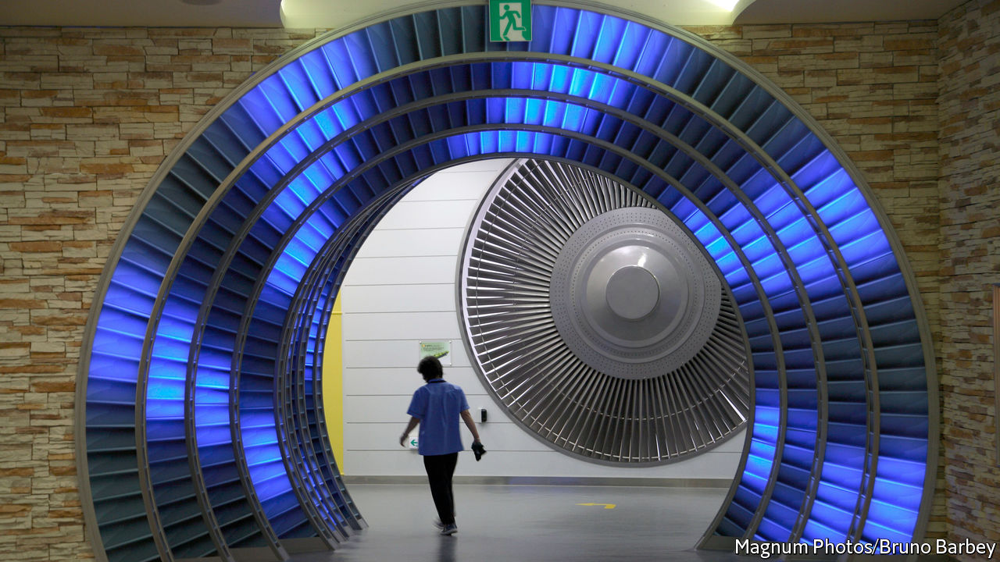

###### Troubled energy

# A plan to revive South Korea’s nuclear-power sector faces obstacles 

##### But it could help wean the country off fossil fuels 

 

> Jun 8th 2022 

The south gate of Shin Hanul, a nuclear power station in Uljin on South Korea’s east coast, does not get a lot of traffic. At lunchtime on a recent weekday there were no heavy vehicles to be seen, only a trickle of cars slowly chugging up to the two newish reactors behind it. The reactors were supposed to have started producing electricity by 2018 but remain dormant after one of them failed a series of safety tests. 

The area could soon see more activity. Yoon Suk-yeol, who took over as South Korea’s president last month, wants to put nuclear power at the core of energy generation, reversing the  of Moon Jae-in, his predecessor. As well as putting the two existing reactors at Shin Hanul to work Mr Yoon wants to build two new ones, a plan Mr Moon abandoned in 2017. He also plans to extend the working life of 18 existing nuclear power stations beyond their scheduled closure in 2030. If Mr Yoon gets his way, nuclear will generate 30-35% of South Korea’s power by 2030, up from 27% in 2021. 

The plan has merits. The fallout from the war in Ukraine has underscored the dangers of relying on fossil fuels, which currently generate nearly two-thirds of South Korea’s energy. Breaking the dependence on coal, oil and gas is also necessary to fulfil South Korea’s pledge to achieve carbon neutrality by 2050, which Mr Yoon has said he intends to honour. Properly regulated and managed nuclear power is green and safe, and could reliably supply South Korea’s heavy industry. What’s more, 49% of South Koreans think the country needs more nuclear power, whereas only 40% disagree. 

But over the past decade the reputation of nuclear power in the country has been tarnished. A series of scandals in which thousands of counterfeit parts with fake documentation were found in nuclear plants resulted in the conviction of 68 people for crimes including bribery, collusion and forgery. Poor management caused a blackout at one facility. North Korea has hacked into the South’s nuclear databases on multiple occasions, at least once stealing blueprints for reactors. 

Reforms in response to these scandals have improved safety and transparency. But the improvements have not mollified critics. Most of South Korea’s nuclear regulation originates in American law and has been simplified in translation, says Park Jong-woon, a professor of nuclear engineering at Dongguk University in Gyeongju. That, and the close ties between regulators and industry, creates loopholes. Even today, the putatively independent Nuclear Safety and Security Commission should really be called the “nuclear-friendly commission”, quips Mr Park.

Another problem is cost. The rising price of imported fossil fuel and an eight-year freeze on domestic energy prices resulted in a 7.8trn won ($6bn) operating loss for kepco, the listed power utility, in the first quarter of 2022, its worst performance ever. Nuclear plants are cheap to operate. The company’s own analysis suggests that without them its losses would have been worse. But building new ones is expensive and takes time, as does passing safety checks. They may also not be the cheapest option in the long run, says Kim Joo-jin of Solutions for Our Climate, an ngo, given the falling cost of renewables. Industry remains to be convinced—the unreliability of renewables limits their appeal.

Sorting out the domestic market is a precondition for another pillar of Mr Yoon’s plan: turning South Korea into an exporter of nuclear power plants. Philip Andrews-Speed of the Energy Studies Institute at the National University of Singapore reckons that the Russian invasion of Ukraine provides an opening for South Korea to capture more of this market. Many countries are less keen to buy plants from Rosatom, a Russian state-run power company and plant manufacturer, for fear it could be sanctioned. But the economic returns of such deals are hard to assess in advance and can take decades to mature. The same holds for Mr Yoon’s plan to revive nuclear power. ■


